# 代码架构设计

<cite>
**本文档引用的文件**
- [douyin-publish.js](file://douyin-publish.js)
- [package.json](file://package.json)
</cite>

## 目录
1. [简介](#简介)
2. [项目结构](#项目结构)
3. [核心组件](#核心组件)
4. [架构概览](#架构概览)
5. [详细组件分析](#详细组件分析)
6. [依赖分析](#依赖分析)
7. [性能考虑](#性能考虑)
8. [故障排除指南](#故障排除指南)
9. [结论](#结论)

## 简介

这是一个基于Playwright的抖音自动发布工具，旨在自动化抖音创作者中心的视频发布流程。该工具实现了完整的发布自动化，包括登录检测、视频上传、内容编辑、隐私设置和定时发布等功能。

## 项目结构

该项目采用单文件架构设计，所有功能都集中在单一的JavaScript文件中，便于部署和维护：

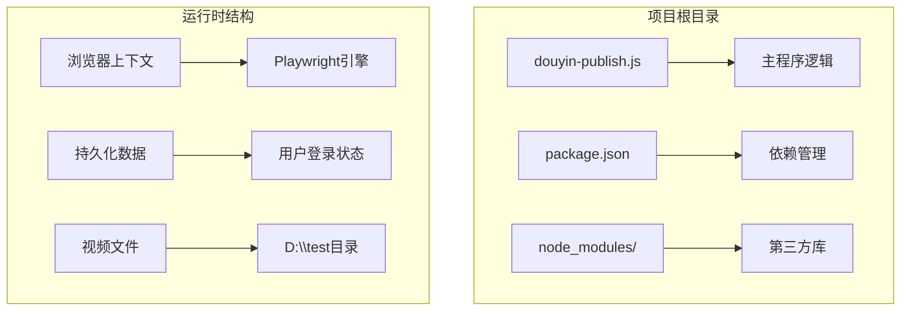

**图表来源**
- [douyin-publish.js:1-625](file://douyin-publish.js#L1-L625)
- [package.json:1-17](file://package.json#L1-L17)

**章节来源**
- [douyin-publish.js:1-625](file://douyin-publish.js#L1-L625)
- [package.json:1-17](file://package.json#L1-L17)

## 核心组件

### 配置管理模块

配置管理模块负责集中管理所有可配置参数，采用全局常量的方式实现：

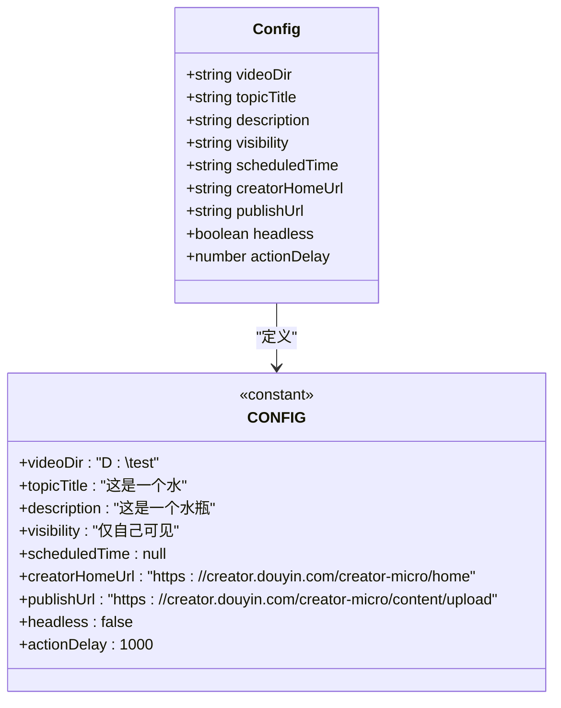

**图表来源**
- [douyin-publish.js:24-53](file://douyin-publish.js#L24-L53)

### 工具函数模块

工具函数模块提供了核心的辅助功能，采用纯函数设计：

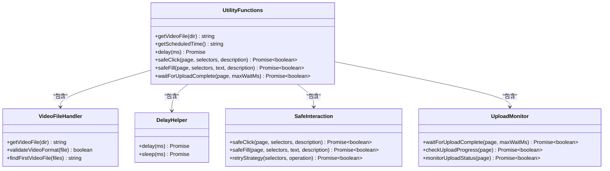

**图表来源**
- [douyin-publish.js:57-235](file://douyin-publish.js#L57-L235)

**章节来源**
- [douyin-publish.js:24-235](file://douyin-publish.js#L24-L235)

## 架构概览

该系统采用模块化设计，主要分为以下几个层次：

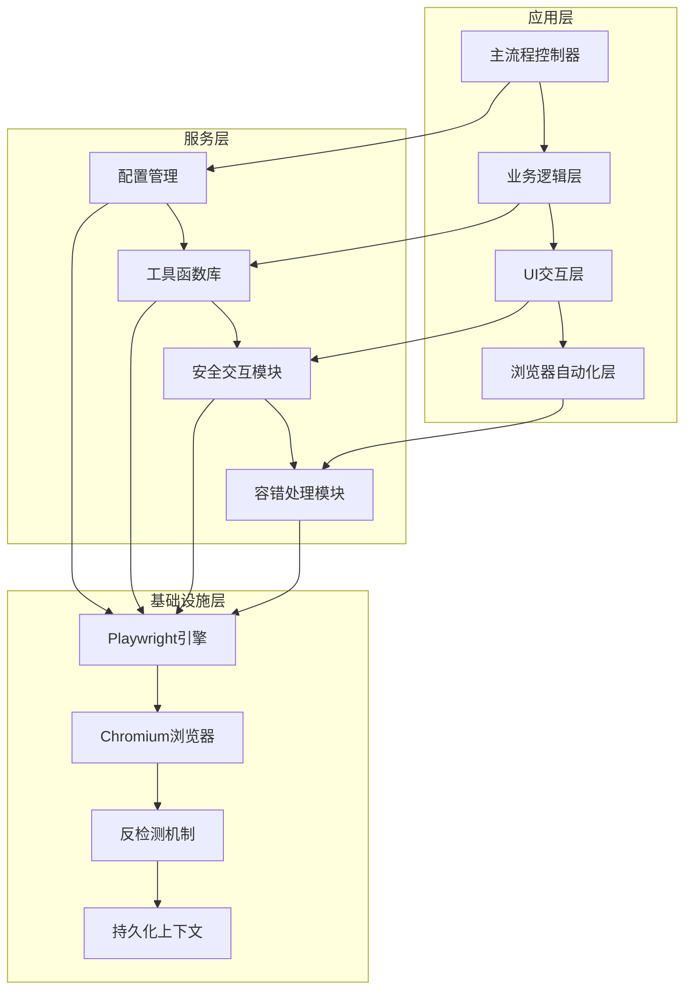

**图表来源**
- [douyin-publish.js:20-284](file://douyin-publish.js#L20-L284)

## 详细组件分析

### 主流程控制模块

主流程控制模块是整个系统的协调者，负责编排各个功能模块的执行顺序：

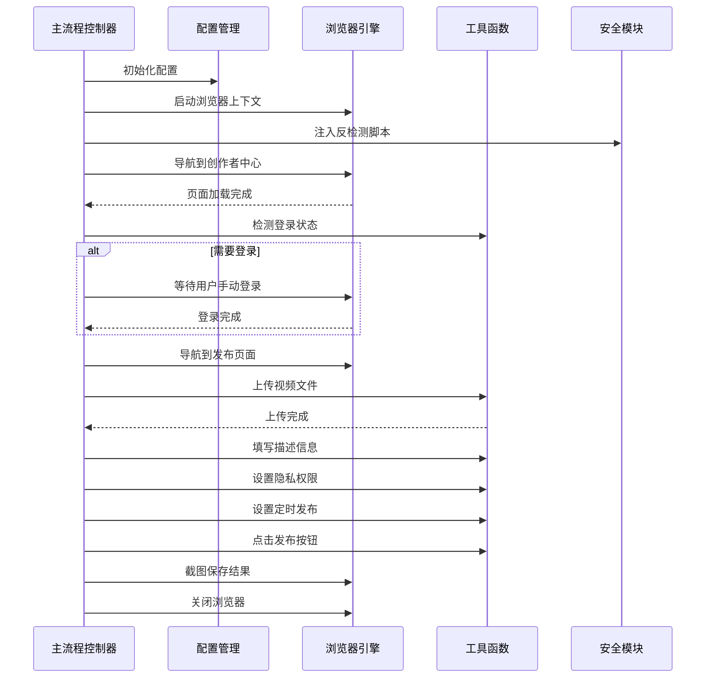

**图表来源**
- [douyin-publish.js:239-618](file://douyin-publish.js#L239-L618)

### 异步编程模式分析

系统广泛采用了现代JavaScript的异步编程模式：

#### Promise链式调用模式

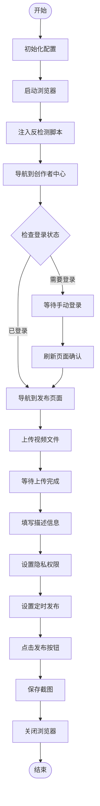

**图表来源**
- [douyin-publish.js:255-284](file://douyin-publish.js#L255-L284)

#### async/await使用场景

系统在以下关键场景中使用了async/await模式：

1. **浏览器操作**: 所有的页面交互操作都使用async/await确保顺序执行
2. **文件系统操作**: 视频文件的读取和验证使用异步模式
3. **用户交互**: 等待用户按键输入使用Promise包装
4. **网络请求**: 页面加载和元素等待使用异步处理

**章节来源**
- [douyin-publish.js:239-618](file://douyin-publish.js#L239-L618)

### 容错设计策略

系统实现了多层次的容错机制：

#### 多选择器点击策略

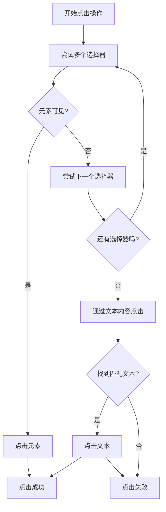

**图表来源**
- [douyin-publish.js:115-143](file://douyin-publish.js#L115-L143)

#### 重试机制实现

系统在关键操作中实现了智能重试：

1. **上传方式重试**: 当第一种上传方式失败时，自动尝试其他上传方法
2. **元素定位重试**: 对于难以定位的元素，提供多种选择器策略
3. **网络超时重试**: 对于网络相关的操作提供超时处理

#### 降级方案

当自动化操作失败时，系统提供人工干预的降级方案：

- **描述填写降级**: 自动失败时提示用户手动填写
- **隐私设置降级**: 自动设置失败时允许用户手动设置
- **定时发布降级**: 提供手动设置的时间输入

**章节来源**
- [douyin-publish.js:324-407](file://douyin-publish.js#L324-L407)
- [douyin-publish.js:427-448](file://douyin-publish.js#L427-L448)
- [douyin-publish.js:469-484](file://douyin-publish.js#L469-L484)

### 反检测技术实现

系统集成了多种反检测技术来规避平台的自动化检测：

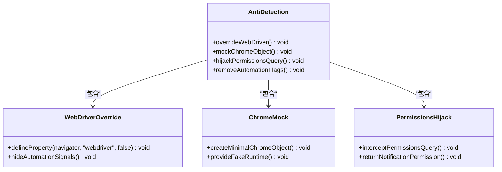

**图表来源**
- [douyin-publish.js:269-284](file://douyin-publish.js#L269-L284)

#### navigator.webdriver覆盖

系统通过修改navigator对象的webdriver属性来隐藏自动化痕迹：

```javascript
Object.defineProperty(navigator, 'webdriver', {
  get: () => false,
});
```

#### Chrome对象模拟

创建最小化的Chrome对象来满足部分检测需求：

```javascript
window.chrome = {
  runtime: {},
};
```

#### Permissions查询劫持

拦截permissions.query方法，返回正常的权限状态：

```javascript
const originalQuery = window.navigator.permissions.query;
window.navigator.permissions.query = (parameters) =>
  parameters.name === 'notifications'
    ? Promise.resolve({ state: Notification.permission })
    : originalQuery(parameters);
```

**章节来源**
- [douyin-publish.js:269-284](file://douyin-publish.js#L269-L284)

### 设计模式应用

#### 策略模式在DOM选择器中的应用

系统在DOM元素定位中大量使用了策略模式：

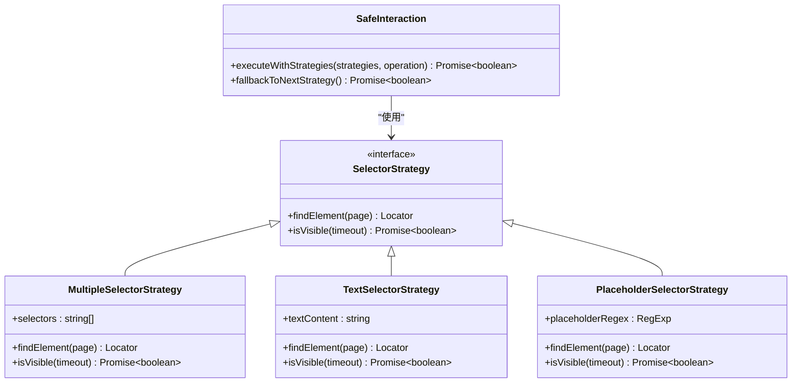

**图表来源**
- [douyin-publish.js:115-184](file://douyin-publish.js#L115-L184)

#### 工厂模式在页面元素创建中的应用

虽然代码中没有显式的工厂类，但safeClick和safeFill函数体现了工厂模式的思想：

- **统一接口**: 提供统一的元素操作接口
- **策略组合**: 支持多种不同的操作策略
- **自动选择**: 根据环境自动选择最优策略

**章节来源**
- [douyin-publish.js:115-184](file://douyin-publish.js#L115-L184)

## 依赖分析

### 外部依赖

项目的主要外部依赖是Playwright，用于浏览器自动化：

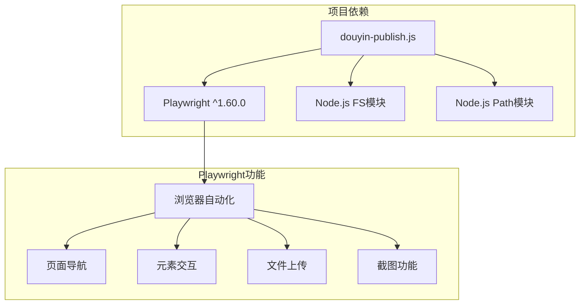

**图表来源**
- [package.json:13-15](file://package.json#L13-L15)

### 内部模块依赖

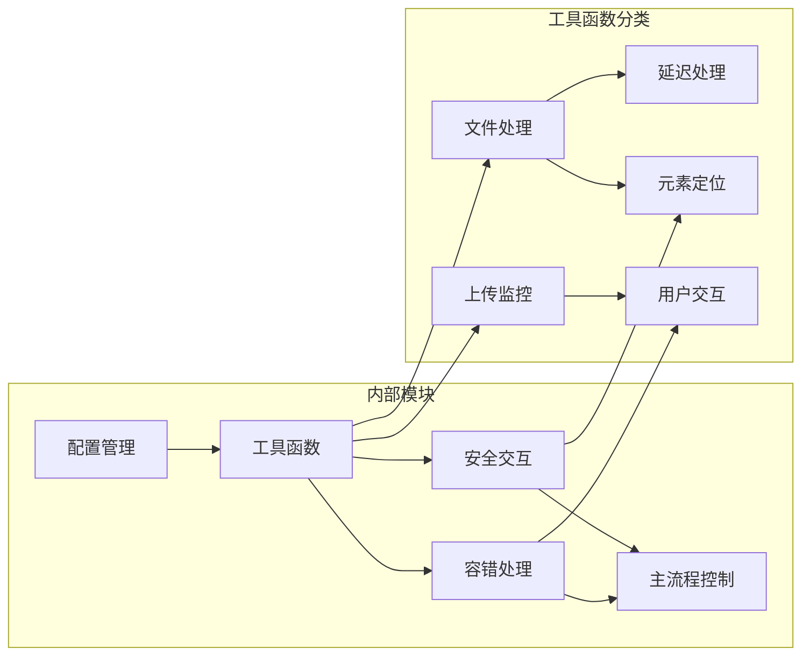

**图表来源**
- [douyin-publish.js:20-235](file://douyin-publish.js#L20-L235)

**章节来源**
- [package.json:1-17](file://package.json#L1-17)

## 性能考虑

### 并发处理

系统采用串行执行模式，确保操作的稳定性和可靠性：

- **顺序执行**: 关键操作按顺序执行，避免竞态条件
- **异步等待**: 使用Promise确保异步操作的正确时序
- **资源管理**: 合理管理浏览器资源，及时释放内存

### 错误处理策略

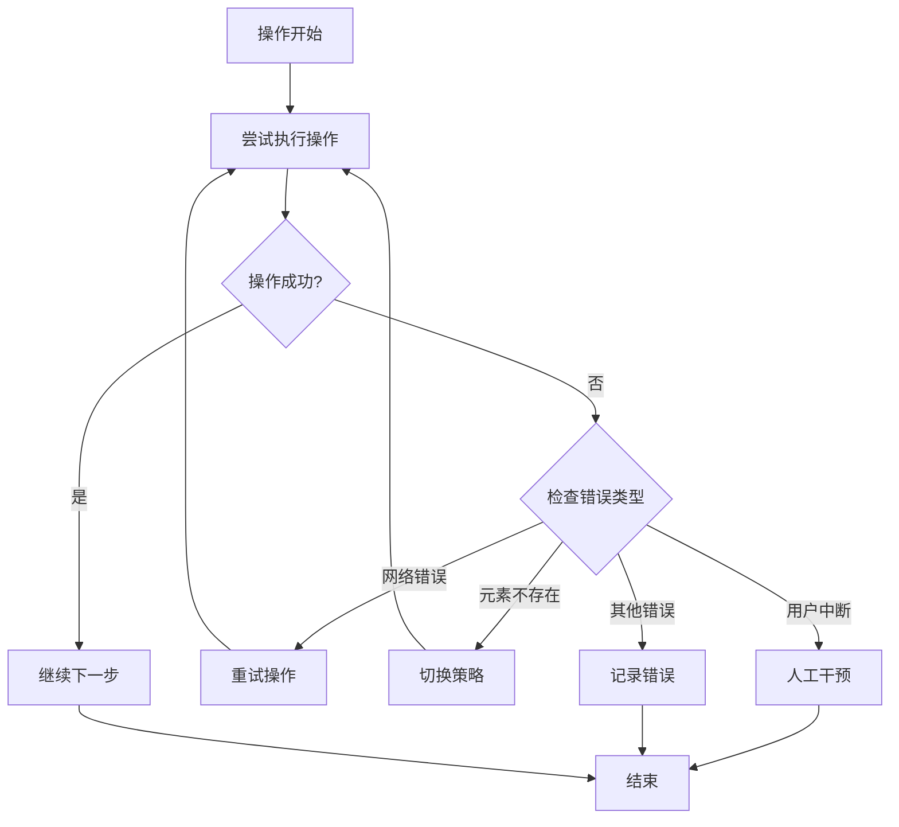

**图表来源**
- [douyin-publish.js:597-618](file://douyin-publish.js#L597-L618)

## 故障排除指南

### 常见问题及解决方案

#### 浏览器启动问题

**问题**: 浏览器无法启动或启动缓慢
**解决方案**: 
- 确保已安装Chromium浏览器
- 检查系统资源是否充足
- 调整headless模式设置

#### 登录检测问题

**问题**: 系统无法识别已登录状态
**解决方案**:
- 手动完成登录后再继续
- 检查网络连接稳定性
- 确认账号状态正常

#### 元素定位失败

**问题**: 无法找到目标元素
**解决方案**:
- 检查页面是否完全加载
- 确认选择器是否正确
- 使用开发者工具验证元素存在性

#### 上传失败

**问题**: 视频上传过程中断
**解决方案**:
- 检查网络连接质量
- 确认视频文件格式支持
- 验证磁盘空间充足

**章节来源**
- [douyin-publish.js:597-618](file://douyin-publish.js#L597-L618)

## 结论

该抖音自动发布工具展现了良好的模块化设计和工程实践：

### 设计优势

1. **模块化架构**: 清晰的功能分离，便于维护和扩展
2. **容错设计**: 多层次的错误处理和降级机制
3. **反检测技术**: 有效的自动化检测规避策略
4. **异步编程**: 现代化的异步处理模式

### 技术亮点

1. **策略模式应用**: DOM选择器的灵活策略组合
2. **工厂模式思想**: 统一的元素操作接口设计
3. **反检测集成**: 多维度的自动化检测规避
4. **用户体验**: 人性化的错误处理和提示机制

### 改进建议

1. **配置文件化**: 将硬编码配置迁移到独立配置文件
2. **日志系统**: 实现结构化的日志记录机制
3. **测试框架**: 添加单元测试和集成测试
4. **监控告警**: 实现运行时状态监控和异常告警

该工具为自动化发布场景提供了一个完整的技术解决方案，展现了现代Web自动化技术的最佳实践。