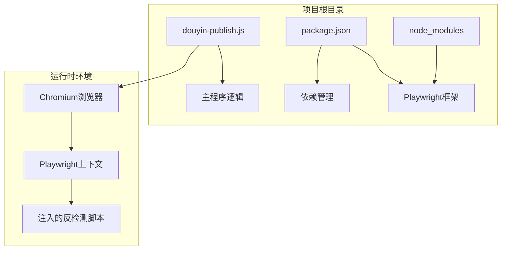
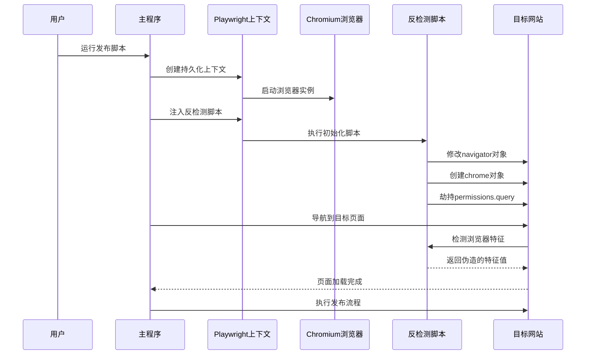
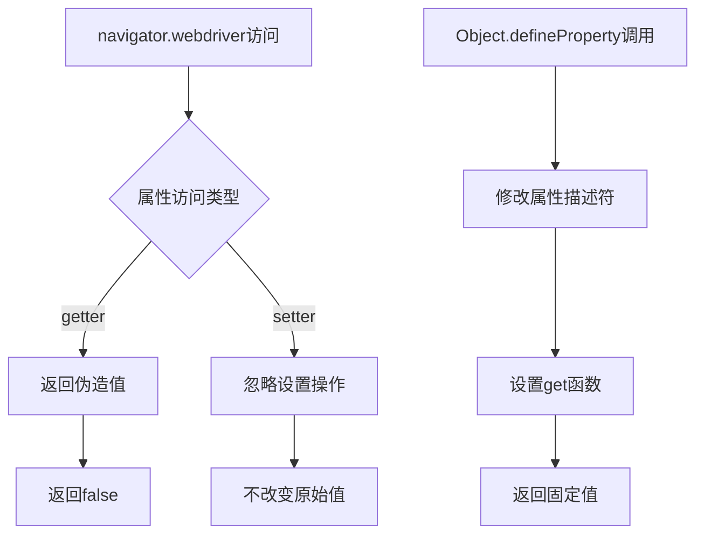
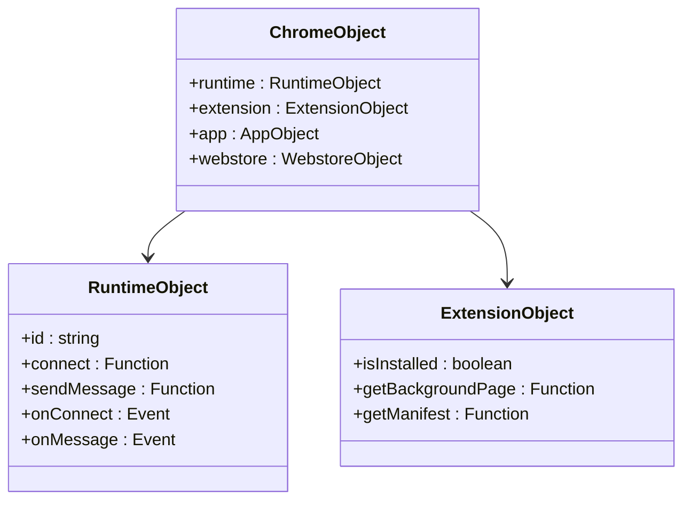
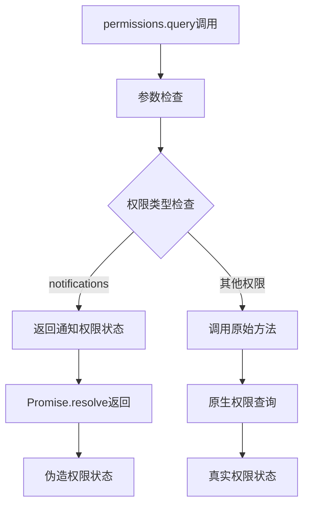
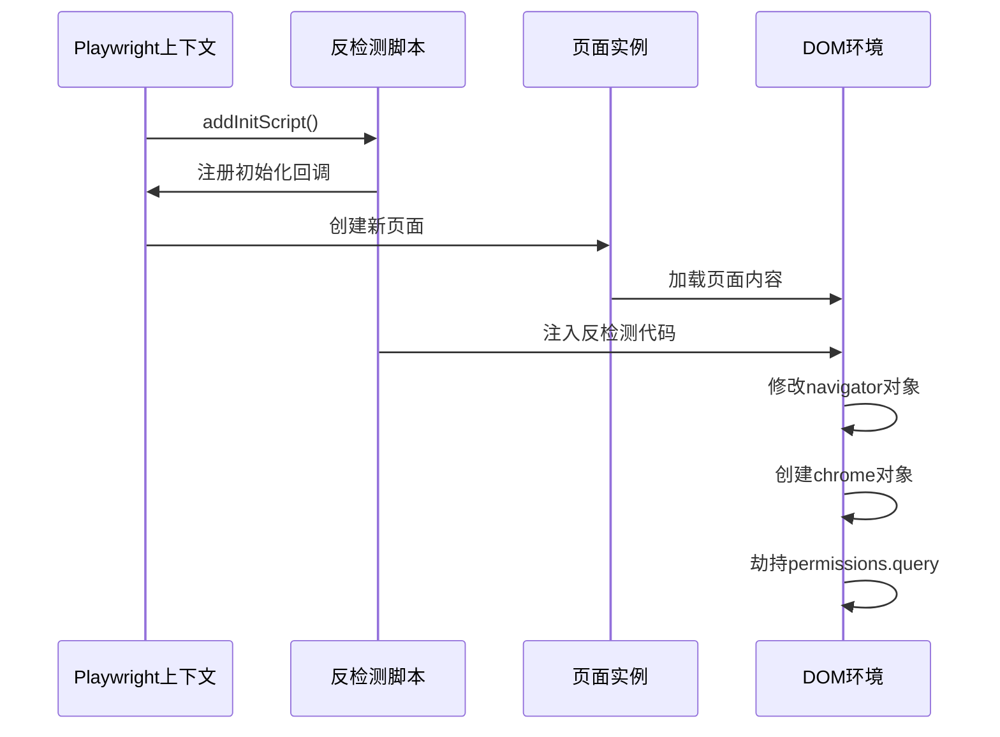
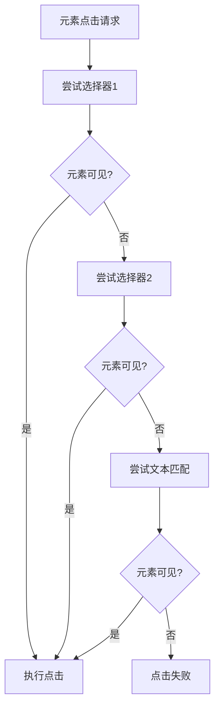
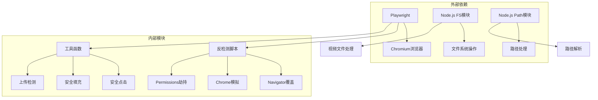

# 反检测技术实现

<cite>
**本文档引用的文件**
- [douyin-publish.js](file://douyin-publish.js)
- [package.json](file://package.json)
</cite>

## 目录
1. [简介](#简介)
2. [项目结构](#项目结构)
3. [核心组件](#核心组件)
4. [架构概览](#架构概览)
5. [详细组件分析](#详细组件分析)
6. [依赖关系分析](#依赖关系分析)
7. [性能考虑](#性能考虑)
8. [故障排除指南](#故障排除指南)
9. [结论](#结论)
10. [附录](#附录)

## 简介

本文档深入分析了抖音自动发布工具中实现的反检测技术，重点涵盖了现代Web应用检测机制的绕过策略。该工具基于Playwright框架构建，采用多层反检测技术来规避浏览器自动化检测，包括navigator.webdriver属性覆盖、Chrome对象模拟、Permissions查询劫持等核心技术。

该实现展示了如何通过浏览器上下文注入脚本来修改页面环境，使自动化脚本看起来更像真实用户的操作行为。文档将详细解释每种反检测技术的实现原理、技术细节和局限性。

## 项目结构

该项目采用简洁的单文件架构设计，主要包含一个核心JavaScript文件和标准的Node.js包配置：

**图表来源**
- [douyin-publish.js:20-266](file://douyin-publish.js#L20-L266)
- [package.json:13-15](file://package.json#L13-L15)

**章节来源**
- [douyin-publish.js:1-625](file://douyin-publish.js#L1-L625)
- [package.json:1-17](file://package.json#L1-L17)

## 核心组件

### 反检测脚本注入系统

该系统的核心是通过Playwright的`addInitScript`方法在浏览器上下文中注入反检测代码。注入的脚本包含三个关键的反检测模块：

1. **navigator.webdriver属性覆盖**
2. **Chrome对象模拟**
3. **Permissions查询劫持**

### 工具函数库

项目提供了丰富的辅助工具函数来增强自动化脚本的可靠性：

- **安全点击函数**：支持多种选择器策略和回退机制
- **安全文本填充**：模拟真实用户输入行为
- **上传完成检测**：智能监控上传进度
- **延迟函数**：控制操作节奏

**章节来源**
- [douyin-publish.js:268-284](file://douyin-publish.js#L268-L284)
- [douyin-publish.js:114-184](file://douyin-publish.js#L114-L184)

## 架构概览

该系统的整体架构采用分层设计，从底层的浏览器自动化到上层的业务逻辑都有清晰的职责划分：

**图表来源**
- [douyin-publish.js:252-284](file://douyin-publish.js#L252-L284)
- [douyin-publish.js:286-342](file://douyin-publish.js#L286-L342)

## 详细组件分析

### navigator.webdriver属性覆盖

这是最基础也是最重要的反检测技术。该技术通过`Object.defineProperty`方法直接修改`navigator.webdriver`属性的行为。

#### 实现原理

**图表来源**
- [douyin-publish.js:271-273](file://douyin-publish.js#L271-L273)

#### 技术细节

该实现使用了`Object.defineProperty`的高级特性：
- **只读属性定义**：通过`get`函数提供只读访问
- **属性描述符配置**：精确控制属性的可枚举性、可配置性
- **类型安全**：确保返回值类型符合预期

**章节来源**
- [douyin-publish.js:270-273](file://douyin-publish.js#L270-L273)

### Chrome对象模拟

现代Web应用经常检查`window.chrome`对象的存在来判断是否为Chrome浏览器。该实现通过创建一个最小化的`chrome`对象来绕过这种检测。

#### 对象结构设计

**图表来源**
- [douyin-publish.js:275-277](file://douyin-publish.js#L275-L277)

#### 实现策略

该实现采用了最小化原则：
- **必要属性保留**：只创建`runtime`对象
- **空对象模式**：其他属性保持undefined
- **兼容性考虑**：确保不会触发额外的检测逻辑

**章节来源**
- [douyin-publish.js:274-277](file://douyin-publish.js#L274-L277)

### Permissions查询劫持

这是最复杂的反检测技术，涉及对`navigator.permissions.query`方法的完整重写。

#### 方法重写机制

**图表来源**
- [douyin-publish.js:278-283](file://douyin-publish.js#L278-L283)

#### 权限处理策略

该实现采用条件重写策略：
- **通知权限特殊处理**：返回当前浏览器的通知权限状态
- **其他权限委托**：将其他权限查询转交给原生方法
- **异步处理**：保持Promise接口的一致性

**章节来源**
- [douyin-publish.js:278-283](file://douyin-publish.js#L278-L283)

### 浏览器上下文注入

#### addInitScript方法使用

**图表来源**
- [douyin-publish.js:268-284](file://douyin-publish.js#L268-L284)

#### 注入时机和作用范围

该注入机制具有以下特点：
- **页面加载前注入**：在DOM完全加载之前执行
- **全局作用域**：影响整个页面的JavaScript环境
- **持久性**：在整个页面生命周期内有效

**章节来源**
- [douyin-publish.js:268-284](file://douyin-publish.js#L268-L284)

### 工具函数系统

#### 安全点击机制

该系统实现了多层次的元素定位策略：

**图表来源**
- [douyin-publish.js:115-143](file://douyin-publish.js#L115-L143)

#### 文本填充模拟

该功能模拟真实用户输入行为：
- **逐字符输入**：通过`delay`参数控制输入速度
- **内容清理**：先清空再输入新内容
- **可见性检查**：确保元素在操作前可见

**章节来源**
- [douyin-publish.js:148-184](file://douyin-publish.js#L148-L184)

## 依赖关系分析

### 核心依赖关系

**图表来源**
- [douyin-publish.js:20-23](file://douyin-publish.js#L20-L23)
- [package.json:13-15](file://package.json#L13-L15)

### 版本兼容性

该实现与Playwright版本的兼容性：
- **最低版本要求**：Playwright ^1.60.0
- **Chromium通道**：使用系统Chrome浏览器
- **Node.js版本**：支持现代Node.js版本

**章节来源**
- [package.json:13-15](file://package.json#L13-L15)
- [douyin-publish.js:255-266](file://douyin-publish.js#L255-L266)

## 性能考虑

### 注入脚本性能

反检测脚本的设计考虑了性能优化：
- **最小化DOM操作**：只进行必要的属性修改
- **避免阻塞**：使用异步方法处理权限查询
- **内存效率**：不创建不必要的对象

### 运行时性能

自动化脚本的性能优化策略：
- **操作间隔控制**：通过`actionDelay`参数控制操作节奏
- **智能等待机制**：根据页面状态动态调整等待时间
- **资源管理**：合理管理浏览器资源和内存使用

## 故障排除指南

### 常见问题诊断

#### 反检测失效

**症状**：目标网站仍然检测到自动化

**可能原因**：
- 注入脚本执行时机问题
- 属性覆盖被后续代码重写
- 权限查询逻辑被绕过

**解决方案**：
- 检查`addInitScript`的执行顺序
- 验证属性描述符的配置
- 扩展权限查询劫持逻辑

#### 页面元素定位失败

**症状**：自动化脚本无法找到目标元素

**可能原因**：
- 页面结构变化
- 动态加载内容
- 选择器过于具体

**解决方案**：
- 使用更灵活的选择器策略
- 实现元素存在性检查
- 添加重试机制

#### 上传失败

**症状**：视频上传过程中断

**可能原因**：
- 网络连接不稳定
- 页面元素状态变化
- 文件格式不支持

**解决方案**：
- 实现上传进度监控
- 添加错误重试逻辑
- 验证文件格式和大小

**章节来源**
- [douyin-publish.js:189-235](file://douyin-publish.js#L189-L235)
- [douyin-publish.js:597-618](file://douyin-publish.js#L597-L618)

## 结论

该抖音自动发布工具展示了一套完整的反检测技术实现方案。通过多层技术手段的组合使用，有效绕过了现代Web应用的自动化检测机制。

### 技术优势

1. **多层次防护**：同时处理多个检测点
2. **实时适配**：能够适应目标网站的变化
3. **用户体验**：保持操作的真实性和流畅性

### 技术局限性

1. **检测技术演进**：检测机制持续升级
2. **平台政策风险**：可能违反服务条款
3. **维护成本**：需要持续更新以应对变化

### 最佳实践建议

1. **渐进式部署**：逐步引入反检测技术
2. **监控机制**：建立效果监控和日志记录
3. **合规性审查**：确保符合相关法律法规
4. **备份方案**：准备人工操作的后备方案

## 附录

### 安全考虑

#### 隐私保护

- 不收集用户个人信息
- 不存储敏感数据
- 遵守数据保护法规

#### 平台合规

- 遵循抖音平台使用条款
- 避免批量自动化操作
- 尊重平台服务限制

#### 技术安全

- 输入验证和清理
- 错误处理和恢复
- 资源管理和释放

### 扩展建议

#### 技术演进方向

1. **机器学习检测对抗**：使用AI技术识别和绕过新的检测机制
2. **分布式执行**：通过多实例执行提高成功率
3. **行为模拟**：更精细地模拟人类用户行为

#### 功能扩展

1. **多平台支持**：扩展到其他社交媒体平台
2. **内容管理**：集成内容创作和管理功能
3. **数据分析**：提供发布效果分析和报告