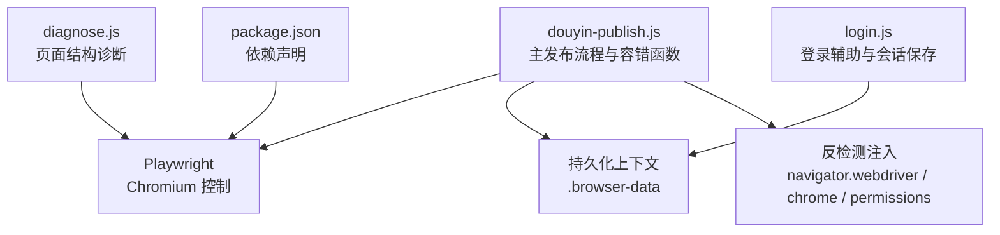
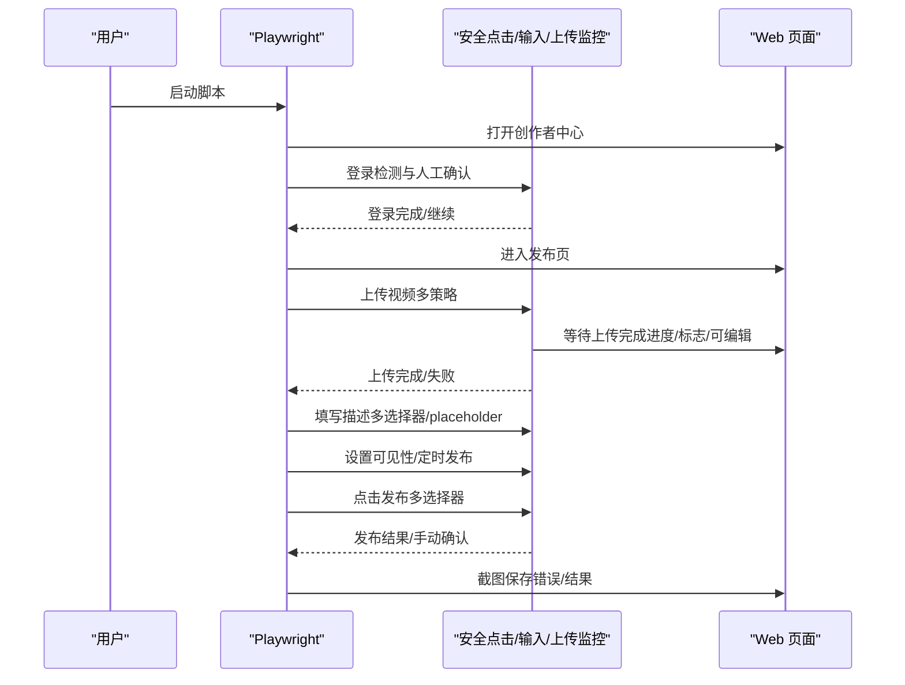
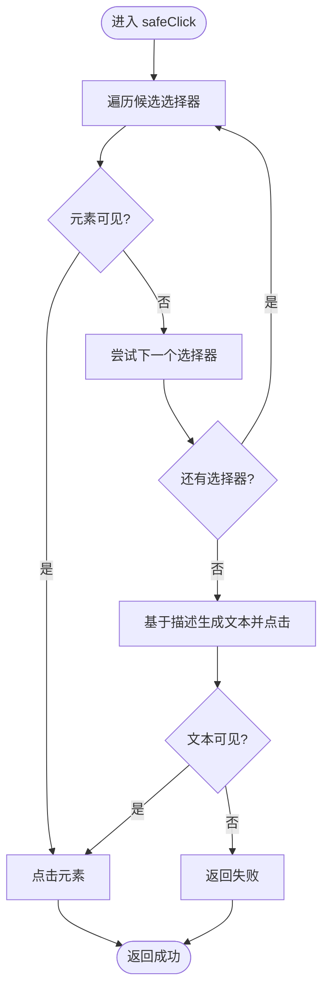
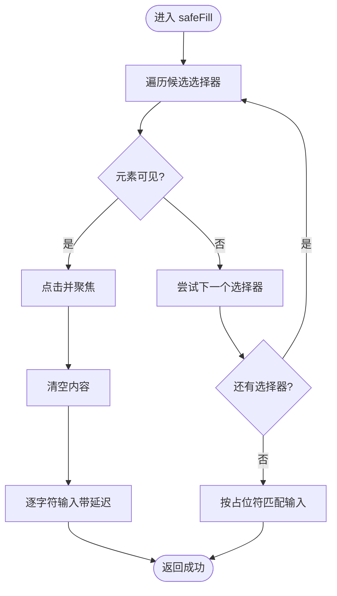
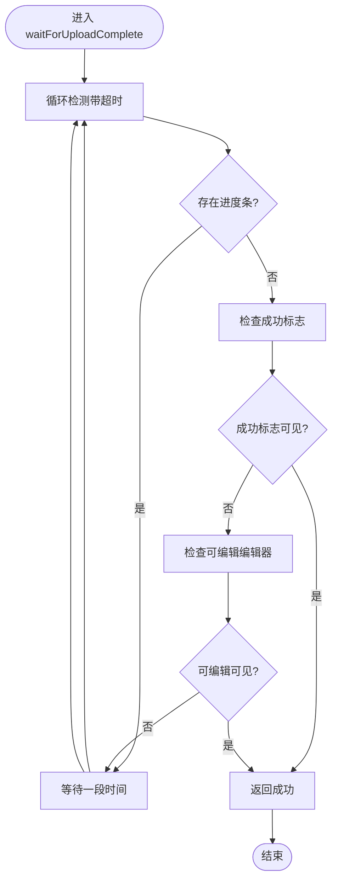
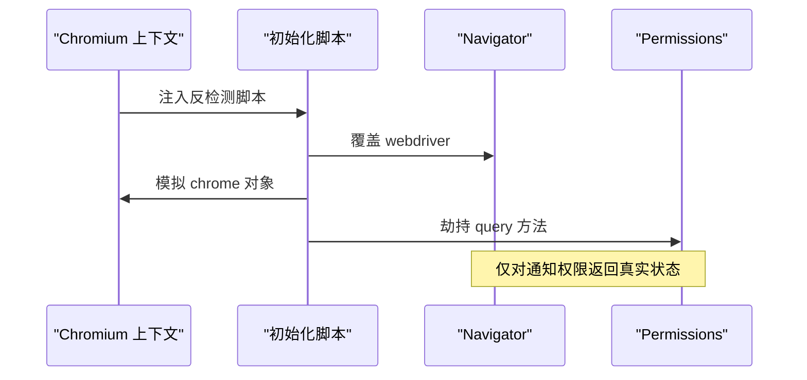
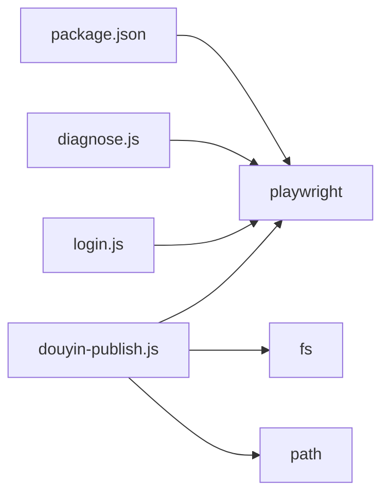

# 容错设计策略

<cite>
**本文引用的文件**
- [douyin-publish.js](file://douyin-publish.js)
- [package.json](file://package.json)
- [diagnose.js](file://diagnose.js)
- [login.js](file://login.js)
</cite>

## 目录
1. [简介](#简介)
2. [项目结构](#项目结构)
3. [核心组件](#核心组件)
4. [架构总览](#架构总览)
5. [详细组件分析](#详细组件分析)
6. [依赖关系分析](#依赖关系分析)
7. [性能考量](#性能考量)
8. [故障排查指南](#故障排查指南)
9. [结论](#结论)
10. [附录](#附录)

## 简介
本文件针对抖音自动发布工具的容错设计策略进行系统性梳理与说明，重点覆盖以下方面：
- 多选择器点击策略：safeClick 的备选机制与失败重试逻辑
- 文本输入容错：逐字符输入、placeholder 匹配与输入验证
- 上传监控容错：waitForUploadComplete 的进度检测、超时与状态判断
- 反检测技术：navigator.webdriver 覆盖、Chrome 对象模拟、Permissions 查询劫持
- 错误恢复与降级：手动干预触发、截图保存、状态记录
- 故障场景与对策：常见问题与对应容错处理
- 性能影响与优化建议

## 项目结构
该仓库包含一个主发布脚本、一个诊断脚本、一个登录辅助脚本以及基础依赖配置。整体采用单入口脚本驱动，通过 Playwright 控制 Chromium 实例，结合持久化上下文与反检测注入实现稳定自动化。

图表来源
- [douyin-publish.js:252-284](file://douyin-publish.js#L252-L284)
- [diagnose.js:7-15](file://diagnose.js#L7-L15)
- [login.js:7-18](file://login.js#L7-L18)
- [package.json:13-15](file://package.json#L13-L15)

章节来源
- [douyin-publish.js:1-625](file://douyin-publish.js#L1-L625)
- [package.json:1-17](file://package.json#L1-L17)

## 核心组件
- 安全点击 safeClick：多选择器备选 + 文本点击兜底 + 可见性校验 + 超时控制
- 安全文本输入 safeFill：多选择器备选 + placeholder 匹配 + 逐字符输入 + 清空与延迟
- 上传监控 waitForUploadComplete：进度条检测 + 成功标志 + 编辑器可用性 + 超时与轮询
- 反检测注入：navigator.webdriver 覆盖、window.chrome 模拟、permissions.query 劫持
- 手动干预与截图：登录检测、错误截图、发布前/后截图、状态记录

章节来源
- [douyin-publish.js:112-184](file://douyin-publish.js#L112-L184)
- [douyin-publish.js:186-235](file://douyin-publish.js#L186-L235)
- [douyin-publish.js:268-284](file://douyin-publish.js#L268-L284)
- [douyin-publish.js:549-595](file://douyin-publish.js#L549-L595)

## 架构总览
整体流程由“登录检测 -> 进入发布页 -> 上传视频 -> 等待上传完成 -> 填写描述 -> 设置可见性 -> 设置定时发布 -> 确认发布”构成。每个关键步骤均配有容错与降级策略，并在异常时保存截图以便定位问题。

图表来源
- [douyin-publish.js:288-617](file://douyin-publish.js#L288-L617)

## 详细组件分析

### 多选择器点击策略（safeClick）
- 设计目标：应对页面结构变化导致的选择器失效，提升点击成功率
- 实现要点
  - 多选择器遍历：对一组候选选择器逐一尝试，先可见性校验再点击
  - 文本点击兜底：当选择器均不可用时，基于描述文本构造文本匹配并点击
  - 超时与容错：每个步骤设置合理超时，捕获异常并继续下一个候选
  - 返回值：成功返回 true，失败返回 false 并输出警告日志
- 适用场景
  - “发布视频”“谁可以看”“定时发布”“发布按钮”等关键交互
- 失败重试逻辑
  - 通过外层调用方的条件判断决定是否回退到直接导航或人工确认

图表来源
- [douyin-publish.js:115-143](file://douyin-publish.js#L115-L143)

章节来源
- [douyin-publish.js:112-143](file://douyin-publish.js#L112-L143)

### 文本输入容错（safeFill）
- 设计目标：提升输入稳定性，模拟真实人类输入行为
- 实现要点
  - 多选择器备选：优先使用编辑器类选择器，兼容多种富文本/文本域
  - placeholder 匹配：当选择器不可用时，通过正则匹配“描述/标题/说说”占位符
  - 逐字符输入：使用 type 并设置字符间延迟，降低被风控概率
  - 输入前清空：先 click 再 fill('')，再 type，保证干净输入
  - 可见性与超时：每步可见性校验与超时控制
- 适用场景
  - 作品主题/描述/标题等文本输入
- 输入验证机制
  - 通过后续步骤（如编辑器可用性）间接验证输入是否生效

图表来源
- [douyin-publish.js:148-184](file://douyin-publish.js#L148-L184)

章节来源
- [douyin-publish.js:145-184](file://douyin-publish.js#L145-L184)

### 上传监控容错（waitForUploadComplete）
- 设计目标：在不确定页面结构的情况下，可靠判断上传完成状态
- 实现要点
  - 轮询检测：固定周期检查进度条是否存在
  - 多态判定：
    - 无进度条：检查成功标志（success/done/finish/complete）
    - 可编辑编辑器出现：表示上传完成且可编辑
  - 进度展示：尝试读取进度文本，实时反馈
  - 超时控制：超过最大等待时间返回失败
- 适用场景
  - 视频上传阶段的状态监控与超时处理
- 失败处理
  - 返回 false，调用方可决定是否退出或人工介入

图表来源
- [douyin-publish.js:189-235](file://douyin-publish.js#L189-L235)

章节来源
- [douyin-publish.js:186-235](file://douyin-publish.js#L186-L235)

### 反检测技术容错
- navigator.webdriver 覆盖：将 navigator.webdriver 设为 false，绕过简单检测
- window.chrome 模拟：注入 window.chrome 对象，避免缺失特征
- Permissions 查询劫持：拦截 permissions.query，对通知权限返回真实状态，其他权限走原始逻辑
- 注入位置：在持久化上下文中添加初始化脚本，确保页面加载即生效
- 作用范围：全局页面生命周期内有效，减少被识别为自动化

图表来源
- [douyin-publish.js:268-284](file://douyin-publish.js#L268-L284)

章节来源
- [douyin-publish.js:268-284](file://douyin-publish.js#L268-L284)

### 错误恢复与降级方案
- 登录检测与人工确认
  - 通过元素可见性判断是否需要登录，若需要则等待用户手动完成登录并回车继续
- 上传失败降级
  - 提供三种上传策略：file input 直传、点击上传区域后再传、filechooser 事件
  - 若均失败，输出错误并退出，避免死循环
- 输入失败降级
  - safeFill 失败时，提示用户手动填写并等待回车继续
- 发布失败降级
  - safeClick 失败时，提示用户手动点击发布按钮
- 截图与状态记录
  - 发布前截图保存，便于核对设置
  - 错误时保存错误截图，便于定位问题
  - 发布后截图保存，便于确认结果
- 手动干预触发
  - 在关键节点（登录、输入、定时时间设置、发布）插入等待用户回车的逻辑

章节来源
- [douyin-publish.js:294-319](file://douyin-publish.js#L294-L319)
- [douyin-publish.js:350-407](file://douyin-publish.js#L350-L407)
- [douyin-publish.js:427-448](file://douyin-publish.js#L427-L448)
- [douyin-publish.js:469-484](file://douyin-publish.js#L469-L484)
- [douyin-publish.js:506-542](file://douyin-publish.js#L506-L542)
- [douyin-publish.js:549-595](file://douyin-publish.js#L549-L595)
- [douyin-publish.js:597-607](file://douyin-publish.js#L597-L607)

## 依赖关系分析
- 依赖 Playwright：用于浏览器控制、页面交互、事件监听与截图
- 依赖 Node FS：用于读取视频文件与目录扫描
- 依赖 Node Path：用于路径拼接与跨平台兼容
- 诊断与登录脚本：独立于主流程，用于页面结构分析与会话保存

图表来源
- [package.json:13-15](file://package.json#L13-L15)
- [douyin-publish.js:20-22](file://douyin-publish.js#L20-L22)
- [diagnose.js:4](file://diagnose.js#L4)
- [login.js:4](file://login.js#L4)

章节来源
- [package.json:1-17](file://package.json#L1-L17)
- [douyin-publish.js:20-22](file://douyin-publish.js#L20-L22)

## 性能考量
- 操作间隔与慢动作
  - 通过 slowMo 与自定义 delay 控制操作节奏，降低被风控概率
  - 建议在稳定网络与页面结构下适当降低 delay，以提升吞吐量
- 轮询与超时
  - waitForUploadComplete 的轮询周期与最大等待时间需平衡准确性与耗时
  - 建议根据视频大小动态调整最大等待时间
- 可见性校验与超时
  - 多处使用 isVisible + timeout，避免长时间阻塞
  - 建议在高频调用处缓存部分可见性结果（谨慎使用）
- 截图成本
  - 错误截图与发布前后截图会增加 I/O 开销
  - 建议仅在必要时截图，并控制截图质量

[本节为通用性能建议，不直接分析具体文件]

## 故障排查指南
- 常见故障场景与对策
  - 登录未完成：脚本检测到登录元素时会等待用户手动登录；确认登录成功后回车继续
  - 上传失败：依次尝试三种上传策略；若仍失败，退出并提示检查页面元素
  - 输入失败：safeFill 失败时提示手动填写；确认输入后回车继续
  - 可见性设置失败：safeClick 失败时提示手动设置；确认设置后回车继续
  - 定时发布失败：safeClick 失败时提示手动设置；确认设置后回车继续
  - 发布按钮点击失败：safeClick 失败时提示手动点击；确认发布后回车继续
- 截图定位
  - 错误截图：保存在视频目录，便于定位问题
  - 发布前/后截图：保存在视频目录，便于核对设置与结果
- 诊断脚本
  - 使用 diagnose.js 获取页面元素结构、上传区域 HTML 片段，辅助选择器优化
- 登录辅助
  - 使用 login.js 先完成登录并保存 session，避免每次运行都手动登录

章节来源
- [douyin-publish.js:294-319](file://douyin-publish.js#L294-L319)
- [douyin-publish.js:350-407](file://douyin-publish.js#L350-L407)
- [douyin-publish.js:427-448](file://douyin-publish.js#L427-L448)
- [douyin-publish.js:469-484](file://douyin-publish.js#L469-L484)
- [douyin-publish.js:506-542](file://douyin-publish.js#L506-L542)
- [douyin-publish.js:549-595](file://douyin-publish.js#L549-L595)
- [douyin-publish.js:597-607](file://douyin-publish.js#L597-L607)
- [diagnose.js:7-142](file://diagnose.js#L7-L142)
- [login.js:7-74](file://login.js#L7-L74)

## 结论
本工具通过多选择器点击、逐字符输入、上传监控与反检测注入等手段构建了完善的容错体系。在面对页面结构变化、网络波动与风控检测时，能够通过多种策略与人工干预实现稳健运行。建议在实际使用中结合诊断脚本持续优化选择器，并根据业务场景调整超时与延迟参数，以获得最佳的稳定性与性能平衡。

[本节为总结性内容，不直接分析具体文件]

## 附录
- 诊断脚本用途：分析页面元素结构、上传区域 HTML、按钮与文本编辑器等，辅助优化选择器
- 登录脚本用途：先完成登录并保存会话，避免重复登录流程

章节来源
- [diagnose.js:1-143](file://diagnose.js#L1-L143)
- [login.js:1-75](file://login.js#L1-L75)