# 异步编程模式

<cite>
**本文档引用的文件**
- [douyin-publish.js](file://douyin-publish.js)
- [package.json](file://package.json)
</cite>

## 目录
1. [简介](#简介)
2. [项目结构](#项目结构)
3. [核心组件](#核心组件)
4. [架构概览](#架构概览)
5. [详细组件分析](#详细组件分析)
6. [异步模式深度解析](#异步模式深度解析)
7. [Promise链式调用分析](#promise链式调用分析)
8. [async/await最佳实践](#asyncawait最佳实践)
9. [并发处理与Promise.all](#并发处理与promiseall)
10. [异步队列管理](#异步队列管理)
11. [错误处理策略](#错误处理策略)
12. [性能优化技巧](#性能优化技巧)
13. [故障排除指南](#故障排除指南)
14. [结论](#结论)

## 简介

本文档深入分析了抖音自动发布工具中的异步编程模式，重点研究了Playwright操作中的Promise链式调用、async/await关键字的使用场景和最佳实践。该工具通过自动化的方式完成抖音创作者中心的视频发布流程，包括页面导航、元素交互、等待机制等复杂的异步操作。

该工具展现了现代Web自动化测试中常见的异步编程模式，包括：
- Promise链式调用在页面操作中的应用
- async/await关键字的正确使用
- Promise.all并发处理的实际应用
- 异步队列管理和操作延迟控制
- 错误处理策略和超时控制机制

## 项目结构

该项目采用简洁的单文件架构设计，主要包含以下核心组件：

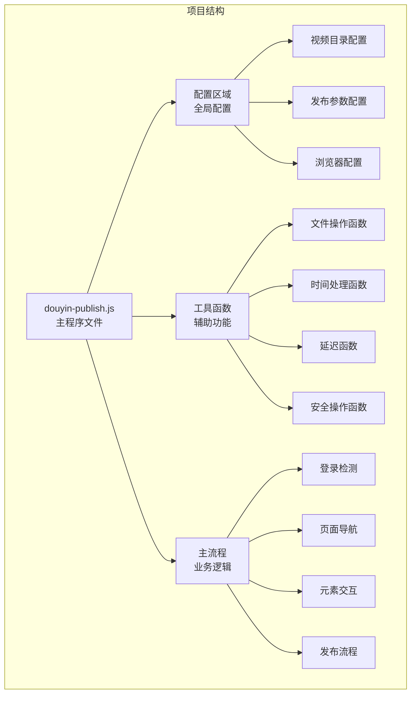

**图表来源**
- [douyin-publish.js:24-53](file://douyin-publish.js#L24-L53)
- [douyin-publish.js:56-184](file://douyin-publish.js#L56-L184)
- [douyin-publish.js:239-618](file://douyin-publish.js#L239-L618)

**章节来源**
- [douyin-publish.js:1-625](file://douyin-publish.js#L1-L625)
- [package.json:1-17](file://package.json#L1-L17)

## 核心组件

### 配置管理系统

系统采用集中式配置管理模式，所有可调整参数都集中在CONFIG对象中：

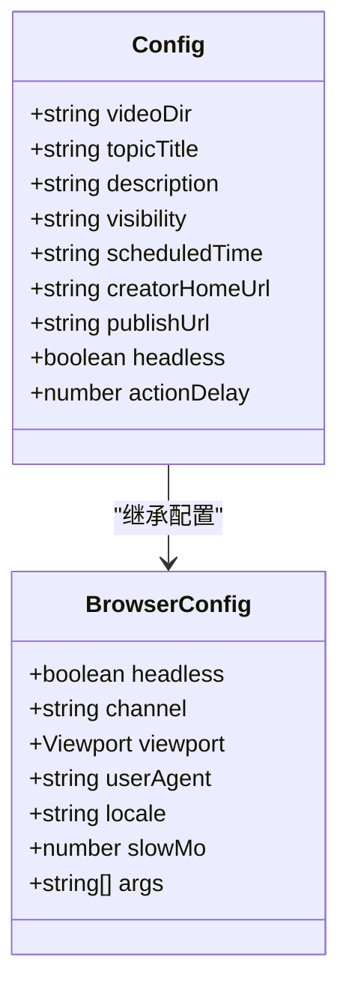

**图表来源**
- [douyin-publish.js:25-53](file://douyin-publish.js#L25-L53)
- [douyin-publish.js:255-266](file://douyin-publish.js#L255-L266)

### 工具函数模块

系统提供了多个专用工具函数来处理不同的异步操作场景：

**章节来源**
- [douyin-publish.js:57-83](file://douyin-publish.js#L57-L83)
- [douyin-publish.js:85-103](file://douyin-publish.js#L85-L103)
- [douyin-publish.js:105-110](file://douyin-publish.js#L105-L110)
- [douyin-publish.js:113-143](file://douyin-publish.js#L113-L143)
- [douyin-publish.js:145-184](file://douyin-publish.js#L145-L184)
- [douyin-publish.js:187-235](file://douyin-publish.js#L187-L235)

## 架构概览

整个系统采用模块化架构设计，通过清晰的职责分离实现了高可维护性和扩展性：

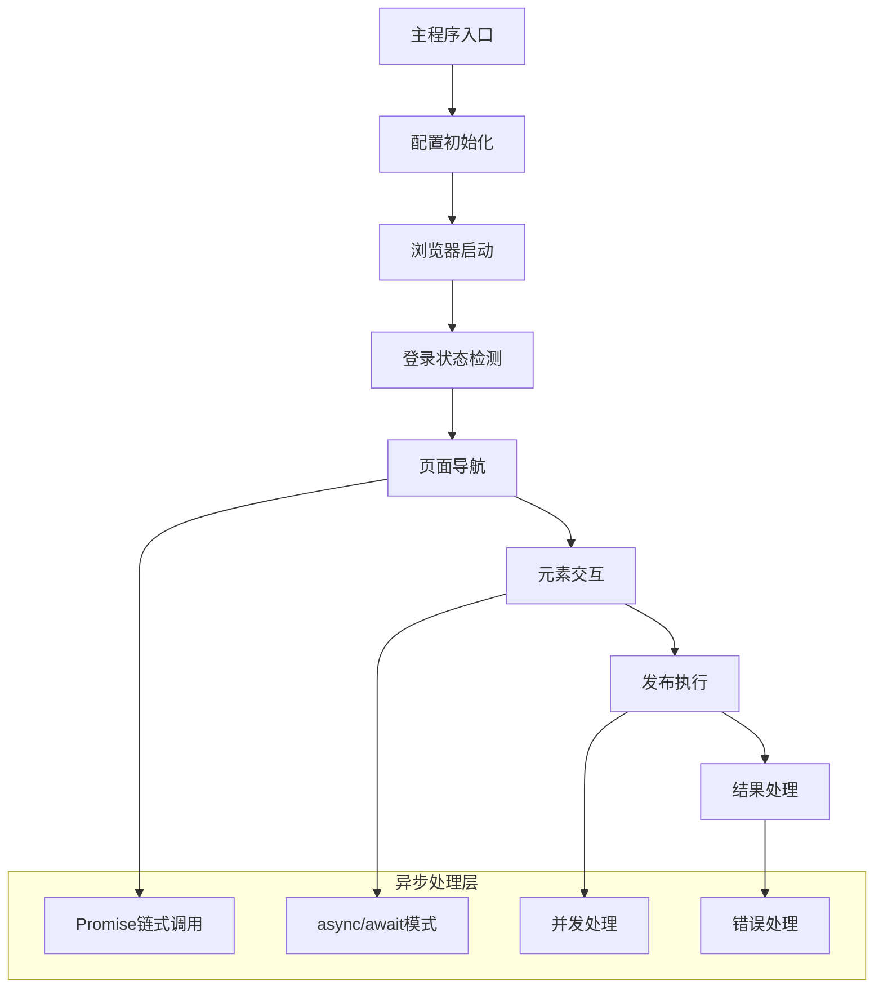

**图表来源**
- [douyin-publish.js:239-618](file://douyin-publish.js#L239-L618)

## 详细组件分析

### 页面导航与元素交互

系统实现了完整的页面导航和元素交互流程，采用了多种策略来确保操作的可靠性：

#### 安全点击机制

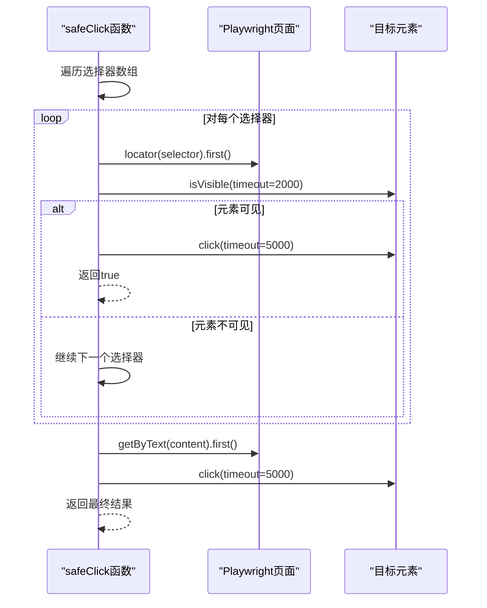

**图表来源**
- [douyin-publish.js:115-143](file://douyin-publish.js#L115-L143)

#### 安全文本填充

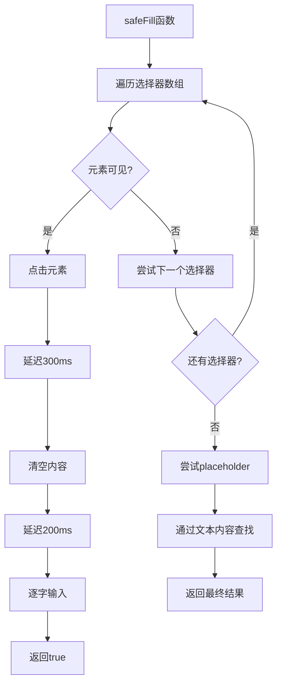

**图表来源**
- [douyin-publish.js:148-184](file://douyin-publish.js#L148-L184)

**章节来源**
- [douyin-publish.js:113-184](file://douyin-publish.js#L113-L184)

### 上传完成检测机制

系统实现了智能的上传完成检测，通过多种策略组合确保准确性：

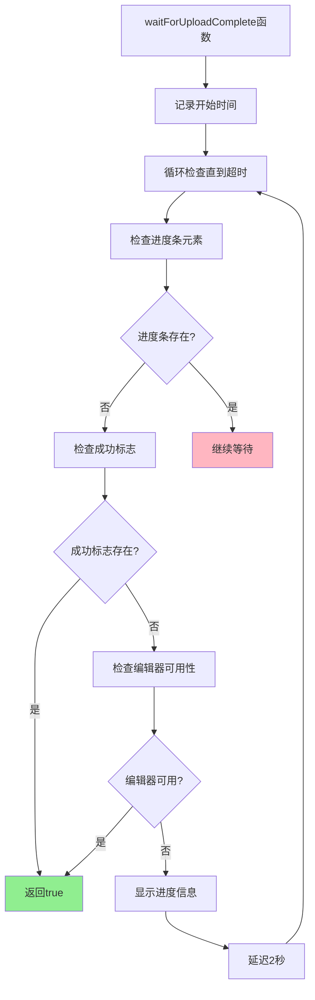

**图表来源**
- [douyin-publish.js:189-235](file://douyin-publish.js#L189-L235)

**章节来源**
- [douyin-publish.js:187-235](file://douyin-publish.js#L187-L235)

## 异步模式深度解析

### Promise链式调用的应用

系统在多个关键场景中运用了Promise链式调用模式：

#### 文件选择器等待

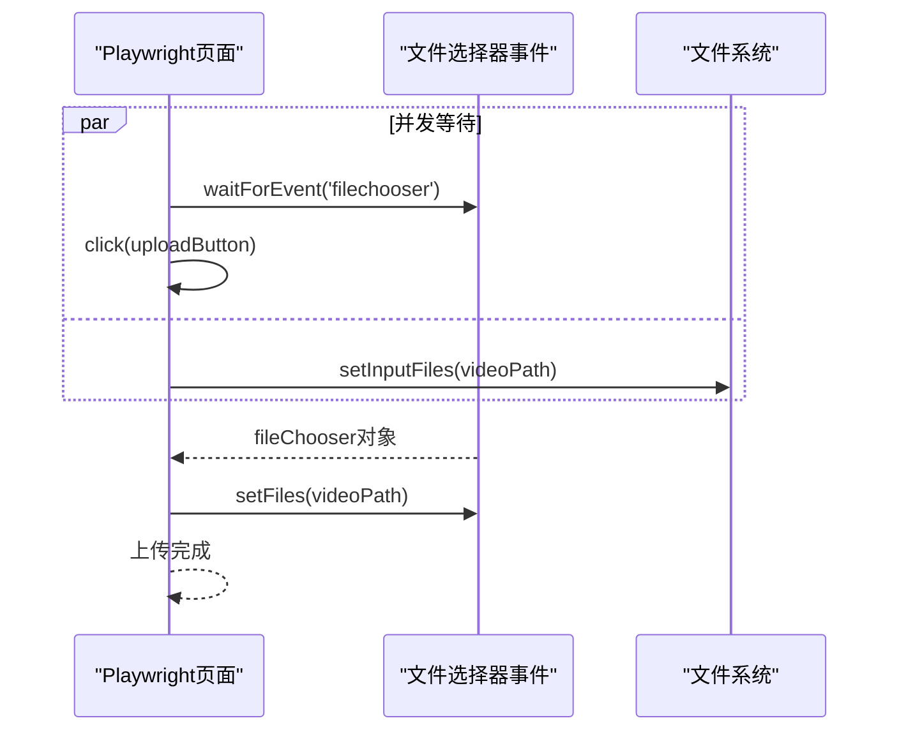

**图表来源**
- [douyin-publish.js:391-401](file://douyin-publish.js#L391-L401)

#### 用户交互等待

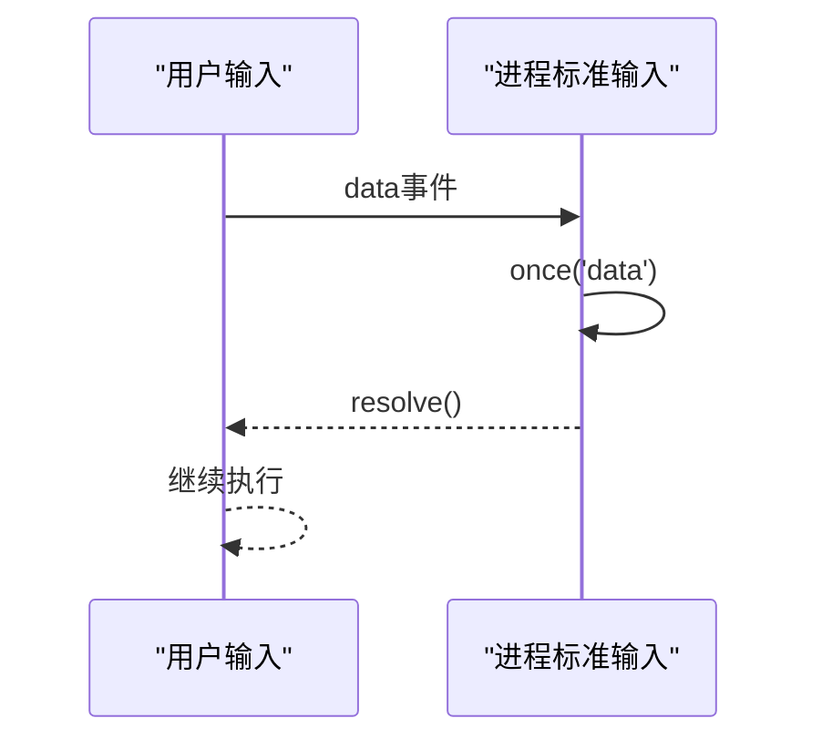

**图表来源**
- [douyin-publish.js:307-311](file://douyin-publish.js#L307-L311)
- [douyin-publish.js:445-447](file://douyin-publish.js#L445-L447)
- [douyin-publish.js:557-559](file://douyin-publish.js#L557-L559)

**章节来源**
- [douyin-publish.js:391-401](file://douyin-publish.js#L391-L401)
- [douyin-publish.js:307-311](file://douyin-publish.js#L307-L311)
- [douyin-publish.js:445-447](file://douyin-publish.js#L445-L447)
- [douyin-publish.js:557-559](file://douyin-publish.js#L557-L559)

### async/await最佳实践

系统展示了多种async/await的正确使用模式：

#### 异常安全的异步操作

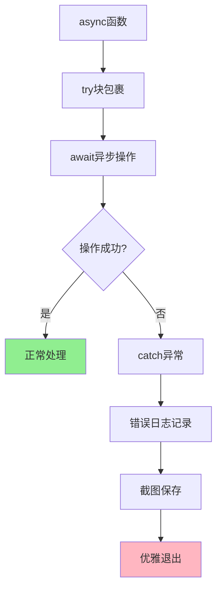

**图表来源**
- [douyin-publish.js:597-617](file://douyin-publish.js#L597-L617)

#### 可选操作的安全处理

```mermaid
flowchart TD
A[可选操作] --> B[await操作.catch()]
B --> C{捕获异常?}
C --> |是| D[忽略错误]
C --> |否| E[继续执行]
D --> F[继续下一个步骤]
E --> G[继续执行]
```

**图表来源**
- [douyin-publish.js:197-198](file://douyin-publish.js#L197-L198)
- [douyin-publish.js:203-204](file://douyin-publish.js#L203-L204)
- [douyin-publish.js:212-213](file://douyin-publish.js#L212-L213)

**章节来源**
- [douyin-publish.js:597-617](file://douyin-publish.js#L597-L617)
- [douyin-publish.js:197-213](file://douyin-publish.js#L197-L213)

## Promise链式调用分析

### 链式调用模式的实现

系统广泛采用了Promise链式调用模式来处理复杂的异步操作序列：

#### 多步骤验证流程

```mermaid
sequenceDiagram
participant V as "验证函数"
participant P as "Playwright页面"
participant E as "元素"
V->>P : locator(selector).first()
P->>E : isVisible(timeout)
E-->>V : Promise<boolean>
V->>V : then(result => {
if (result) { ... }
})
V->>E : click(timeout)
E-->>V : Promise<void>
V->>V : then(() => {
// 下一步操作
})
```

**图表来源**
- [douyin-publish.js:118-123](file://douyin-publish.js#L118-L123)
- [douyin-publish.js:153-161](file://douyin-publish.js#L153-L161)

#### 条件分支处理

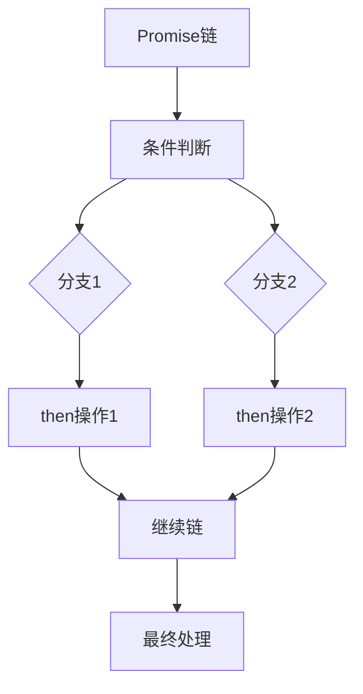

**图表来源**
- [douyin-publish.js:354-363](file://douyin-publish.js#L354-L363)
- [douyin-publish.js:366-385](file://douyin-publish.js#L366-L385)

**章节来源**
- [douyin-publish.js:118-123](file://douyin-publish.js#L118-L123)
- [douyin-publish.js:354-385](file://douyin-publish.js#L354-L385)

## async/await最佳实践

### 错误处理策略

系统实现了多层次的错误处理策略：

#### 分层错误处理

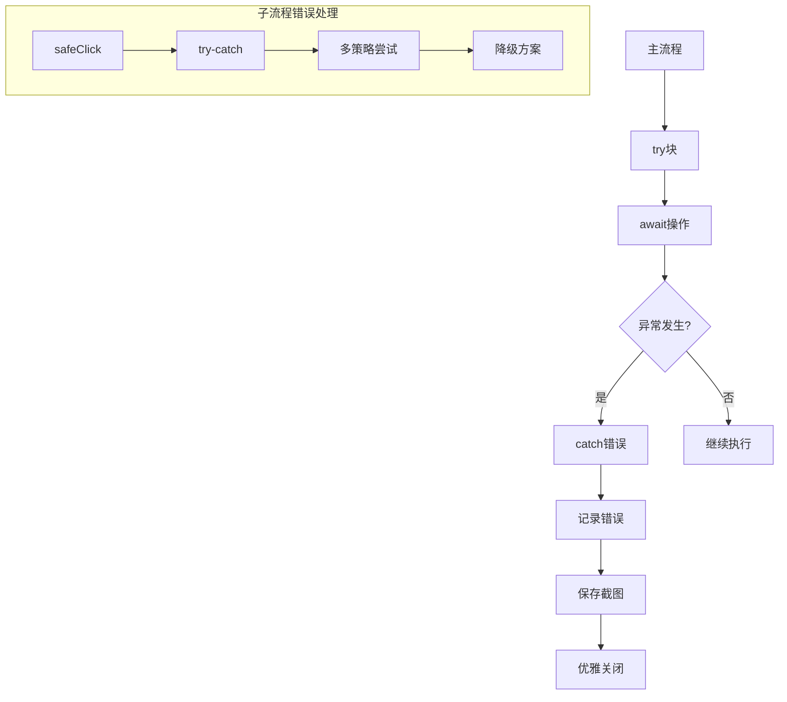

**图表来源**
- [douyin-publish.js:597-617](file://douyin-publish.js#L597-L617)
- [douyin-publish.js:115-143](file://douyin-publish.js#L115-L143)

#### 超时控制机制

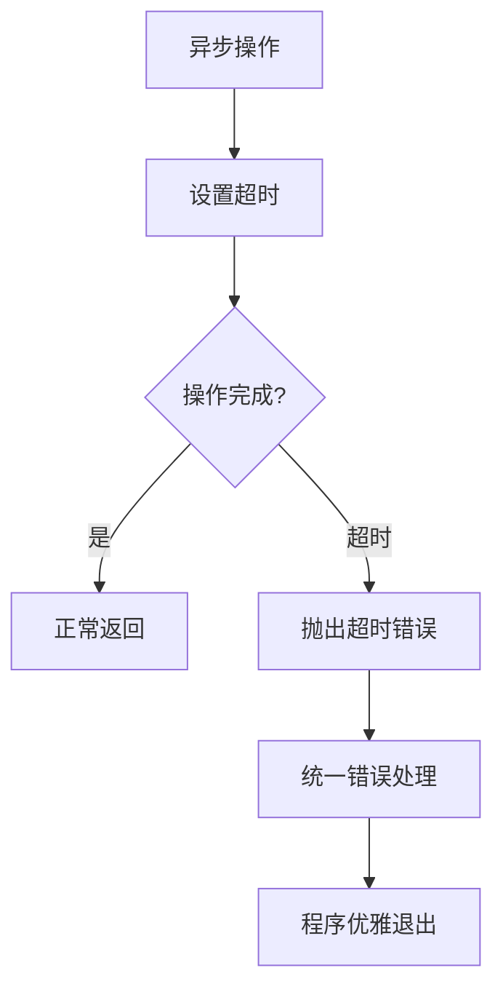

**图表来源**
- [douyin-publish.js:119-120](file://douyin-publish.js#L119-L120)
- [douyin-publish.js:152-153](file://douyin-publish.js#L152-L153)

**章节来源**
- [douyin-publish.js:597-617](file://douyin-publish.js#L597-L617)
- [douyin-publish.js:115-153](file://douyin-publish.js#L115-L153)

## 并发处理与Promise.all

### Promise.all的应用实例

系统在文件上传过程中巧妙地运用了Promise.all进行并发处理：

#### 并发等待策略

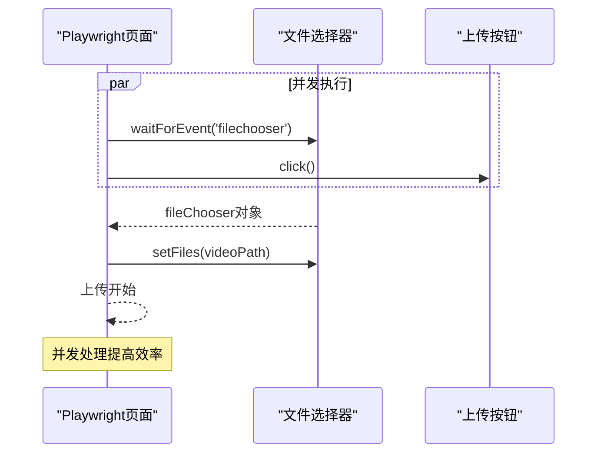

**图表来源**
- [douyin-publish.js:391-394](file://douyin-publish.js#L391-L394)

#### 多元素操作的并发优化

虽然当前版本主要展示了文件选择器的并发处理，但系统架构为未来的并发优化预留了空间：

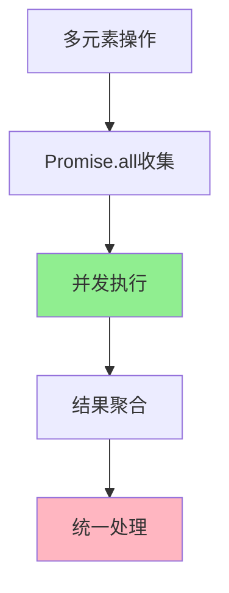

**图表来源**
- [douyin-publish.js:391-394](file://douyin-publish.js#L391-L394)

**章节来源**
- [douyin-publish.js:391-394](file://douyin-publish.js#L391-L394)

## 异步队列管理

### 操作延迟控制

系统通过delay函数实现了精细的操作延迟控制：

#### 延迟函数实现

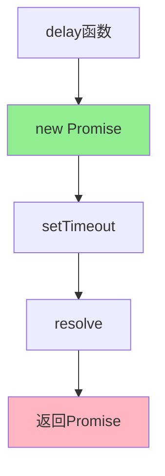

**图表来源**
- [douyin-publish.js:108-110](file://douyin-publish.js#L108-L110)

#### 延迟策略的应用

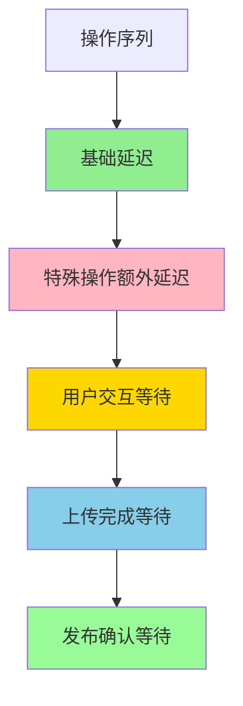

**图表来源**
- [douyin-publish.js:292](file://douyin-publish.js#L292)
- [douyin-publish.js:315](file://douyin-publish.js#L315)
- [douyin-publish.js:420](file://douyin-publish.js#L420)
- [douyin-publish.js:544](file://douyin-publish.js#L544)

**章节来源**
- [douyin-publish.js:108-110](file://douyin-publish.js#L108-L110)
- [douyin-publish.js:292](file://douyin-publish.js#L292)
- [douyin-publish.js:315](file://douyin-publish.js#L315)
- [douyin-publish.js:420](file://douyin-publish.js#L420)
- [douyin-publish.js:544](file://douyin-publish.js#L544)

## 错误处理策略

### 重试机制与降级策略

系统实现了完善的错误处理和恢复机制：

#### 多策略重试

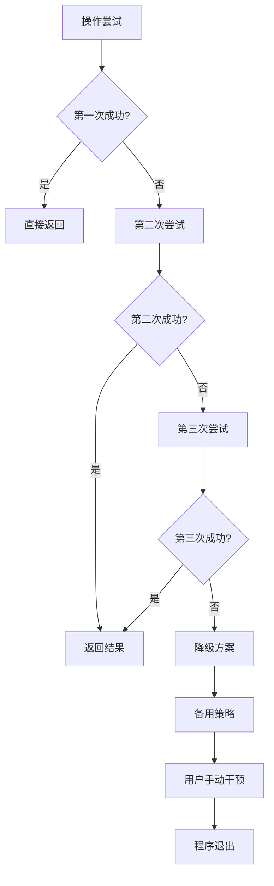

**图表来源**
- [douyin-publish.js:115-143](file://douyin-publish.js#L115-L143)
- [douyin-publish.js:148-184](file://douyin-publish.js#L148-L184)

#### 异常恢复机制

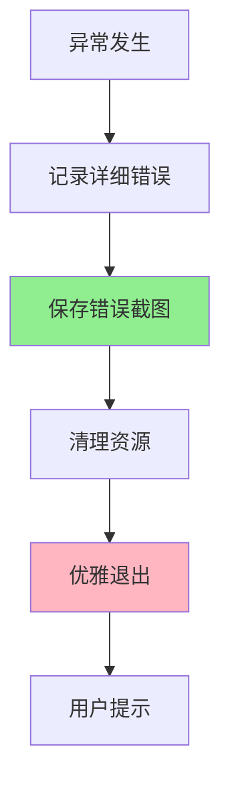

**图表来源**
- [douyin-publish.js:597-617](file://douyin-publish.js#L597-L617)

**章节来源**
- [douyin-publish.js:115-184](file://douyin-publish.js#L115-L184)
- [douyin-publish.js:597-617](file://douyin-publish.js#L597-L617)

## 性能优化技巧

### 异步操作优化

系统在多个方面实现了性能优化：

#### 智能等待策略

```mermaid
flowchart TD
A[等待策略] --> B[预估等待时间]
B --> C[动态调整]
C --> D[条件检查]
D --> E{条件满足?}
E --> |是| F[立即返回]
E --> |否| G[继续等待]
G --> H[指数退避]
style F fill:#90EE90
style H fill:#FFD700
```

**图表来源**
- [douyin-publish.js:189-235](file://douyin-publish.js#L189-L235)

#### 资源管理优化

```mermaid
flowchart TD
A[资源管理] --> B[延迟初始化]
B --> C[按需加载]
C --> D[及时释放]
D --> E[内存监控]
style B fill:#90EE90
style D fill:#FFB6C1
```

**图表来源**
- [douyin-publish.js:255-266](file://douyin-publish.js#L255-L266)

**章节来源**
- [douyin-publish.js:189-235](file://douyin-publish.js#L189-L235)
- [douyin-publish.js:255-266](file://douyin-publish.js#L255-L266)

## 故障排除指南

### 常见问题诊断

#### 登录状态问题

```mermaid
flowchart TD
A[登录检测] --> B{检测到登录?}
B --> |是| C[继续执行]
B --> |否| D[提示手动登录]
D --> E[等待用户输入]
E --> F[重新加载页面]
F --> G[验证登录状态]
style D fill:#FFD700
style G fill:#90EE90
```

**图表来源**
- [douyin-publish.js:298-319](file://douyin-publish.js#L298-L319)

#### 元素定位失败

```mermaid
flowchart TD
A[元素定位] --> B[首选选择器]
B --> C{定位成功?}
C --> |是| D[使用首选方案]
C --> |否| E[备选选择器]
E --> F{备选成功?}
F --> |是| D
F --> |否| G[文本匹配]
G --> H{文本匹配成功?}
H --> |是| D
H --> |否| I[降级处理]
style D fill:#90EE90
style I fill:#FFB6C1
```

**图表来源**
- [douyin-publish.js:115-143](file://douyin-publish.js#L115-L143)
- [douyin-publish.js:148-184](file://douyin-publish.js#L148-L184)

**章节来源**
- [douyin-publish.js:298-319](file://douyin-publish.js#L298-L319)
- [douyin-publish.js:115-184](file://douyin-publish.js#L115-L184)

## 结论

该抖音自动发布工具展现了现代异步编程的最佳实践，通过精心设计的异步模式实现了可靠的自动化发布流程。系统的主要优势包括：

### 核心优势

1. **健壮的错误处理**：多层异常处理和降级策略确保了系统的稳定性
2. **灵活的异步模式**：合理运用Promise链式调用和async/await提高了代码可读性
3. **智能的等待机制**：动态等待和超时控制平衡了性能和可靠性
4. **优雅的资源管理**：完善的资源清理和异常恢复机制

### 应用场景

该异步编程模式适用于：
- Web自动化测试
- 数据采集和处理
- 用户界面自动化
- 批量任务处理

### 最佳实践总结

1. **选择合适的异步模式**：根据具体场景选择Promise链式调用或async/await
2. **实现多层次错误处理**：从操作级别到系统级别的完整保护
3. **合理设置超时和重试**：平衡用户体验和系统性能
4. **优化等待策略**：使用智能等待减少不必要的等待时间
5. **保持代码可维护性**：通过模块化设计提高代码的可读性和可维护性

该工具为理解现代Web自动化中的异步编程模式提供了优秀的实践案例，展示了如何在复杂的异步环境中实现可靠和高效的自动化解决方案。