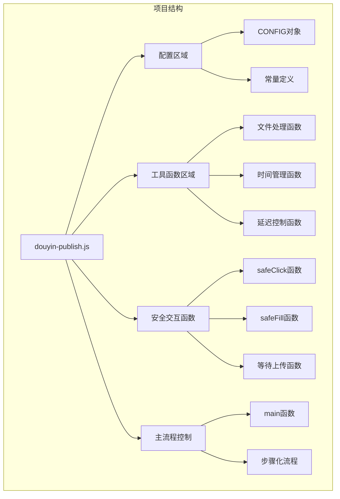
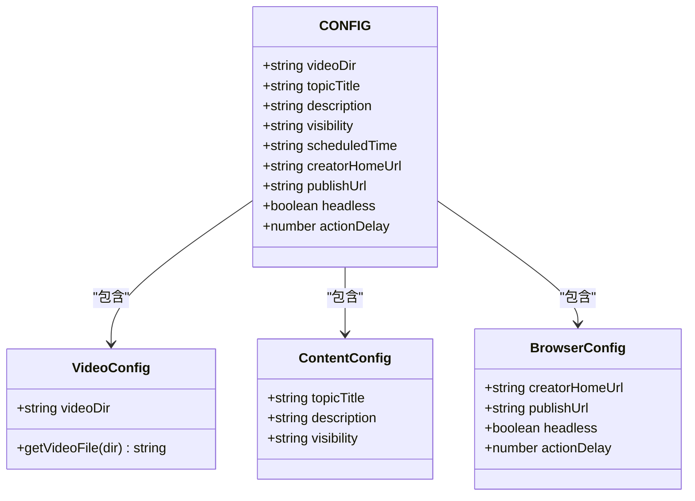
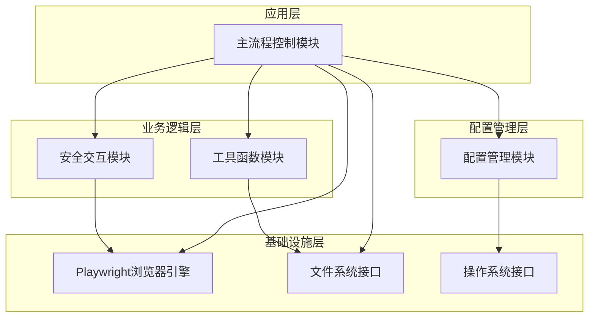
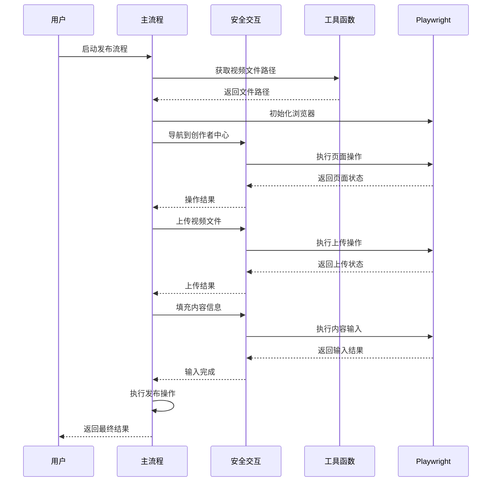
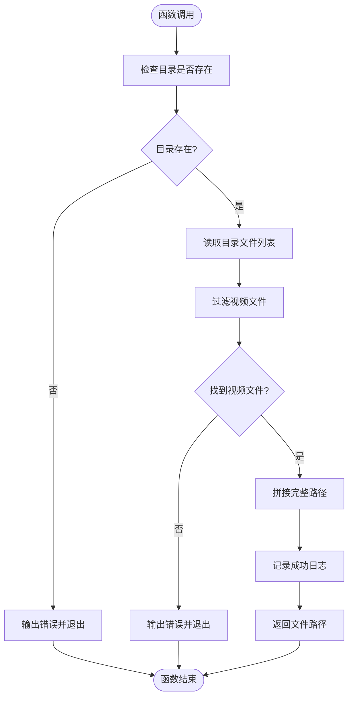
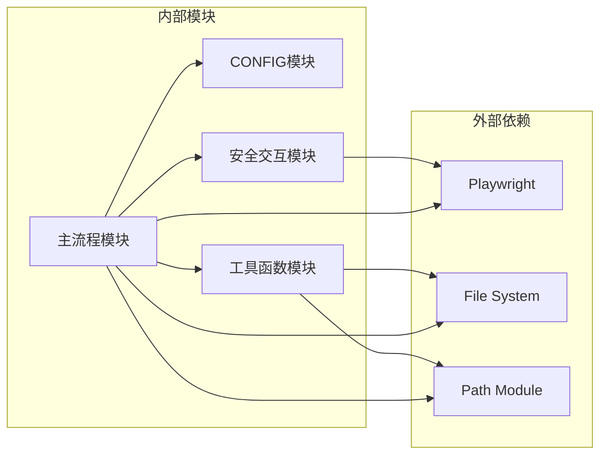

# 模块化设计

<cite>
**本文档引用的文件**
- [douyin-publish.js](file://douyin-publish.js)
- [package.json](file://package.json)
- [package-lock.json](file://package-lock.json)
</cite>

## 目录
1. [简介](#简介)
2. [项目结构](#项目结构)
3. [核心组件](#核心组件)
4. [架构概览](#架构概览)
5. [详细组件分析](#详细组件分析)
6. [依赖关系分析](#依赖关系分析)
7. [性能考虑](#性能考虑)
8. [故障排除指南](#故障排除指南)
9. [结论](#结论)

## 简介

本文档深入分析了抖音自动发布工具的模块化设计架构。该工具采用Playwright框架实现自动化发布流程，通过精心设计的模块化结构实现了高度的可维护性和扩展性。系统主要包含四个核心模块：配置管理模块、工具函数模块、安全交互模块和主流程控制模块。

该工具的核心功能包括自动打开抖音创作者中心、点击发布视频、上传本地视频、填写作品描述、设置隐私权限、配置定时发布以及最终确认发布。通过模块化设计，每个功能模块都有明确的职责边界，便于单独测试、调试和维护。

## 项目结构

该项目采用单文件模块化架构，所有功能集中在单一JavaScript文件中，但通过清晰的代码分段和注释实现了逻辑上的模块分离：

**图表来源**
- [douyin-publish.js:24-625](file://douyin-publish.js#L24-L625)

**章节来源**
- [douyin-publish.js:1-625](file://douyin-publish.js#L1-L625)
- [package.json:1-17](file://package.json#L1-L17)

## 核心组件

### 配置管理模块 (CONFIG)

配置管理模块是整个系统的中枢神经，采用集中式配置管理策略，将所有可变参数统一管理：

**设计理念优势：**
- **单一真相源**：所有配置参数集中在一个位置，避免分散配置导致的不一致
- **易于维护**：修改配置只需在一个地方进行，降低维护成本
- **环境适配**：支持不同环境下的配置切换
- **类型安全**：通过明确的键值对结构提供基本的类型约束

**参数组织结构：**

**图表来源**
- [douyin-publish.js:25-53](file://douyin-publish.js#L25-L53)

**章节来源**
- [douyin-publish.js:24-53](file://douyin-publish.js#L24-L53)

### 工具函数模块

工具函数模块提供了系统运行所需的基础功能，采用纯函数设计，无副作用且高度可复用：

**文件处理函数 (getVideoFile)：**
- 支持多种视频格式（MP4、MOV、AVI、MKV等）
- 提供完整的错误处理和用户友好的错误信息
- 实现文件存在性验证和格式检查

**时间管理函数 (getScheduledTime)：**
- 支持自定义时间和默认算法（明天10:00）
- 提供灵活的时间格式化能力
- 实现智能时间计算逻辑

**延迟控制函数 (delay)：**
- 基于Promise的异步延迟机制
- 支持可配置的延迟时间
- 为自动化操作提供稳定的节奏控制

**章节来源**
- [douyin-publish.js:57-110](file://douyin-publish.js#L57-L110)

### 安全交互模块

安全交互模块是系统的核心可靠性保障，通过多策略容错机制确保与Web界面的稳定交互：

**多策略点击函数 (safeClick)：**
- **策略1：CSS选择器优先** - 使用多个候选选择器提高成功率
- **策略2：可见性检测** - 确保元素完全加载后再进行操作
- **策略3：文本回退** - 当选择器失败时，通过文本内容定位元素
- **容错机制** - 每个策略失败时优雅降级到下一个策略

**文本输入函数 (safeFill)：**
- **智能清空** - 先清除现有内容再输入新内容
- **逐字输入** - 模拟真实用户输入行为，避免被检测
- **占位符支持** - 通过placeholder属性自动定位输入框
- **延迟控制** - 在关键操作之间插入适当的延迟

**章节来源**
- [douyin-publish.js:113-184](file://douyin-publish.js#L113-L184)

### 主流程控制模块

主流程控制模块实现了完整的发布工作流，采用步骤化设计确保每个环节的可控性和可追踪性：

**浏览器初始化：**
- 使用持久化上下文保持登录状态
- 注入反检测脚本绕过自动化检测
- 配置浏览器参数优化用户体验

**页面操作流程：**
- **步骤1：登录检测** - 自动检测登录状态并处理登录流程
- **步骤2：导航到发布页面** - 多种导航策略确保页面可达性
- **步骤3：视频上传** - 三种上传方式提供冗余保障
- **步骤4：内容填充** - 智能识别各种编辑器类型
- **步骤5：隐私设置** - 精确的权限控制配置
- **步骤6：定时发布** - 时间选择器的智能操作
- **步骤7：最终确认** - 用户确认和发布执行

**章节来源**
- [douyin-publish.js:239-618](file://douyin-publish.js#L239-L618)

## 架构概览

系统采用分层架构设计，通过清晰的模块边界实现高内聚低耦合：

**图表来源**
- [douyin-publish.js:20-23](file://douyin-publish.js#L20-L23)
- [douyin-publish.js:239-618](file://douyin-publish.js#L239-L618)

### 数据流分析

系统数据流遵循单向流动原则，确保数据的一致性和可追踪性：

**图表来源**
- [douyin-publish.js:239-618](file://douyin-publish.js#L239-L618)

## 详细组件分析

### 配置管理模块深度分析

配置管理模块采用对象字面量形式，提供了完整的配置参数集合：

**配置参数详解：**
- **视频目录 (videoDir)**: 指定包含待发布视频的目录路径
- **主题标题 (topicTitle)**: 视频的主题或标题内容
- **作品描述 (description)**: 视频的详细描述信息
- **可见性 (visibility)**: 内容的可见性设置选项
- **定时时间 (scheduledTime)**: 自定义定时发布时间，null表示使用默认算法
- **URL配置**: 创作者中心和发布页面的访问地址
- **浏览器配置**: 是否显示浏览器界面和操作间隔设置

**配置扩展性考虑：**
- 支持从环境变量读取配置
- 提供配置验证机制
- 支持配置热更新
- 实现配置分层继承

**章节来源**
- [douyin-publish.js:25-53](file://douyin-publish.js#L25-L53)

### 工具函数模块详细实现

#### 文件处理函数 (getVideoFile)

该函数实现了智能的视频文件发现和验证机制：

**图表来源**
- [douyin-publish.js:60-83](file://douyin-publish.js#L60-L83)

#### 时间管理函数 (getScheduledTime)

时间管理函数提供了灵活的时间计算能力：

**默认算法实现：**
- 计算明天的日期
- 设置时间为上午10:00
- 格式化为YYYY-MM-DD HH:mm字符串
- 支持自定义时间覆盖

**章节来源**
- [douyin-publish.js:88-103](file://douyin-publish.js#L88-L103)

#### 延迟控制函数 (delay)

延迟控制函数实现了基于Promise的异步等待机制：

**设计特点：**
- 基于setTimeout的Promise封装
- 支持任意毫秒数的延迟
- 非阻塞式异步操作
- 可用于流程控制和节流

**章节来源**
- [douyin-publish.js:108-110](file://douyin-publish.js#L108-L110)

### 安全交互模块详细实现

#### 多策略点击函数 (safeClick)

安全点击函数实现了三层容错机制：

**策略层次结构：**
1. **CSS选择器策略** - 使用多个候选选择器提高命中率
2. **可见性检测策略** - 确保元素完全加载和可见
3. **文本回退策略** - 通过元素文本内容进行定位

**容错机制：**
- 每个策略失败时自动降级
- 提供详细的错误日志
- 支持操作结果的布尔返回
- 实现优雅的失败处理

**章节来源**
- [douyin-publish.js:115-143](file://douyin-publish.js#L115-L143)

#### 文本输入函数 (safeFill)

安全文本输入函数提供了智能的文本填充机制：

**输入策略：**
- **智能清空** - 先清除现有内容
- **逐字输入** - 模拟真实用户输入速度
- **占位符支持** - 自动识别placeholder属性
- **延迟控制** - 在关键操作间插入延迟

**章节来源**
- [douyin-publish.js:148-184](file://douyin-publish.js#L148-L184)

### 主流程控制模块详细实现

#### 浏览器初始化流程

主流程控制模块的浏览器初始化采用了多项技术来提升用户体验和稳定性：

**持久化上下文配置：**
- 保存浏览器用户数据
- 维持登录状态
- 减少重复登录开销
- 支持跨会话状态保持

**反检测脚本注入：**
- 覆盖navigator.webdriver属性
- 模拟正常浏览器环境
- 绕过自动化检测机制
- 保护用户账户安全

**章节来源**
- [douyin-publish.js:252-284](file://douyin-publish.js#L252-L284)

#### 页面操作流程

主流程控制模块实现了完整的七步发布流程：

**步骤化设计优势：**
- 每个步骤都有明确的目标和验证点
- 支持步骤间的状态检查和回滚
- 提供详细的进度反馈和日志记录
- 实现灵活的错误处理和重试机制

**章节来源**
- [douyin-publish.js:288-618](file://douyin-publish.js#L288-L618)

## 依赖关系分析

系统依赖关系清晰明确，遵循单一职责原则：

**图表来源**
- [douyin-publish.js:20-23](file://douyin-publish.js#L20-L23)
- [package.json:13-15](file://package.json#L13-L15)

### 模块间耦合度分析

**低耦合设计原则：**
- 每个模块都有明确的接口边界
- 依赖关系单向且清晰
- 配置参数通过全局对象传递
- 工具函数保持纯函数特性
- 安全交互函数独立于具体页面

**依赖注入模式：**
- 通过参数传递实现依赖注入
- 配置对象作为共享状态容器
- 回调函数实现异步通信
- Promise链实现异步流程控制

**章节来源**
- [douyin-publish.js:20-23](file://douyin-publish.js#L20-L23)
- [package.json:13-15](file://package.json#L13-L15)

## 性能考虑

### 异步操作优化

系统大量采用异步编程模式，通过Promise和async/await实现非阻塞操作：

**性能优化策略：**
- 使用Promise.all并行处理多个异步操作
- 合理设置超时时间避免无限等待
- 实现指数退避重试机制
- 优化网络请求和页面加载策略

### 内存管理

**内存使用优化：**
- 及时释放不再使用的变量和对象
- 合理使用垃圾回收机制
- 避免内存泄漏和循环引用
- 控制日志输出避免内存占用过高

### 网络性能

**网络优化措施：**
- 合理设置超时和重试机制
- 实现断线重连和错误恢复
- 优化资源加载顺序
- 减少不必要的网络请求

## 故障排除指南

### 常见问题诊断

**配置相关问题：**
- 检查视频目录路径是否正确
- 验证配置参数格式和类型
- 确认环境变量设置
- 检查文件权限和访问权限

**浏览器相关问题：**
- 确认Chrome浏览器已正确安装
- 检查Playwright浏览器缓存
- 验证浏览器版本兼容性
- 检查代理和网络设置

**页面元素定位问题：**
- 更新选择器以适应页面变化
- 检查元素可见性和加载状态
- 验证CSS选择器的有效性
- 实现更健壮的选择器策略

### 错误处理机制

系统实现了多层次的错误处理机制：

**模块级错误处理：**
- 每个函数都有独立的错误处理逻辑
- 提供详细的错误信息和上下文
- 实现优雅的降级和回退策略
- 支持错误状态的传播和恢复

**用户交互错误处理：**
- 提供清晰的错误提示和指导
- 支持手动干预和继续执行
- 实现错误状态的可视化反馈
- 提供恢复和重试机制

**章节来源**
- [douyin-publish.js:597-618](file://douyin-publish.js#L597-L618)

## 结论

抖音自动发布工具通过精心设计的模块化架构，成功实现了高度可维护、可扩展和可靠的自动化发布系统。该架构的主要优势包括：

**设计优势：**
- **模块化程度高**：每个功能模块职责明确，便于独立开发和测试
- **容错能力强**：多策略容错机制确保系统稳定性
- **扩展性良好**：清晰的接口设计支持功能扩展和定制
- **维护成本低**：集中式配置管理和标准化的错误处理

**技术亮点：**
- 采用Playwright实现可靠的浏览器自动化
- 实现智能的页面元素定位和交互
- 提供完善的日志记录和错误处理
- 支持多种视频格式和输入方式

**未来改进方向：**
- 增加配置文件支持，实现更好的环境隔离
- 添加单元测试和集成测试框架
- 实现插件化架构支持第三方扩展
- 增加监控和性能分析功能
- 提供图形化用户界面选项

该模块化设计为类似自动化工具的开发提供了优秀的参考模板，展示了如何在复杂场景下实现高质量的软件架构。