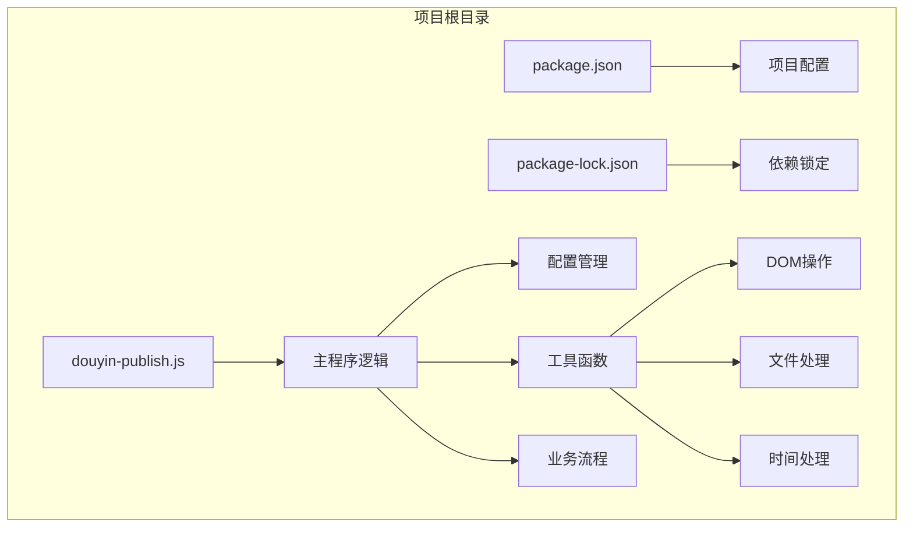
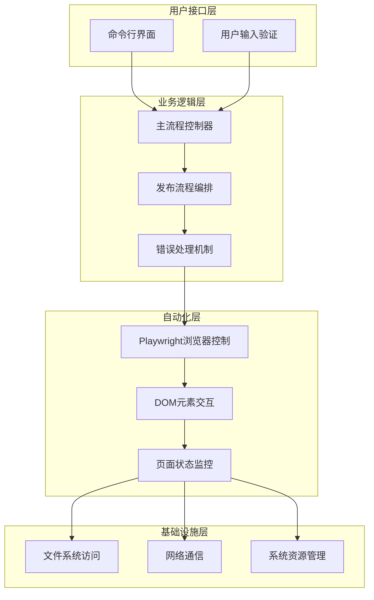
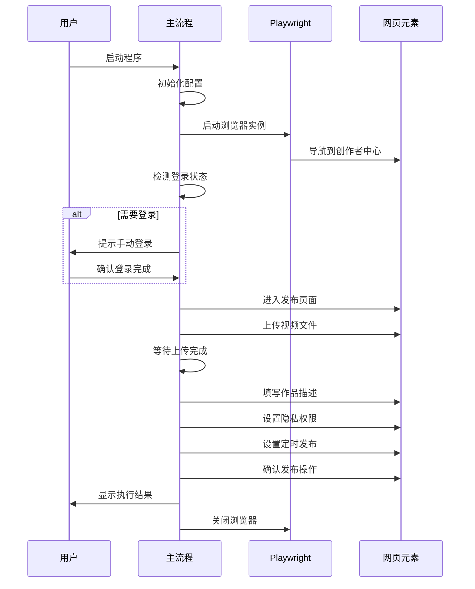
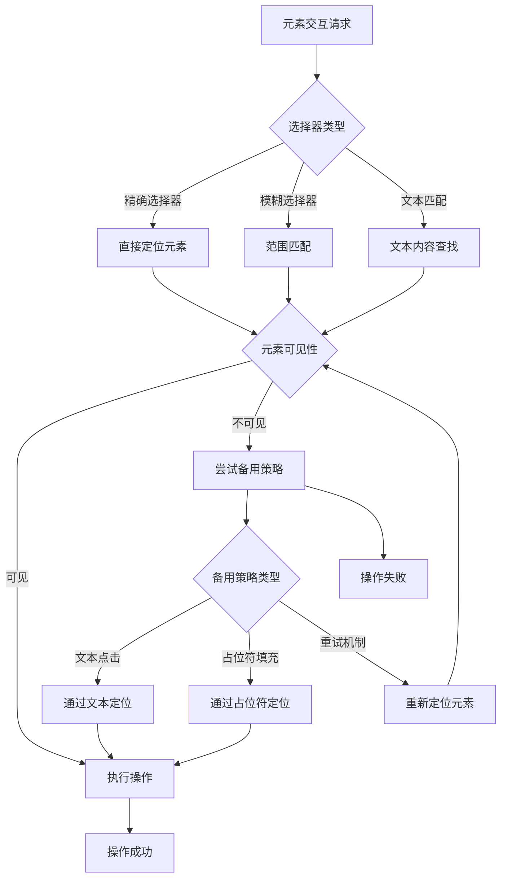
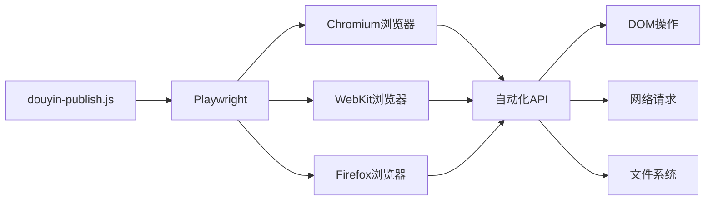
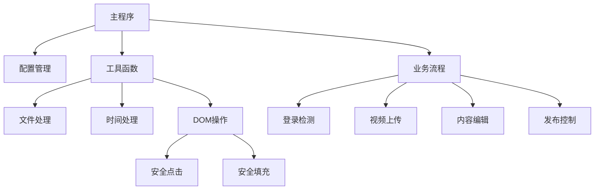
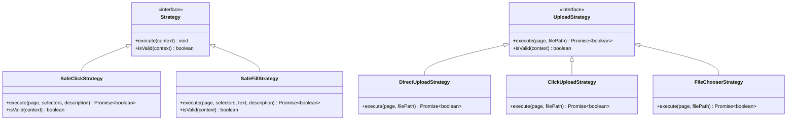
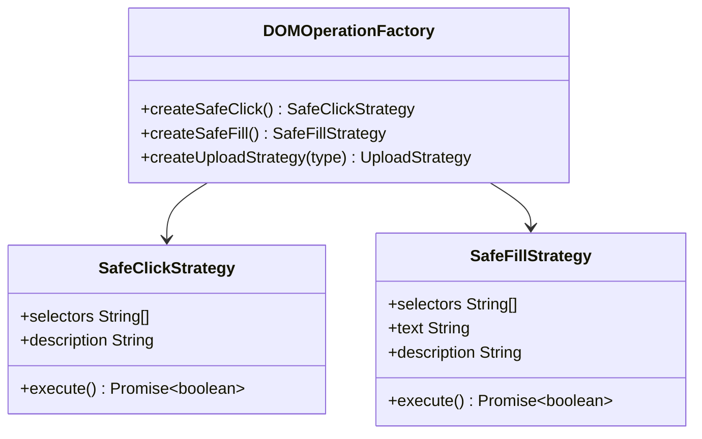
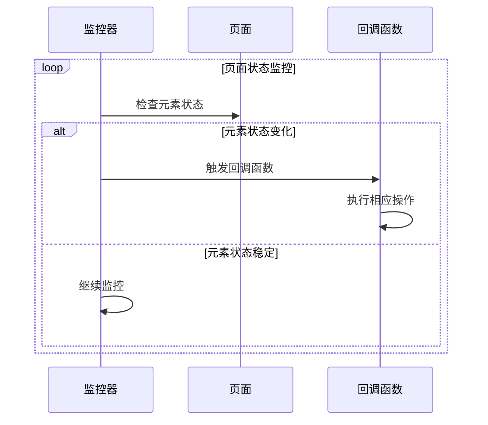
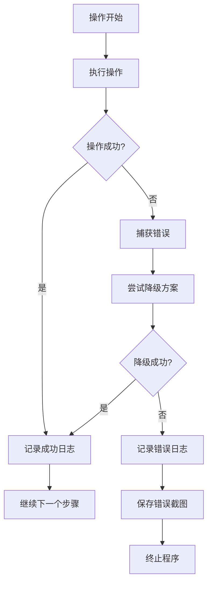

# 开发者指南

<cite>
**本文档引用的文件**
- [douyin-publish.js](file://douyin-publish.js)
- [package.json](file://package.json)
- [package-lock.json](file://package-lock.json)
</cite>

## 目录
1. [简介](#简介)
2. [项目结构](#项目结构)
3. [核心组件](#核心组件)
4. [架构概览](#架构概览)
5. [详细组件分析](#详细组件分析)
6. [依赖关系分析](#依赖关系分析)
7. [性能考虑](#性能考虑)
8. [故障排除指南](#故障排除指南)
9. [扩展开发指南](#扩展开发指南)
10. [设计模式应用](#设计模式应用)
11. [调试技巧与最佳实践](#调试技巧与最佳实践)
12. [代码贡献指南](#代码贡献指南)
13. [常见问题解答](#常见问题解答)
14. [结论](#结论)

## 简介

抖音自动发布工具是一个基于 Playwright 的自动化脚本，用于自动发布视频到抖音创作者中心。该工具实现了完整的发布流程自动化，包括登录检测、视频上传、内容编辑、隐私设置和定时发布等功能。

该工具采用模块化设计，通过函数分离关注点，使用异步编程模式处理复杂的用户界面交互，并实现了多层容错机制来应对网页元素变化和网络不稳定的情况。

## 项目结构

该项目采用极简的单文件架构，所有功能都集中在单一 JavaScript 文件中：

**图表来源**
- [douyin-publish.js:1-625](file://douyin-publish.js#L1-L625)
- [package.json:1-17](file://package.json#L1-L17)

**章节来源**
- [douyin-publish.js:1-625](file://douyin-publish.js#L1-L625)
- [package.json:1-17](file://package.json#L1-L17)

## 核心组件

### 配置管理系统

系统使用集中式配置管理，所有可调整参数都定义在 CONFIG 对象中：

| 配置项 | 类型 | 默认值 | 描述 |
|--------|------|--------|------|
| videoDir | 字符串 | 'D:\\test' | 视频文件存储目录 |
| topicTitle | 字符串 | '这是一个水' | 作品主题标题 |
| description | 字符串 | '这是一个水瓶' | 作品描述内容 |
| visibility | 字符串 | '仅自己可见' | 隐私设置选项 |
| scheduledTime | 字符串/Null | null | 定时发布时间 |
| creatorHomeUrl | 字符串 | 创作者中心URL | 抖音创作者中心地址 |
| publishUrl | 字符串 | 发布页面URL | 视频发布页面地址 |
| headless | 布尔值 | false | 是否以无头模式运行 |
| actionDelay | 数值 | 1000 | 操作间隔（毫秒） |

### 工具函数模块

系统实现了多个专用工具函数来处理不同的自动化任务：

1. **文件处理函数**：`getVideoFile()` - 智能查找视频文件
2. **时间处理函数**：`getScheduledTime()` - 计算定时发布时间
3. **延迟函数**：`delay()` - 异步等待机制
4. **安全DOM操作函数**：`safeClick()` 和 `safeFill()` - 多策略元素交互
5. **上传监控函数**：`waitForUploadComplete()` - 上传状态检测

**章节来源**
- [douyin-publish.js:25-53](file://douyin-publish.js#L25-L53)
- [douyin-publish.js:57-83](file://douyin-publish.js#L57-L83)
- [douyin-publish.js:85-103](file://douyin-publish.js#L85-L103)
- [douyin-publish.js:105-110](file://douyin-publish.js#L105-L110)
- [douyin-publish.js:113-143](file://douyin-publish.js#L113-L143)
- [douyin-publish.js:145-184](file://douyin-publish.js#L145-L184)
- [douyin-publish.js:187-235](file://douyin-publish.js#L187-L235)

## 架构概览

该系统采用分层架构设计，从上到下分为以下层次：

**图表来源**
- [douyin-publish.js:239-618](file://douyin-publish.js#L239-L618)

系统的核心执行流程遵循瀑布式设计模式，每个步骤都有明确的职责分工和错误处理机制。

**章节来源**
- [douyin-publish.js:239-618](file://douyin-publish.js#L239-L618)

## 详细组件分析

### 主流程控制器

主流程控制器是整个系统的中枢，负责协调各个子系统的协作：

**图表来源**
- [douyin-publish.js:239-618](file://douyin-publish.js#L239-L618)

### DOM选择器策略

系统实现了多层DOM选择器策略来应对网页元素的不确定性：

**图表来源**
- [douyin-publish.js:115-143](file://douyin-publish.js#L115-L143)
- [douyin-publish.js:148-184](file://douyin-publish.js#L148-L184)

### 元素定位算法

系统采用了智能的元素定位算法，结合多种策略来提高成功率：

#### 策略1：多选择器链式查找
- 支持多种CSS选择器组合
- 按优先级顺序尝试
- 自动跳过无效选择器

#### 策略2：可见性检测
- 实时检查元素可见性
- 超时控制机制
- 动态等待策略

#### 策略3：文本匹配降级
- 当选择器失效时使用文本内容
- 支持模糊匹配
- 自动清理文本内容

**章节来源**
- [douyin-publish.js:115-143](file://douyin-publish.js#L115-L143)
- [douyin-publish.js:148-184](file://douyin-publish.js#L148-L184)

### 交互模拟技术

系统实现了多种交互模拟技术来模拟真实用户行为：

#### 输入模拟
- 逐字符输入模拟真实打字
- 自定义输入延迟
- 内容清除和重置

#### 点击模拟
- 多策略点击尝试
- 可视化反馈
- 错误恢复机制

#### 上传流程
- 多种上传方式支持
- 文件选择器事件监听
- 上传状态实时监控

**章节来源**
- [douyin-publish.js:148-184](file://douyin-publish.js#L148-L184)
- [douyin-publish.js:347-407](file://douyin-publish.js#L347-L407)
- [douyin-publish.js:413-418](file://douyin-publish.js#L413-L418)

## 依赖关系分析

### 外部依赖

项目使用 Playwright 作为核心自动化框架，提供了强大的浏览器控制能力：

**图表来源**
- [package.json:13-15](file://package.json#L13-L15)
- [package-lock.json:29-58](file://package-lock.json#L29-L58)

### 内部模块依赖

系统内部模块之间存在清晰的依赖关系：

**图表来源**
- [douyin-publish.js:25-53](file://douyin-publish.js#L25-L53)
- [douyin-publish.js:57-83](file://douyin-publish.js#L57-L83)
- [douyin-publish.js:85-103](file://douyin-publish.js#L85-L103)
- [douyin-publish.js:113-184](file://douyin-publish.js#L113-L184)

**章节来源**
- [package.json:13-15](file://package.json#L13-L15)
- [package-lock.json:29-58](file://package-lock.json#L29-L58)

## 性能考虑

### 异步编程模式

系统广泛使用 Promise 和 async/await 模式来处理异步操作：

- **延迟机制**：统一使用 `delay()` 函数处理异步等待
- **超时控制**：为每个操作设置合理的超时时间
- **并发控制**：避免不必要的并发操作
- **资源释放**：确保浏览器实例正确关闭

### 内存管理

- **对象生命周期**：及时释放不再使用的变量
- **文件句柄管理**：确保文件操作完成后正确关闭
- **浏览器资源**：在 finally 块中确保资源清理

### 网络优化

- **重试机制**：对网络不稳定的场景实施重试
- **超时设置**：为网络请求设置合理的超时时间
- **错误隔离**：防止单个请求失败影响整体流程

## 故障排除指南

### 常见问题及解决方案

#### 登录问题
**症状**：无法进入发布页面
**原因**：账号未登录或登录状态过期
**解决方案**：
1. 手动登录抖音账号
2. 确保浏览器缓存中保存了登录状态
3. 检查网络连接稳定性

#### 元素定位失败
**症状**：点击或填写操作失败
**原因**：网页元素选择器过时
**解决方案**：
1. 更新选择器表达式
2. 增加更多的备用选择器
3. 检查页面加载状态

#### 上传超时
**症状**：视频上传长时间无响应
**原因**：网络连接不稳定或视频文件过大
**解决方案**：
1. 检查网络连接质量
2. 减小视频文件大小
3. 增加等待时间限制

### 调试技巧

#### 日志记录
系统提供了丰富的日志输出，包括：
- 操作步骤跟踪
- 错误信息输出
- 进度状态显示
- 截图保存信息

#### 截图功能
- 发布前状态截图
- 发布后结果截图
- 错误状态截图
- 自动保存到指定目录

**章节来源**
- [douyin-publish.js:597-617](file://douyin-publish.js#L597-L617)
- [douyin-publish.js:549-552](file://douyin-publish.js#L549-L552)
- [douyin-publish.js:588-591](file://douyin-publish.js#L588-L591)
- [douyin-publish.js:600-607](file://douyin-publish.js#L600-L607)

## 扩展开发指南

### 添加新的上传策略

要添加新的视频上传策略，需要修改上传流程部分：

1. **分析现有策略**：查看现有的三种上传方式
2. **识别新策略需求**：确定需要支持的新上传方式
3. **实现新策略**：在上传流程中添加新的分支
4. **测试新策略**：验证新策略的有效性

**扩展点位置**：
- 视频上传主流程：[douyin-publish.js:347-407](file://douyin-publish.js#L347-L407)
- 上传状态监控：[douyin-publish.js:187-235](file://douyin-publish.js#L187-L235)

### 自定义页面元素选择器

要自定义页面元素选择器，需要修改相应的选择器数组：

1. **定位目标元素**：使用浏览器开发者工具分析元素
2. **编写选择器**：根据元素特征编写CSS选择器
3. **测试选择器**：验证选择器的准确性
4. **添加到数组**：将新选择器添加到对应的选择器列表

**常用选择器位置**：
- 发布按钮选择器：[douyin-publish.js:325-333](file://douyin-publish.js#L325-L333)
- 隐私设置选择器：[douyin-publish.js:456-476](file://douyin-publish.js#L456-L476)
- 定时发布选择器：[douyin-publish.js:492-501](file://douyin-publish.js#L492-L501)

### 集成新的功能模块

要集成新的功能模块，建议遵循以下步骤：

1. **模块设计**：设计独立的功能模块
2. **接口定义**：定义清晰的模块接口
3. **错误处理**：实现完善的错误处理机制
4. **测试验证**：进行全面的功能测试
5. **文档更新**：更新相关文档说明

## 设计模式应用

### 策略模式

系统大量使用策略模式来处理不同的操作场景：

**图表来源**
- [douyin-publish.js:115-143](file://douyin-publish.js#L115-L143)
- [douyin-publish.js:148-184](file://douyin-publish.js#L148-L184)
- [douyin-publish.js:354-401](file://douyin-publish.js#L354-L401)

### 工厂模式

系统实现了简单的工厂模式来创建不同类型的DOM操作对象：

**图表来源**
- [douyin-publish.js:115-184](file://douyin-publish.js#L115-L184)

### 观察者模式

系统使用观察者模式来监控页面状态变化：

**图表来源**
- [douyin-publish.js:189-235](file://douyin-publish.js#L189-L235)

**章节来源**
- [douyin-publish.js:115-184](file://douyin-publish.js#L115-L184)
- [douyin-publish.js:189-235](file://douyin-publish.js#L189-L235)

## 调试技巧与最佳实践

### 日志记录最佳实践

系统实现了多层次的日志记录机制：

1. **操作步骤日志**：记录每个主要操作的执行情况
2. **错误日志**：详细记录错误信息和堆栈跟踪
3. **状态日志**：显示当前系统状态和进度
4. **调试日志**：提供详细的调试信息

### 错误处理策略

系统采用了多层错误处理策略：

**图表来源**
- [douyin-publish.js:597-617](file://douyin-publish.js#L597-L617)

### 截图保存机制

系统实现了智能的截图保存机制：

1. **发布前截图**：保存发布前的页面状态
2. **发布后截图**：保存发布后的结果状态
3. **错误截图**：保存发生错误时的页面状态
4. **自动命名**：使用时间戳和描述信息命名文件

### 性能监控方法

系统提供了多种性能监控方法：

1. **执行时间统计**：记录每个步骤的执行时间
2. **内存使用监控**：监控内存使用情况
3. **网络性能分析**：分析网络请求性能
4. **资源使用报告**：生成资源使用报告

**章节来源**
- [douyin-publish.js:549-552](file://douyin-publish.js#L549-L552)
- [douyin-publish.js:588-591](file://douyin-publish.js#L588-L591)
- [douyin-publish.js:600-607](file://douyin-publish.js#L600-L607)

## 代码贡献指南

### 编码规范

#### 命名规范
- **变量命名**：使用驼峰命名法
- **函数命名**：使用动词短语命名
- **常量命名**：使用全大写字母和下划线
- **类命名**：使用帕斯卡命名法

#### 代码风格
- **缩进**：使用4个空格
- **行长度**：不超过120字符
- **注释**：每个函数都有详细注释
- **空行**：合理使用空行分隔逻辑块

#### 错误处理
- **异常捕获**：每个异步操作都有错误处理
- **错误传播**：适当的错误信息传递
- **资源清理**：确保资源正确释放

### 测试要求

#### 单元测试
- **函数测试**：每个重要函数都有单元测试
- **边界测试**：测试边界条件和异常情况
- **性能测试**：测试关键操作的性能

#### 集成测试
- **端到端测试**：完整流程的端到端测试
- **兼容性测试**：不同浏览器和版本的兼容性测试
- **稳定性测试**：长时间运行的稳定性测试

### 文档维护标准

#### 代码文档
- **函数注释**：每个函数都有详细的参数和返回值说明
- **配置说明**：所有配置项都有详细说明
- **使用示例**：提供完整的使用示例

#### 项目文档
- **README更新**：随着功能更新而更新
- **变更日志**：记录重要的功能变更
- **迁移指南**：提供向后兼容的迁移指南

## 常见问题解答

### Q: 如何修改视频文件夹路径？
**A**: 修改 CONFIG.videoDir 配置项即可。

### Q: 如何添加新的视频格式支持？
**A**: 在 getVideoFile 函数中添加新的文件扩展名到 videoExtensions 数组。

### Q: 如何调整操作延迟？
**A**: 修改 CONFIG.actionDelay 配置项，单位为毫秒。

### Q: 如何禁用浏览器界面？
**A**: 将 CONFIG.headless 设置为 true。

### Q: 如何自定义发布时间？
**A**: 设置 CONFIG.scheduledTime 为期望的时间字符串。

### Q: 如何添加新的发布策略？
**A**: 在主流程中添加新的步骤，并实现相应的DOM操作函数。

**章节来源**
- [douyin-publish.js:25-53](file://douyin-publish.js#L25-L53)
- [douyin-publish.js:60-83](file://douyin-publish.js#L60-L83)

## 结论

抖音自动发布工具是一个设计良好的自动化脚本，具有以下特点：

### 技术优势
- **模块化设计**：清晰的模块划分和职责分离
- **异步编程**：充分利用现代JavaScript的异步特性
- **容错设计**：多层错误处理和降级机制
- **可扩展性**：易于添加新功能和自定义配置

### 架构特色
- **策略模式应用**：灵活的多策略选择机制
- **观察者模式**：智能的状态监控和响应
- **工厂模式**：简洁的对象创建机制
- **分层架构**：清晰的职责分离和依赖管理

### 开发价值
该工具为开发者提供了学习自动化测试和Web爬虫技术的优秀案例，展示了如何在复杂的Web环境中实现可靠的自动化操作。其模块化的设计思路和容错机制对于开发类似的应用具有重要的参考价值。

通过深入理解和掌握该工具的实现原理，开发者可以将其设计理念应用到其他自动化项目中，构建更加健壮和高效的自动化解决方案。