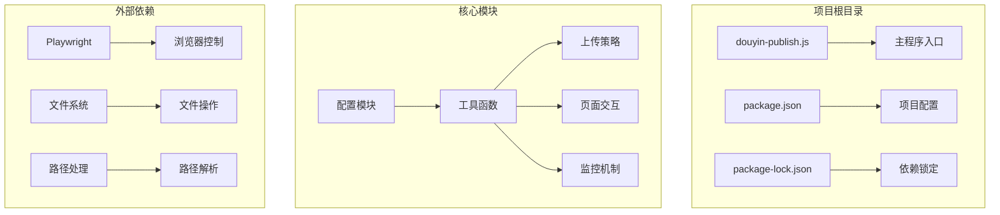
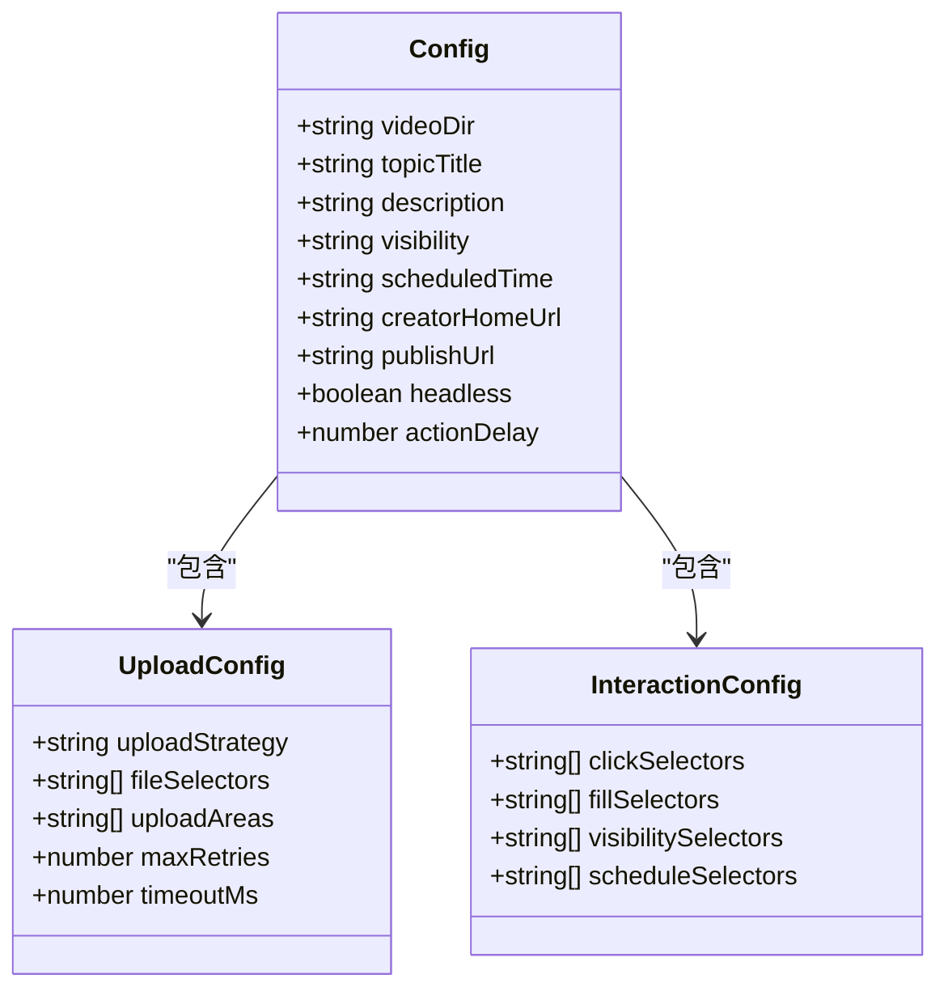
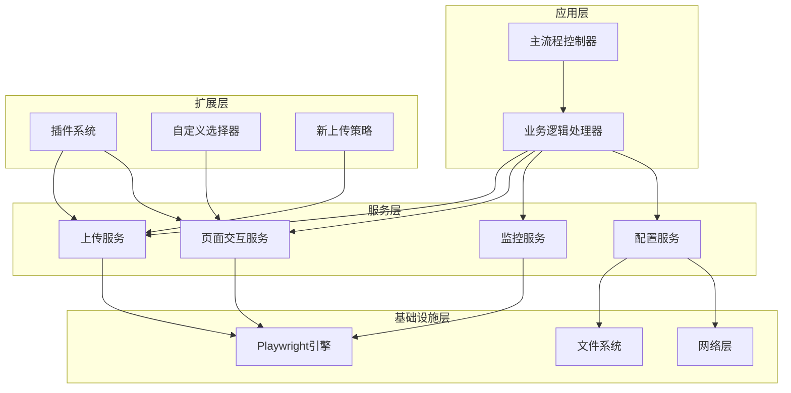
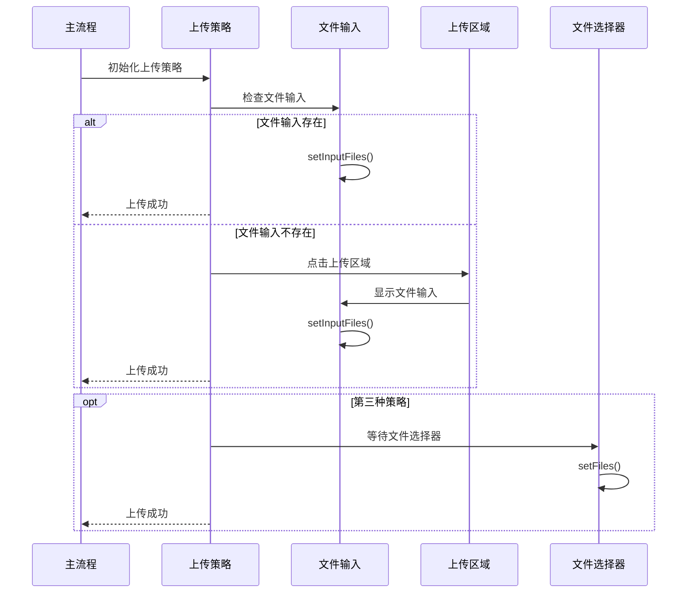
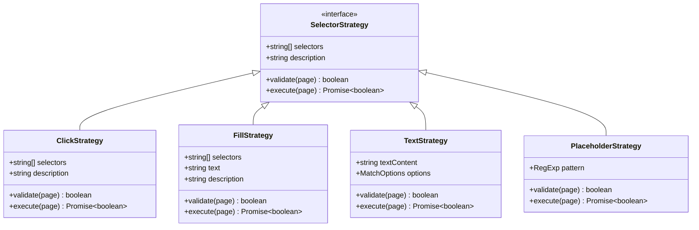
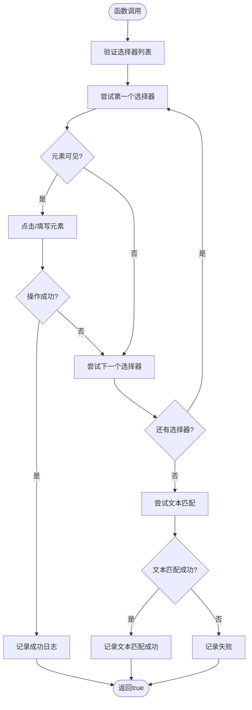
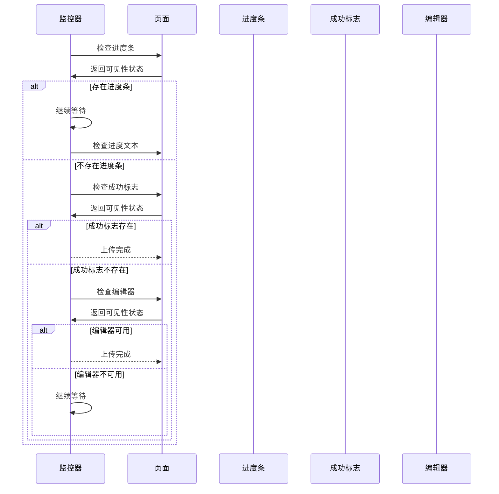

# 扩展开发指南

<cite>
**本文档引用的文件**
- [douyin-publish.js](file://douyin-publish.js)
- [package.json](file://package.json)
- [package-lock.json](file://package-lock.json)
</cite>

## 目录
1. [简介](#简介)
2. [项目结构](#项目结构)
3. [核心组件](#核心组件)
4. [架构概览](#架构概览)
5. [详细组件分析](#详细组件分析)
6. [依赖关系分析](#依赖关系分析)
7. [性能考虑](#性能考虑)
8. [故障排除指南](#故障排除指南)
9. [结论](#结论)
10. [附录](#附录)

## 简介

抖音自动发布工具是一个基于Playwright的自动化脚本，用于自动发布视频到抖音创作者中心。该工具提供了完整的发布流程自动化，包括登录检测、视频上传、内容编辑、隐私设置和定时发布等功能。

本指南专注于扩展开发，详细说明如何添加新的上传策略、自定义页面元素选择器、集成新功能模块以及实现插件系统架构。

## 项目结构

该项目采用简洁的单文件架构设计，所有功能集中在单一JavaScript文件中，便于维护和扩展。



**图表来源**
- [douyin-publish.js:1-625](file://douyin-publish.js#L1-L625)
- [package.json:1-17](file://package.json#L1-L17)

**章节来源**
- [douyin-publish.js:1-625](file://douyin-publish.js#L1-L625)
- [package.json:1-17](file://package.json#L1-L17)

## 核心组件

### 配置系统

配置系统采用集中式管理，所有可配置参数都定义在CONFIG对象中，便于扩展和维护。



**图表来源**
- [douyin-publish.js:24-53](file://douyin-publish.js#L24-L53)

### 工具函数模块

工具函数模块提供了核心的自动化操作能力，包括安全点击、安全填充和上传监控等。

**章节来源**
- [douyin-publish.js:57-184](file://douyin-publish.js#L57-L184)

## 架构概览

系统采用模块化架构设计，主要分为以下几个层次：



**图表来源**
- [douyin-publish.js:239-618](file://douyin-publish.js#L239-L618)

## 详细组件分析

### 上传策略系统

上传策略系统是扩展开发的核心部分，支持多种上传方式的自动切换。



**图表来源**
- [douyin-publish.js:347-407](file://douyin-publish.js#L347-L407)

#### 新上传策略添加指南

要添加新的上传策略，需要：

1. **识别逻辑实现**：在上传流程中添加新的检测逻辑
2. **文件选择器适配**：扩展文件选择器数组
3. **上传监控机制**：集成到现有监控系统

**章节来源**
- [douyin-publish.js:347-407](file://douyin-publish.js#L347-L407)

### 页面元素选择器系统

页面元素选择器系统采用多策略设计，支持多种元素定位方式。



**图表来源**
- [douyin-publish.js:114-184](file://douyin-publish.js#L114-L184)

#### 自定义页面元素选择器开发

要开发自定义页面元素选择器，需要：

1. **选择器策略设计**：根据目标元素类型选择合适的策略
2. **元素定位算法**：实现精确的元素定位逻辑
3. **兼容性处理**：处理不同版本页面的差异

**章节来源**
- [douyin-publish.js:114-184](file://douyin-publish.js#L114-L184)

### 安全交互函数扩展

安全交互函数是系统的核心交互层，提供了robust的用户界面交互能力。



**图表来源**
- [douyin-publish.js:114-143](file://douyin-publish.js#L114-L143)

#### 扩展现有交互函数

要扩展现有的safeClick和safeFill函数：

1. **参数扩展**：添加新的配置选项
2. **策略增加**：支持更多的交互模式
3. **错误处理**：增强错误恢复机制

**章节来源**
- [douyin-publish.js:114-184](file://douyin-publish.js#L114-L184)

### 上传监控机制

上传监控机制提供了实时的上传状态跟踪和反馈。



**图表来源**
- [douyin-publish.js:188-235](file://douyin-publish.js#L188-L235)

**章节来源**
- [douyin-publish.js:188-235](file://douyin-publish.js#L188-L235)

## 依赖关系分析

项目依赖关系简单明了，主要依赖Playwright进行浏览器自动化。

```mermaid
graph LR
A[douyin-publish.js] --> B[playwright@^1.60.0]
C[package.json] --> B
D[package-lock.json] --> B
subgraph "Playwright依赖树"
B --> E[playwright-core@1.60.0]
E --> F[浏览器二进制文件]
end
subgraph "运行时要求"
G[Node.js >= 18]
B --> G
end
```

**图表来源**
- [package.json:13-15](file://package.json#L13-L15)
- [package-lock.json:29-58](file://package-lock.json#L29-L58)

**章节来源**
- [package.json:1-17](file://package.json#L1-L17)
- [package-lock.json:1-61](file://package-lock.json#L1-L61)

## 性能考虑

系统在性能方面采用了多项优化措施：

1. **异步操作**：所有长时间操作都使用Promise和async/await
2. **超时控制**：为每个操作设置合理的超时时间
3. **重试机制**：关键操作具备自动重试能力
4. **资源管理**：正确管理浏览器上下文和页面资源

## 故障排除指南

### 常见问题及解决方案

| 问题类型 | 症状 | 解决方案 |
|---------|------|----------|
| 上传失败 | 文件无法选择 | 检查上传区域选择器，尝试多种策略 |
| 元素找不到 | safeClick/safeFill失败 | 验证选择器有效性，检查页面加载状态 |
| 登录问题 | 自动登录检测失败 | 手动登录后刷新页面，检查登录元素 |
| 超时错误 | 操作超时 | 增加超时时间，检查网络连接 |

### 调试技巧

1. **截图调试**：在关键节点保存页面截图
2. **日志输出**：详细记录操作步骤和状态
3. **元素检查**：使用Playwright的元素检查功能
4. **逐步执行**：将复杂流程分解为多个小步骤

**章节来源**
- [douyin-publish.js:597-617](file://douyin-publish.js#L597-L617)

## 结论

本扩展开发指南提供了完整的抖音自动发布工具扩展开发框架。通过模块化设计和清晰的架构分层，开发者可以轻松地添加新的上传策略、自定义页面元素选择器和集成新功能模块。

关键要点：
- 遵循现有的代码风格和架构原则
- 利用现有的工具函数和监控机制
- 实现向后兼容性和错误处理
- 提供充分的测试和调试支持

## 附录

### 开发最佳实践

1. **代码组织**：保持功能模块的独立性和可重用性
2. **错误处理**：实现完善的异常捕获和恢复机制
3. **文档编写**：为每个新功能提供详细的使用说明
4. **测试覆盖**：编写单元测试和集成测试用例

### 扩展开发清单

- [ ] 新上传策略实现
- [ ] 自定义选择器开发
- [ ] 插件系统集成
- [ ] 配置参数扩展
- [ ] 生命周期管理实现
- [ ] 单元测试编写
- [ ] 集成测试策略
- [ ] 文档更新