# 调试技巧与最佳实践

<cite>
**本文档引用的文件**
- [douyin-publish.js](file://douyin-publish.js)
- [package.json](file://package.json)
- [package-lock.json](file://package-lock.json)
</cite>

## 目录
1. [简介](#简介)
2. [项目结构](#项目结构)
3. [核心组件](#核心组件)
4. [架构概览](#架构概览)
5. [详细组件分析](#详细组件分析)
6. [调试技巧详解](#调试技巧详解)
7. [错误处理机制](#错误处理机制)
8. [截图保存与分析](#截图保存与分析)
9. [性能监控与优化](#性能监控与优化)
10. [调试工具使用指南](#调试工具使用指南)
11. [常见问题诊断](#常见问题诊断)
12. [代码质量保证](#代码质量保证)
13. [结论](#结论)

## 简介

抖音自动发布工具是一个基于Playwright的自动化脚本，用于自动完成抖音创作者中心的视频发布流程。该工具实现了从登录检测、视频上传、内容编辑到定时发布的完整自动化流程。本文档将详细介绍该工具的调试技巧与最佳实践，帮助开发者高效地进行问题排查和性能优化。

## 项目结构

该项目采用简洁的单文件架构设计，主要包含以下组件：

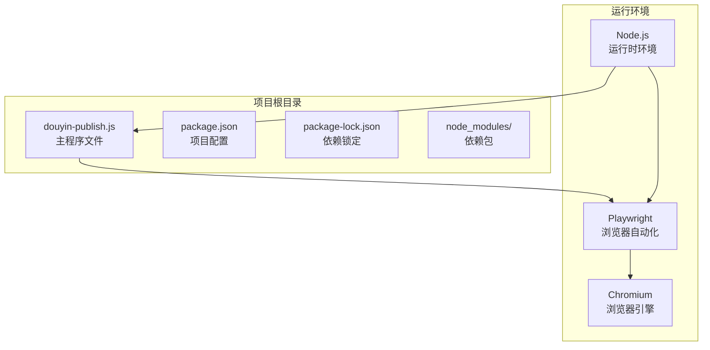

**图表来源**
- [douyin-publish.js:1-20](file://douyin-publish.js#L1-L20)
- [package.json:1-17](file://package.json#L1-L17)

**章节来源**
- [douyin-publish.js:1-625](file://douyin-publish.js#L1-L625)
- [package.json:1-17](file://package.json#L1-L17)
- [package-lock.json:1-61](file://package-lock.json#L1-L61)

## 核心组件

### 配置管理系统

系统采用集中式配置管理，所有可调参数都定义在CONFIG对象中：

| 配置项 | 类型 | 默认值 | 说明 |
|--------|------|--------|------|
| videoDir | string | 'D:\\test' | 视频文件存储目录 |
| topicTitle | string | '这是一个水' | 作品主题标题 |
| description | string | '这是一个水瓶' | 作品描述内容 |
| visibility | string | '仅自己可见' | 视频可见性设置 |
| scheduledTime | string/null | null | 定时发布时间 |
| creatorHomeUrl | string | 创作者中心URL | 抖音创作者中心地址 |
| publishUrl | string | 发布页面URL | 视频发布页面地址 |
| headless | boolean | false | 是否以无头模式运行 |
| actionDelay | number | 1000 | 操作间隔（毫秒） |

### 工具函数模块

系统提供了多个核心工具函数来支持自动化操作：

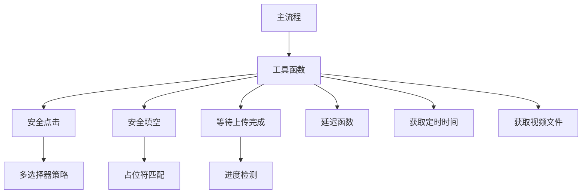

**图表来源**
- [douyin-publish.js:56-83](file://douyin-publish.js#L56-L83)
- [douyin-publish.js:85-103](file://douyin-publish.js#L85-L103)
- [douyin-publish.js:108-110](file://douyin-publish.js#L108-L110)
- [douyin-publish.js:115-143](file://douyin-publish.js#L115-L143)
- [douyin-publish.js:148-184](file://douyin-publish.js#L148-L184)
- [douyin-publish.js:189-235](file://douyin-publish.js#L189-L235)

**章节来源**
- [douyin-publish.js:24-53](file://douyin-publish.js#L24-L53)
- [douyin-publish.js:56-235](file://douyin-publish.js#L56-L235)

## 架构概览

系统采用模块化架构设计，主要分为以下几个层次：

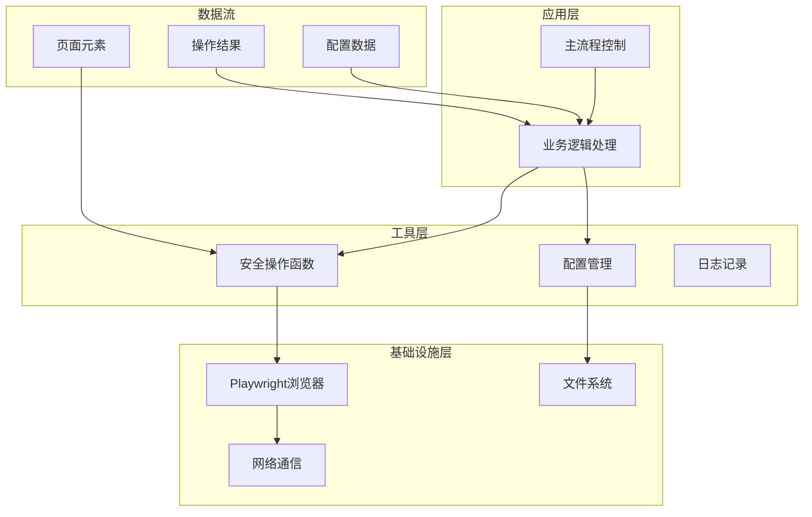

**图表来源**
- [douyin-publish.js:239-618](file://douyin-publish.js#L239-L618)
- [douyin-publish.js:20-23](file://douyin-publish.js#L20-L23)

## 详细组件分析

### 主流程控制组件

主流程采用异步函数设计，实现了完整的发布自动化流程：

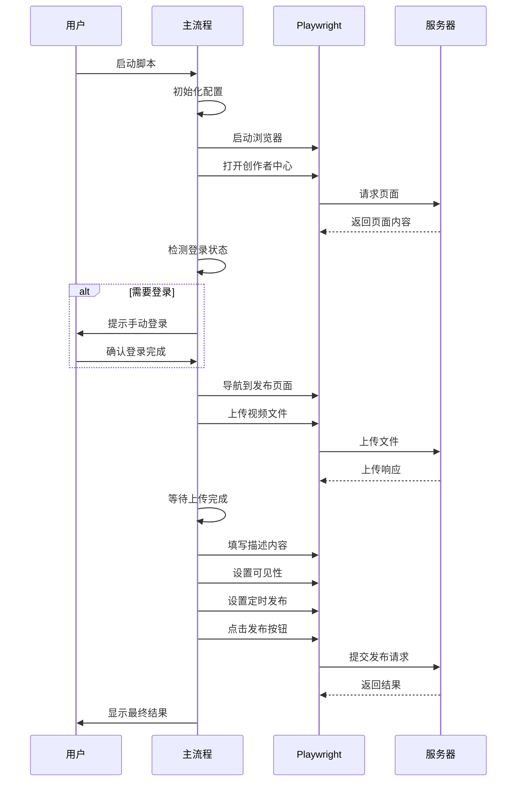

**图表来源**
- [douyin-publish.js:239-618](file://douyin-publish.js#L239-L618)

### 安全操作组件

系统实现了多层安全操作机制，确保自动化操作的可靠性：

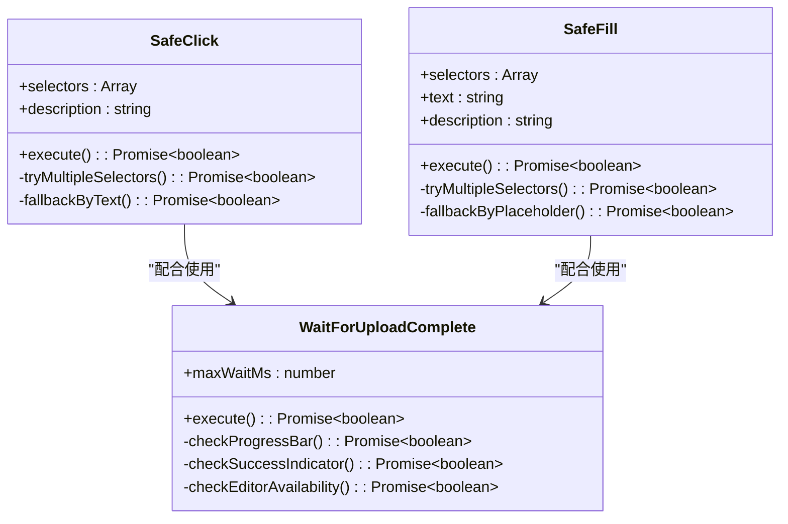

**图表来源**
- [douyin-publish.js:115-143](file://douyin-publish.js#L115-L143)
- [douyin-publish.js:148-184](file://douyin-publish.js#L148-L184)
- [douyin-publish.js:189-235](file://douyin-publish.js#L189-L235)

**章节来源**
- [douyin-publish.js:239-618](file://douyin-publish.js#L239-L618)
- [douyin-publish.js:115-235](file://douyin-publish.js#L115-L235)

## 调试技巧详解

### 日志记录策略

系统采用了多层次的日志记录策略，确保每个关键节点都有清晰的调试信息：

#### 关键节点日志输出

| 日志类型 | 触发条件 | 输出内容 | 格式化级别 |
|----------|----------|----------|------------|
| 启动日志 | 程序启动时 | 基本配置信息 | 信息级别 |
| 步骤日志 | 每个主要步骤 | 步骤名称和状态 | 信息级别 |
| 成功日志 | 操作成功时 | 成功消息和描述 | 成功级别 |
| 警告日志 | 操作失败但可恢复 | 失败原因和替代方案 | 警告级别 |
| 错误日志 | 程序异常时 | 错误详情和截图路径 | 错误级别 |

#### 错误信息格式化

系统使用统一的错误信息格式化标准：

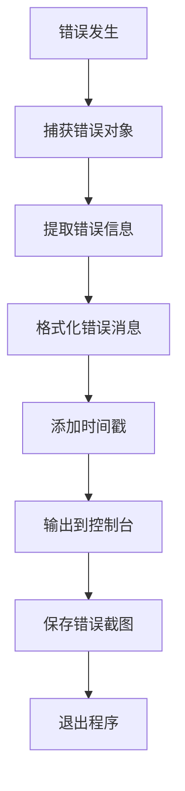

**图表来源**
- [douyin-publish.js:597-607](file://douyin-publish.js#L597-L607)

#### 调试信息分类管理

系统采用颜色编码和符号标识来区分不同类型的调试信息：

| 符号 | 类型 | 用途 | 示例 |
|------|------|------|------|
| 🚀 | 启动 | 程序启动 | 启动信息 |
| 📌 | 步骤 | 主要步骤 | 步骤开始 |
| 📹 | 文件 | 文件操作 | 视频文件 |
| ⏳ | 等待 | 等待操作 | 上传等待 |
| ✅ | 成功 | 操作成功 | 点击成功 |
| ⚠️ | 警告 | 操作警告 | 点击失败 |
| ❌ | 错误 | 程序错误 | 上传超时 |

**章节来源**
- [douyin-publish.js:239-618](file://douyin-publish.js#L239-L618)

## 错误处理机制

### 异步错误捕获策略

系统采用了多层次的异步错误处理机制：

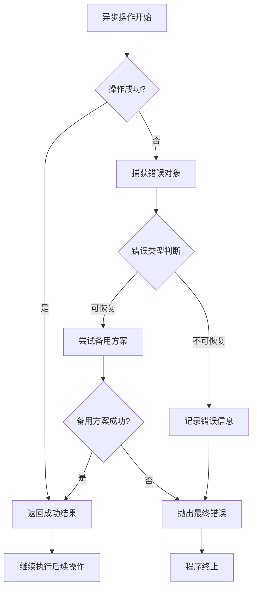

**图表来源**
- [douyin-publish.js:115-143](file://douyin-publish.js#L115-L143)
- [douyin-publish.js:148-184](file://douyin-publish.js#L148-L184)

### Promise错误处理最佳实践

系统在Promise链中实现了完善的错误处理：

#### 多重选择器策略

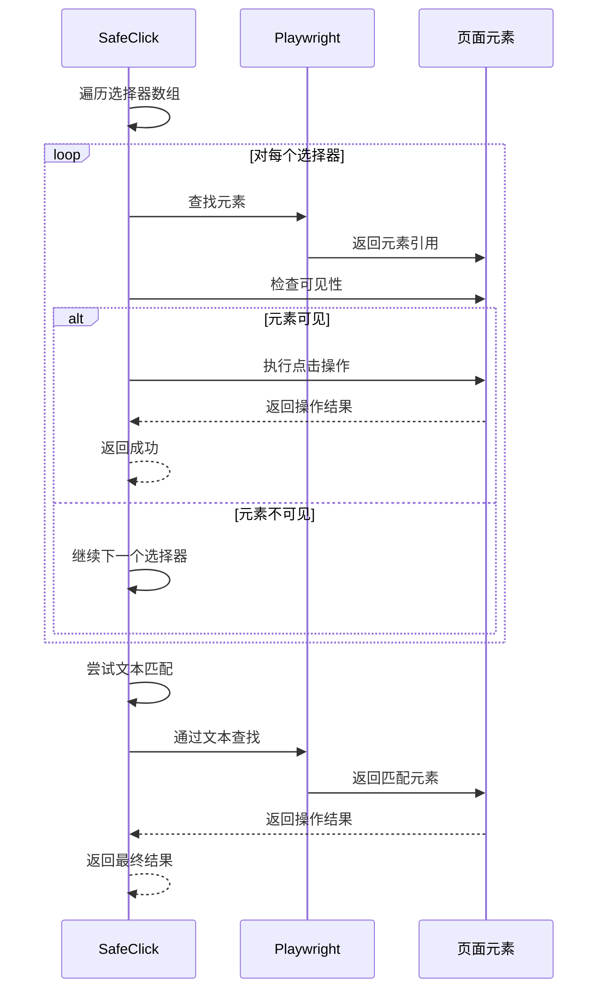

**图表来源**
- [douyin-publish.js:115-143](file://douyin-publish.js#L115-L143)

**章节来源**
- [douyin-publish.js:115-184](file://douyin-publish.js#L115-L184)

## 截图保存与分析

### 截图保存策略

系统在关键节点自动保存截图，便于问题分析：

#### 截图时机选择

| 截图时机 | 触发条件 | 截图目的 | 文件名规则 |
|----------|----------|----------|------------|
| 发布前截图 | 点击发布按钮前 | 检查最终配置 | before_publish.png |
| 发布结果截图 | 发布请求提交后 | 验证发布状态 | after_publish.png |
| 错误截图 | 发生异常时 | 记录错误场景 | error_screenshot.png |
| 步骤截图 | 关键步骤完成后 | 记录操作结果 | step_{n}.png |

#### 截图命名规则

系统采用统一的命名规范：
- 基础命名：`{action}_{timestamp}.png`
- 特殊命名：`before_publish.png`, `after_publish.png`, `error_screenshot.png`
- 序列命名：`step_1.png`, `step_2.png`, ..., `step_n.png`

#### 视觉分析技巧

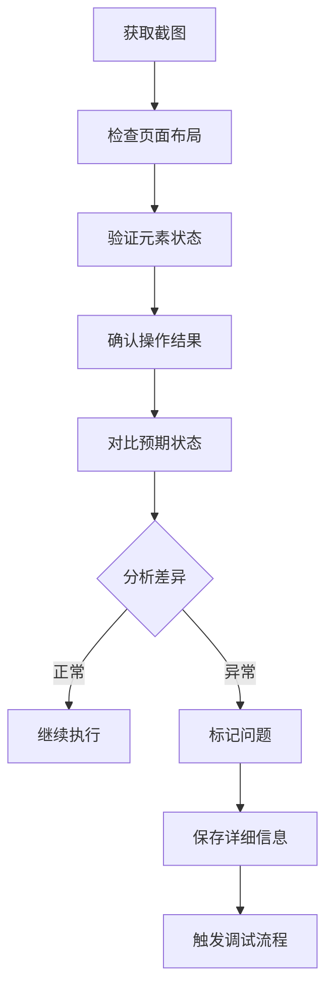

**图表来源**
- [douyin-publish.js:549-595](file://douyin-publish.js#L549-L595)

**章节来源**
- [douyin-publish.js:549-595](file://douyin-publish.js#L549-L595)

## 性能监控与优化

### 操作延迟测量

系统实现了精确的操作延迟监控：

#### 时间测量机制

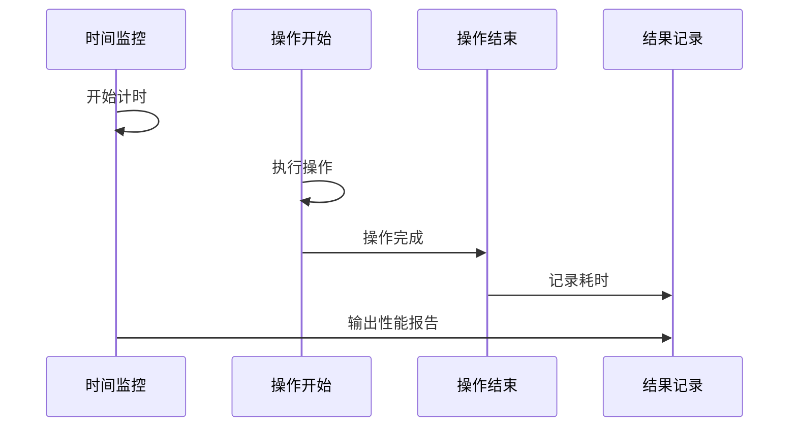

**图表来源**
- [douyin-publish.js:189-235](file://douyin-publish.js#L189-L235)

### 页面加载时间统计

系统提供了详细的页面加载时间统计功能：

| 统计指标 | 测量方法 | 阈值建议 | 监控意义 |
|----------|----------|----------|----------|
| 页面加载时间 | DOMContentLoaded事件 | < 10秒 | 页面响应速度 |
| 资源加载时间 | 所有资源加载完成 | < 15秒 | 资源优化效果 |
| 交互准备时间 | 可点击元素就绪 | < 5秒 | 用户体验 |
| 上传完成时间 | 文件传输完成 | < 5分钟 | 上传效率 |

### 资源使用监控

系统采用轻量级的资源使用监控：

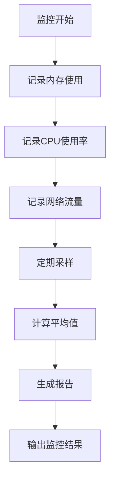

**章节来源**
- [douyin-publish.js:189-235](file://douyin-publish.js#L189-L235)

## 调试工具使用指南

### Playwright调试器

系统集成了Playwright的调试功能：

#### 调试模式配置

| 配置项 | 值 | 作用 |
|--------|----|------|
| headless | false | 显示浏览器界面 |
| slowMo | 100 | 慢动作演示 |
| viewport | 1440x900 | 浏览器窗口大小 |
| channel | 'chrome' | 使用Chrome浏览器 |

#### 调试技巧

1. **元素定位调试**：使用浏览器开发者工具检查元素选择器
2. **网络请求监控**：观察上传请求的状态和响应
3. **页面状态检查**：验证元素的可见性和可交互性
4. **性能分析**：监控页面加载和操作响应时间

### 浏览器开发者工具

系统推荐的调试工具使用方法：

#### 关键调试功能

| 功能 | 使用场景 | 操作方法 |
|------|----------|----------|
| 元素检查 | 验证选择器 | F12 -> Elements |
| 网络监控 | 检查上传状态 | F12 -> Network |
| 控制台调试 | 执行JavaScript | F12 -> Console |
| 性能分析 | 监控页面性能 | F12 -> Performance |

### Node.js调试技术

系统支持标准的Node.js调试技术：

#### 调试命令

```bash
# 启用调试模式
node --inspect-brk=douyin-publish.js

# 使用VS Code调试
# 在launch.json中配置Node.js调试配置
```

**章节来源**
- [douyin-publish.js:255-284](file://douyin-publish.js#L255-L284)

## 常见问题诊断

### 页面元素找不到

这是最常见的调试问题，系统提供了多种诊断方法：

#### 诊断流程

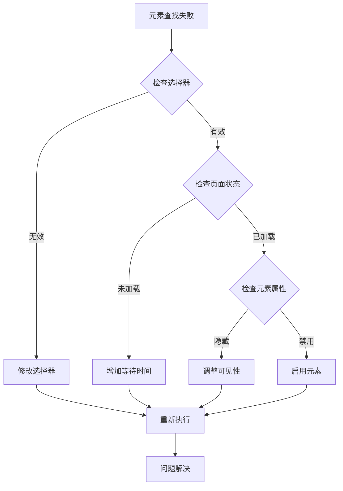

**图表来源**
- [douyin-publish.js:115-143](file://douyin-publish.js#L115-L143)

#### 排查步骤

1. **验证选择器有效性**：在浏览器控制台测试选择器
2. **检查页面加载状态**：确认目标元素已渲染
3. **验证元素可见性**：检查CSS样式和布局
4. **测试交互能力**：验证元素是否可点击或可输入

### 上传失败问题

上传失败通常由网络或页面状态引起：

#### 上传失败诊断

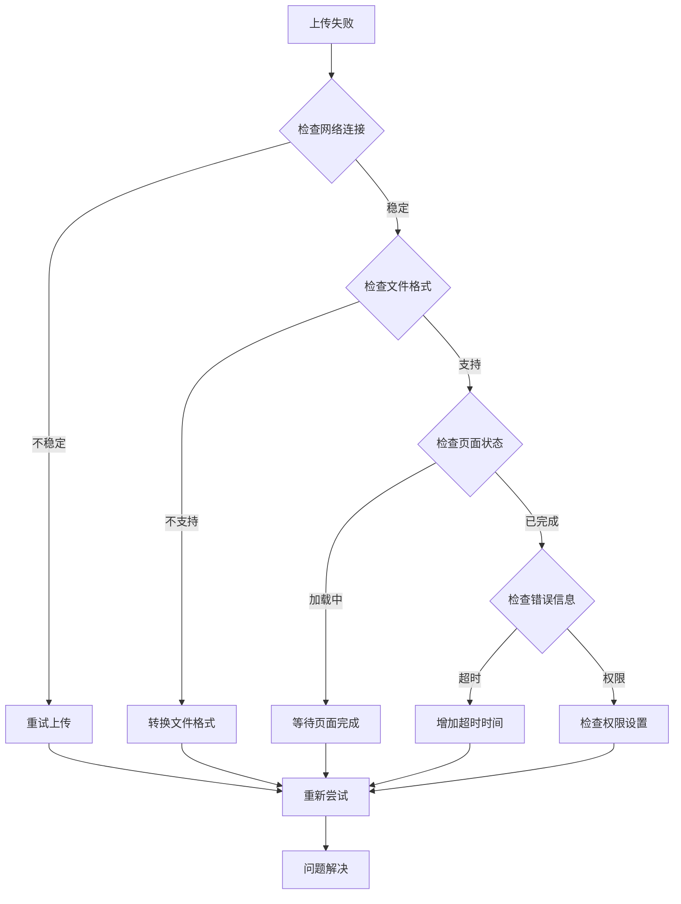

**图表来源**
- [douyin-publish.js:347-407](file://douyin-publish.js#L347-L407)

### 定时发布异常

定时发布功能的异常排查：

#### 定时发布问题诊断

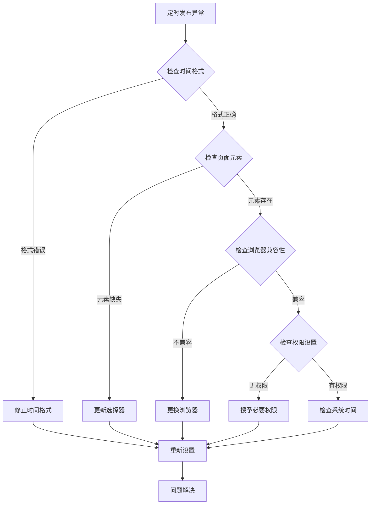

**图表来源**
- [douyin-publish.js:488-542](file://douyin-publish.js#L488-L542)

**章节来源**
- [douyin-publish.js:115-143](file://douyin-publish.js#L115-L143)
- [douyin-publish.js:347-407](file://douyin-publish.js#L347-L407)
- [douyin-publish.js:488-542](file://douyin-publish.js#L488-L542)

## 代码质量保证

### 代码审查要点

#### 结构性审查

| 审查维度 | 审查要点 | 通过标准 |
|----------|----------|----------|
| 模块化设计 | 函数职责单一 | 每个函数只做一件事 |
| 错误处理 | 异常情况覆盖 | 所有可能的错误都被处理 |
| 配置管理 | 参数集中管理 | 所有可变参数都在CONFIG中 |
| 日志记录 | 关键节点都有日志 | 每个重要步骤都有输出 |
| 超时设置 | 合理的超时时间 | 避免无限等待 |

#### 可维护性审查

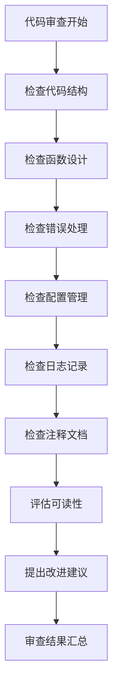

### 测试覆盖率要求

#### 当前测试状态

项目目前缺少正式的单元测试和集成测试：

| 测试类型 | 当前状态 | 建议改进 |
|----------|----------|----------|
| 单元测试 | 未实现 | 添加针对工具函数的测试 |
| 集成测试 | 未实现 | 创建端到端测试场景 |
| 性能测试 | 未实现 | 添加性能基准测试 |
| 回归测试 | 未实现 | 建立自动化回归测试 |

### 持续集成配置

#### CI/CD建议配置

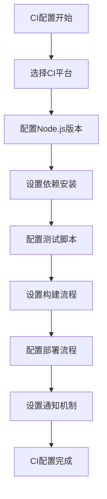

**图表来源**
- [package.json:5-8](file://package.json#L5-L8)

**章节来源**
- [package.json:5-8](file://package.json#L5-L8)

## 结论

抖音自动发布工具展现了良好的自动化脚本设计原则，通过多层安全操作、完善的错误处理和详细的日志记录，为复杂的Web自动化任务提供了可靠的解决方案。本文档总结的调试技巧与最佳实践将帮助开发者：

1. **提高调试效率**：通过系统化的日志记录和截图分析，快速定位问题根源
2. **增强代码可靠性**：通过多重错误处理和超时机制，提升脚本的稳定性
3. **优化用户体验**：通过性能监控和可视化调试，改善自动化流程的响应速度
4. **保证代码质量**：通过结构化的设计和测试策略，确保代码的可维护性

建议在实际使用中结合具体的业务场景，进一步完善测试体系和监控机制，以适应不断变化的Web环境和业务需求。