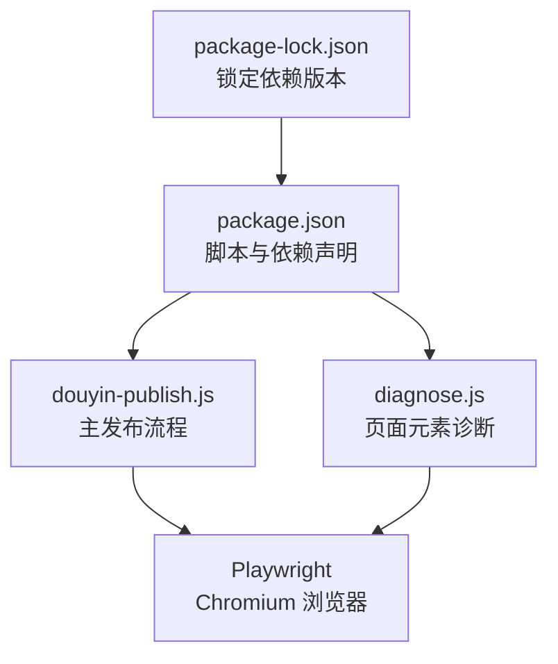
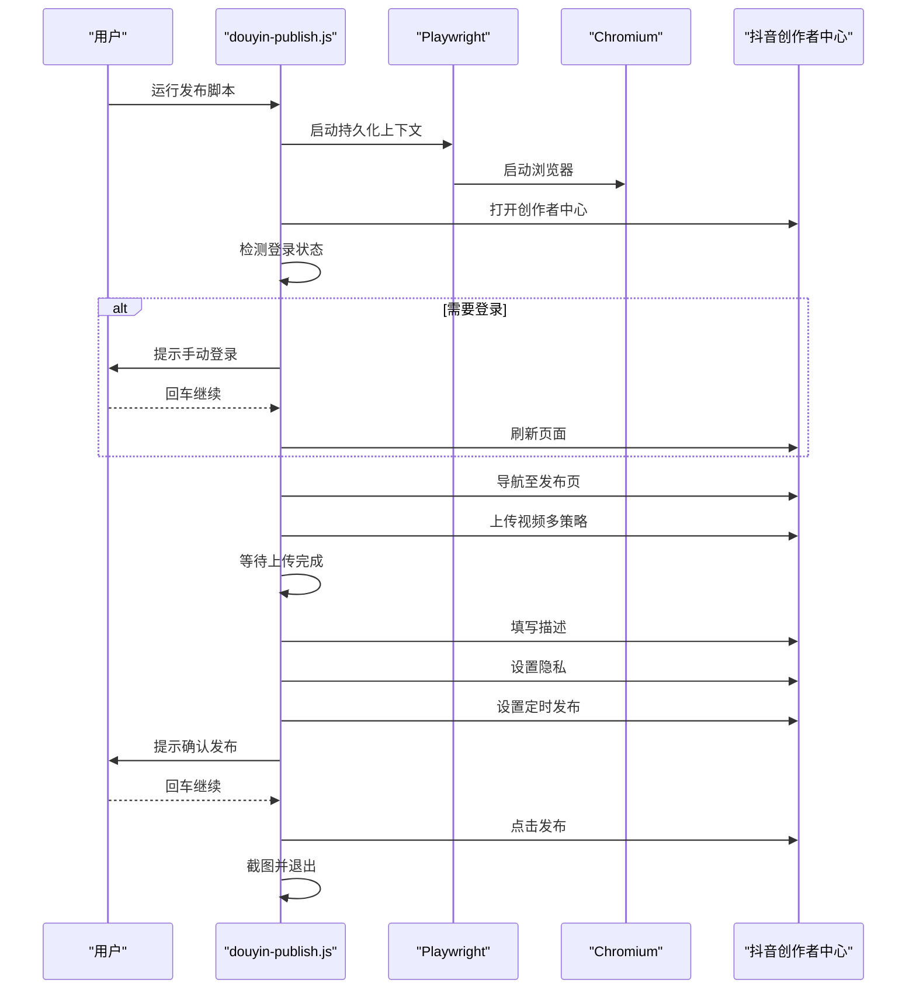
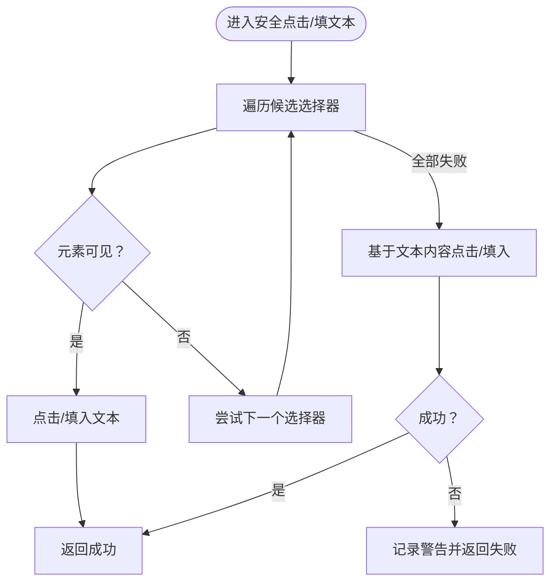
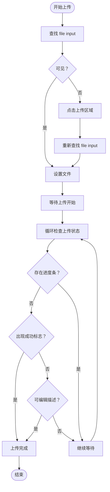
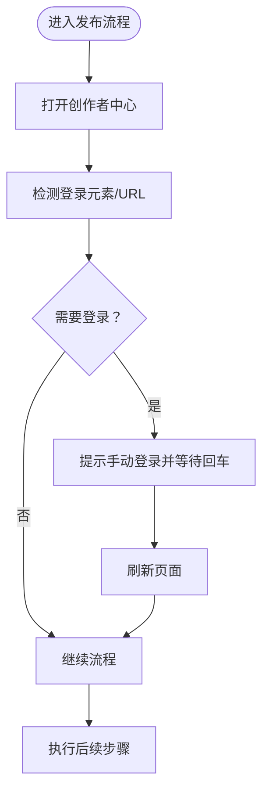
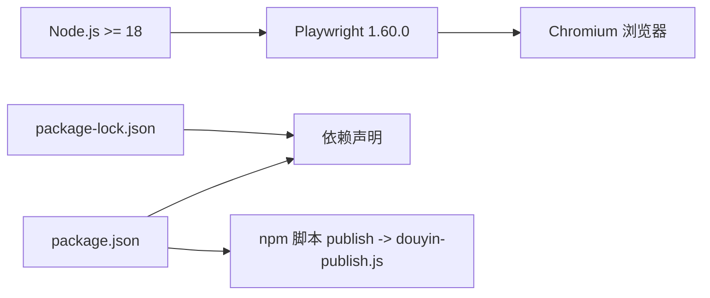

# 故障排除

<cite>
**本文引用的文件**
- [douyin-publish.js](file://douyin-publish.js)
- [diagnose.js](file://diagnose.js)
- [package.json](file://package.json)
- [package-lock.json](file://package-lock.json)
</cite>

## 目录
1. [简介](#简介)
2. [项目结构](#项目结构)
3. [核心组件](#核心组件)
4. [架构总览](#架构总览)
5. [详细组件分析](#详细组件分析)
6. [依赖关系分析](#依赖关系分析)
7. [性能考虑](#性能考虑)
8. [故障排除指南](#故障排除指南)
9. [结论](#结论)
10. [附录](#附录)

## 简介
本指南面向使用抖音自动发布工具的用户与维护者，系统梳理常见错误类型与解决方案，覆盖环境配置、依赖安装、浏览器兼容性、网络连接异常等场景；提供日志分析、截图检查、调试工具使用方法；深入解释异常捕获、错误恢复与用户提示策略；给出跨平台与浏览器适配建议；并包含性能诊断与优化建议，以及问题反馈与报告机制。

## 项目结构
该仓库包含一个主发布脚本、一个诊断脚本、以及 npm 包管理配置文件：
- 主发布脚本：负责打开抖音创作者中心、登录检测、上传视频、填写描述、设置隐私与定时发布、最终确认发布。
- 诊断脚本：用于分析发布页面元素结构，辅助定位页面元素变化导致的自动化失败。
- 包管理：定义 Playwright 依赖及运行脚本。

图表来源
- [douyin-publish.js:20-286](file://douyin-publish.js#L20-L286)
- [diagnose.js:4-15](file://diagnose.js#L4-L15)
- [package.json:1-17](file://package.json#L1-L17)
- [package-lock.json:1-61](file://package-lock.json#L1-L61)

章节来源
- [douyin-publish.js:1-625](file://douyin-publish.js#L1-L625)
- [diagnose.js:1-143](file://diagnose.js#L1-L143)
- [package.json:1-17](file://package.json#L1-L17)
- [package-lock.json:1-61](file://package-lock.json#L1-L61)

## 核心组件
- 配置区：集中管理视频目录、主题、描述、可见性、定时时间、目标 URL、浏览器模式与操作间隔等。
- 工具函数：安全点击、安全填文本、等待上传完成、延迟、获取定时时间、获取视频文件。
- 主流程：启动浏览器、持久化上下文、注入反检测脚本、打开创作者中心、登录检测、进入发布页、上传视频、等待上传完成、填写描述、设置隐私、设置定时发布、确认发布、截图与收尾。

章节来源
- [douyin-publish.js:24-53](file://douyin-publish.js#L24-L53)
- [douyin-publish.js:57-184](file://douyin-publish.js#L57-L184)
- [douyin-publish.js:239-618](file://douyin-publish.js#L239-L618)

## 架构总览
整体采用“脚本驱动 + 浏览器自动化”的架构，通过 Playwright 控制 Chromium 实现页面交互。脚本在关键节点进行元素可见性判断与多策略尝试，失败时输出明确提示并生成截图，便于人工介入。

图表来源
- [douyin-publish.js:252-286](file://douyin-publish.js#L252-L286)
- [douyin-publish.js:288-618](file://douyin-publish.js#L288-L618)

## 详细组件分析

### 安全点击与安全填文本
- 安全点击：对多个候选选择器逐一尝试，若均不可见则尝试基于文本内容的点击；失败时记录警告并返回 false。
- 安全填文本：对多个候选选择器逐一尝试，先点击再清空再逐字输入，提升稳定性；失败时尝试通过占位符定位；失败时记录警告并返回 false。

图表来源
- [douyin-publish.js:115-143](file://douyin-publish.js#L115-L143)
- [douyin-publish.js:148-184](file://douyin-publish.js#L148-L184)

章节来源
- [douyin-publish.js:115-184](file://douyin-publish.js#L115-L184)

### 上传流程与等待逻辑
- 上传策略：优先使用 file input；若不可见，尝试点击上传区域触发 file input；最后使用 filechooser 事件。
- 等待上传完成：轮询检查进度条、成功标志与可编辑描述区域；超时则报错并退出。

图表来源
- [douyin-publish.js:347-407](file://douyin-publish.js#L347-L407)
- [douyin-publish.js:189-235](file://douyin-publish.js#L189-L235)

章节来源
- [douyin-publish.js:347-407](file://douyin-publish.js#L347-L407)
- [douyin-publish.js:189-235](file://douyin-publish.js#L189-L235)

### 登录检测与人工确认
- 登录检测：通过多种选择器组合判断是否需要登录；若需要，等待用户手动登录后刷新页面。
- 人工确认：在关键步骤（如描述、隐私、定时发布、发布按钮）提供回车继续的人工确认，防止误操作。

图表来源
- [douyin-publish.js:288-319](file://douyin-publish.js#L288-L319)

章节来源
- [douyin-publish.js:288-319](file://douyin-publish.js#L288-L319)

### 错误处理与截图
- 异常捕获：主流程外层捕获异常并打印错误信息。
- 错误截图：发生异常时保存完整页面截图，便于定位问题。
- 退出策略：统一在 finally 中关闭浏览器并提示用户按键退出。

章节来源
- [douyin-publish.js:597-618](file://douyin-publish.js#L597-L618)

### 诊断脚本
- 功能：打开发布页，检测登录状态，截图并导出关键元素信息（file input、上传区域、按钮、文本编辑器、选择/开关控件、上传区域 HTML 片段）。
- 用途：当自动化失败时，使用诊断脚本快速定位页面结构变化，辅助调整选择器。

章节来源
- [diagnose.js:7-142](file://diagnose.js#L7-L142)

## 依赖关系分析
- 运行时要求：Playwright 1.60.0，Node.js 版本要求为 >= 18。
- 依赖锁定：package-lock.json 锁定依赖版本，确保可复现。
- 脚本入口：通过 npm scripts 的 publish 脚本运行主脚本。

图表来源
- [package.json:13-15](file://package.json#L13-L15)
- [package-lock.json:29-58](file://package-lock.json#L29-L58)
- [douyin-publish.js:20-286](file://douyin-publish.js#L20-L286)

章节来源
- [package.json:1-17](file://package.json#L1-L17)
- [package-lock.json:1-61](file://package-lock.json#L1-L61)

## 性能考虑
- 操作间隔：通过 CONFIG.actionDelay 控制操作节奏，避免过快导致页面未响应。
- 等待策略：使用可见性检查与轮询等待，减少无效重试。
- 网络与上传：上传耗时受网络与视频大小影响，建议在稳定网络环境下运行；若上传缓慢，可适当增加等待时间上限或降低视频质量。
- 浏览器参数：启用 slowMo 与禁用沙箱等参数有助于稳定运行，但会增加耗时。

章节来源
- [douyin-publish.js:51-53](file://douyin-publish.js#L51-L53)
- [douyin-publish.js:255-266](file://douyin-publish.js#L255-L266)
- [douyin-publish.js:189-235](file://douyin-publish.js#L189-L235)

## 故障排除指南

### 一、环境配置错误
- 症状
  - 运行时报错提示 Node.js 版本不满足要求。
  - 无法找到 Playwright 或浏览器二进制。
- 诊断
  - 检查 Node.js 版本是否满足 >= 18。
  - 检查 package.json 与 package-lock.json 是否匹配。
- 解决
  - 升级 Node.js 至 18+。
  - 删除 node_modules 与 package-lock.json，重新安装依赖。
  - 确保已安装 Chromium：执行 Playwright 安装命令。
- 相关路径
  - [package.json:40-42](file://package.json#L40-L42)
  - [package-lock.json:40-46](file://package-lock.json#L40-L46)

章节来源
- [package.json:40-42](file://package.json#L40-L42)
- [package-lock.json:40-46](file://package-lock.json#L40-L46)

### 二、依赖安装问题
- 症状
  - require('playwright') 报错找不到模块。
  - npx playwright install 执行失败。
- 诊断
  - 确认 package.json 中已声明 playwright 依赖。
  - 检查网络代理与镜像源。
- 解决
  - 使用 npm ci 或 npm install 安装依赖。
  - 若网络受限，配置 npm registry 或使用代理。
  - 执行 npx playwright install chromium 安装浏览器。
- 相关路径
  - [package.json:13-15](file://package.json#L13-L15)
  - [douyin-publish.js:20](file://douyin-publish.js#L20)

章节来源
- [package.json:13-15](file://package.json#L13-L15)
- [douyin-publish.js:20](file://douyin-publish.js#L20)

### 三、浏览器兼容性问题
- 症状
  - 启动浏览器失败或白屏。
  - 页面元素检测不到或不稳定。
- 诊断
  - 检查是否使用了受支持的浏览器通道（Chrome）。
  - 检查 slowMo、禁用沙箱等参数是否合理。
- 解决
  - 使用 channel: 'chrome' 并确保系统已安装 Chrome。
  - 适当提高 slowMo 以适应较慢设备。
  - 在 headless 模式下观察行为差异，必要时开启可视化调试。
- 相关路径
  - [douyin-publish.js:257](file://douyin-publish.js#L257)
  - [douyin-publish.js:261-266](file://douyin-publish.js#L261-L266)

章节来源
- [douyin-publish.js:257](file://douyin-publish.js#L257)
- [douyin-publish.js:261-266](file://douyin-publish.js#L261-L266)

### 四、网络连接异常
- 症状
  - 页面加载超时或频繁重定向。
  - 上传长时间无响应或超时。
- 诊断
  - 检查网络连通性与 DNS 解析。
  - 观察上传进度文本与成功标志。
- 解决
  - 在稳定网络环境下运行。
  - 适当延长等待时间上限（注意：当前上传等待默认上限较长）。
  - 降低视频码率或压缩后再上传。
- 相关路径
  - [douyin-publish.js:291](file://douyin-publish.js#L291)
  - [douyin-publish.js:189-235](file://douyin-publish.js#L189-L235)

章节来源
- [douyin-publish.js:291](file://douyin-publish.js#L291)
- [douyin-publish.js:189-235](file://douyin-publish.js#L189-L235)

### 五、页面元素定位困难
- 症状
  - 点击/填入失败，提示“点击失败/填写失败”。
  - 上传区域不可见或选择器失效。
- 诊断
  - 使用诊断脚本导出关键元素信息与上传区域 HTML 片段。
  - 对比页面实际结构与脚本中的选择器。
- 解决
  - 更新选择器集合，增加更多候选选择器。
  - 使用文本内容作为回退点击策略。
  - 在页面元素变化频繁时，增加可见性等待时间。
- 相关路径
  - [diagnose.js:56-135](file://diagnose.js#L56-L135)
  - [douyin-publish.js:115-143](file://douyin-publish.js#L115-L143)
  - [douyin-publish.js:148-184](file://douyin-publish.js#L148-L184)

章节来源
- [diagnose.js:56-135](file://diagnose.js#L56-L135)
- [douyin-publish.js:115-143](file://douyin-publish.js#L115-L143)
- [douyin-publish.js:148-184](file://douyin-publish.js#L148-L184)

### 六、登录与会话问题
- 症状
  - 未检测到登录状态，反复提示登录。
  - 登录后仍无法进入发布页。
- 诊断
  - 检查登录检测逻辑与 URL 判断。
  - 确认持久化上下文数据目录是否存在。
- 解决
  - 手动完成登录后按回车继续。
  - 清理 .browser-data 目录后重新登录。
  - 确保网络环境允许第三方 Cookie。
- 相关路径
  - [douyin-publish.js:294-319](file://douyin-publish.js#L294-L319)
  - [douyin-publish.js:254](file://douyin-publish.js#L254)

章节来源
- [douyin-publish.js:294-319](file://douyin-publish.js#L294-L319)
- [douyin-publish.js:254](file://douyin-publish.js#L254)

### 七、发布流程中断与恢复
- 症状
  - 发布按钮点击失败或发布结果未确认。
  - 需要人工干预后继续。
- 诊断
  - 检查发布前后的截图与页面元素状态。
  - 确认定时发布时间是否正确设置。
- 解决
  - 使用人工确认机制继续流程。
  - 如发布按钮点击失败，保留截图并手动点击。
  - 确认定时时间后再次尝试发布。
- 相关路径
  - [douyin-publish.js:557-595](file://douyin-publish.js#L557-L595)
  - [douyin-publish.js:506-542](file://douyin-publish.js#L506-L542)

章节来源
- [douyin-publish.js:557-595](file://douyin-publish.js#L557-L595)
- [douyin-publish.js:506-542](file://douyin-publish.js#L506-L542)

### 八、日志分析与截图检查
- 日志要点
  - 视频文件查找失败、上传超时、点击/填入失败、定时时间设置失败等。
- 截图位置
  - 发布前截图、发布结果截图、错误截图。
- 检查建议
  - 结合截图与日志定位具体步骤。
  - 使用诊断脚本导出页面结构辅助分析。
- 相关路径
  - [douyin-publish.js:60-83](file://douyin-publish.js#L60-L83)
  - [douyin-publish.js:189-235](file://douyin-publish.js#L189-L235)
  - [douyin-publish.js:550](file://douyin-publish.js#L550)
  - [douyin-publish.js:589](file://douyin-publish.js#L589)
  - [douyin-publish.js:602](file://douyin-publish.js#L602)

章节来源
- [douyin-publish.js:60-83](file://douyin-publish.js#L60-L83)
- [douyin-publish.js:189-235](file://douyin-publish.js#L189-L235)
- [douyin-publish.js:550](file://douyin-publish.js#L550)
- [douyin-publish.js:589](file://douyin-publish.js#L589)
- [douyin-publish.js:602](file://douyin-publish.js#L602)

### 九、调试工具与技巧
- Playwright 调试
  - 使用 headless=false 开启可视化调试。
  - 合理设置 slowMo 提升可观察性。
  - 使用 page.screenshot 保存关键节点截图。
- 浏览器开发者工具
  - 打开控制台检查网络请求与错误。
  - Elements 面板验证选择器是否匹配。
- 诊断脚本
  - 运行诊断脚本导出页面结构，辅助定位问题。
- 相关路径
  - [douyin-publish.js:256](file://douyin-publish.js#L256)
  - [douyin-publish.js:261-266](file://douyin-publish.js#L261-L266)
  - [diagnose.js:38](file://diagnose.js#L38)

章节来源
- [douyin-publish.js:256](file://douyin-publish.js#L256)
- [douyin-publish.js:261-266](file://douyin-publish.js#L261-L266)
- [diagnose.js:38](file://diagnose.js#L38)

### 十、跨平台与浏览器特定解决方案
- Windows
  - 确保系统已安装 Chrome，使用 channel: 'chrome'。
  - 注意路径分隔符与权限问题。
- macOS/Linux
  - 安装 Chromium 或 Chrome，并确保可执行权限。
  - 注意 fsevents 等可选依赖的影响。
- 浏览器版本
  - 使用最新稳定版 Chrome，避免过旧版本导致检测失败。
- 相关路径
  - [douyin-publish.js:257](file://douyin-publish.js#L257)
  - [package-lock.json:15-28](file://package-lock.json#L15-L28)

章节来源
- [douyin-publish.js:257](file://douyin-publish.js#L257)
- [package-lock.json:15-28](file://package-lock.json#L15-L28)

### 十一、性能问题诊断与优化
- 上传速度慢
  - 降低视频分辨率或码率。
  - 在网络稳定的时段运行。
  - 增加等待时间上限（谨慎使用）。
- 页面加载失败
  - 提高等待超时时间。
  - 检查网络与 DNS。
- 元素定位困难
  - 使用诊断脚本导出页面结构。
  - 增加选择器候选与可见性等待。
- 相关路径
  - [douyin-publish.js:291](file://douyin-publish.js#L291)
  - [douyin-publish.js:189-235](file://douyin-publish.js#L189-L235)
  - [diagnose.js:124-135](file://diagnose.js#L124-L135)

章节来源
- [douyin-publish.js:291](file://douyin-publish.js#L291)
- [douyin-publish.js:189-235](file://douyin-publish.js#L189-L235)
- [diagnose.js:124-135](file://diagnose.js#L124-L135)

### 十二、问题反馈与报告机制
- 收集信息
  - 运行日志（含错误信息与警告）。
  - 发布前/后/错误截图。
  - 诊断脚本导出的页面结构 JSON。
  - 操作系统、浏览器版本、Node.js 版本。
- 提交渠道
  - 在仓库 Issues 中提交，附带上述信息。
- 相关路径
  - [douyin-publish.js:597-618](file://douyin-publish.js#L597-L618)
  - [diagnose.js:137-142](file://diagnose.js#L137-L142)

章节来源
- [douyin-publish.js:597-618](file://douyin-publish.js#L597-L618)
- [diagnose.js:137-142](file://diagnose.js#L137-L142)

## 结论
本指南从环境、依赖、浏览器、网络、页面元素、流程控制、日志与截图、调试工具、跨平台适配、性能优化与问题反馈等方面提供了系统化的故障排除方法。建议在首次运行前完成环境与依赖检查，日常使用中结合诊断脚本与截图进行快速定位，并在遇到复杂问题时按模板收集信息以便高效获得支持。

## 附录
- 快速检查清单
  - Node.js 版本满足要求。
  - 已安装 Playwright 与 Chromium。
  - 视频目录存在且包含支持格式的视频文件。
  - 已登录抖音账号并保持会话有效。
  - 网络稳定，上传时间充足。
  - 使用 headless=false 进行调试。
  - 保存并随问题报告附带截图与日志。