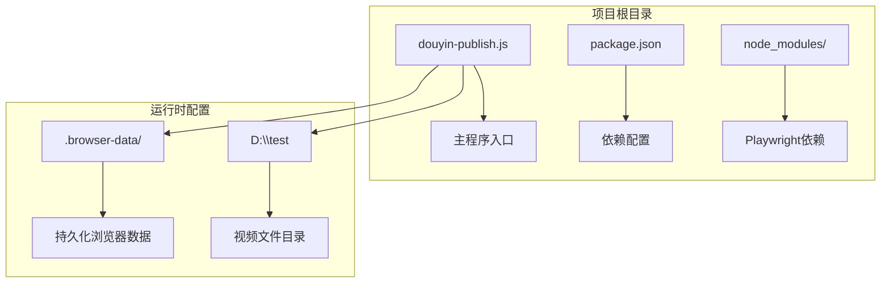
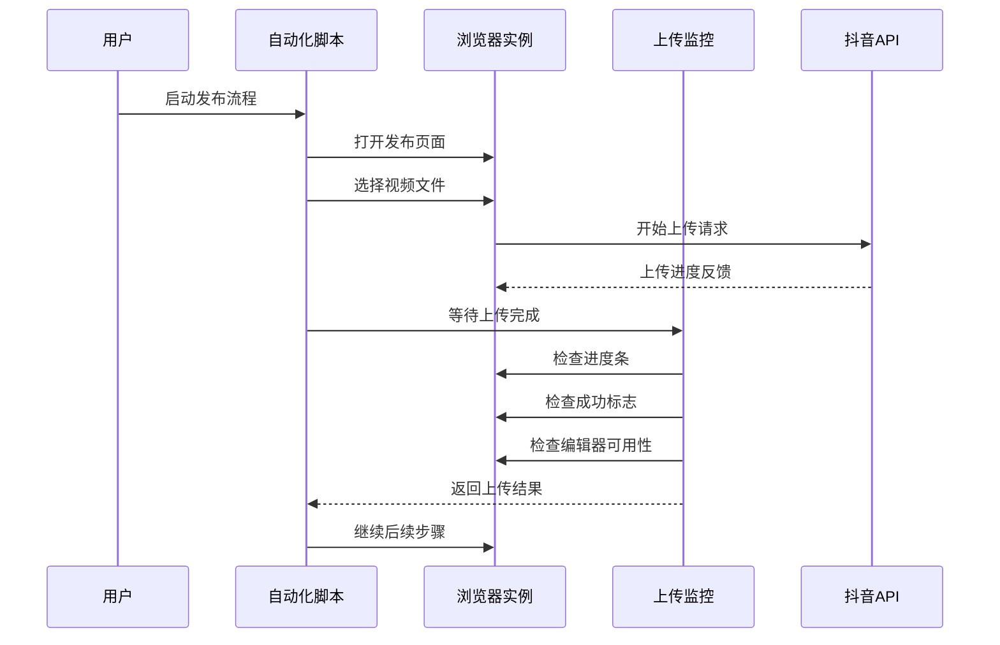
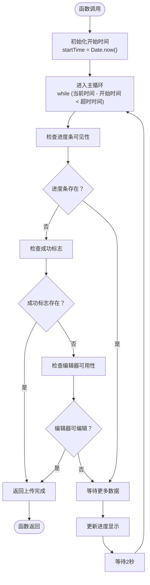
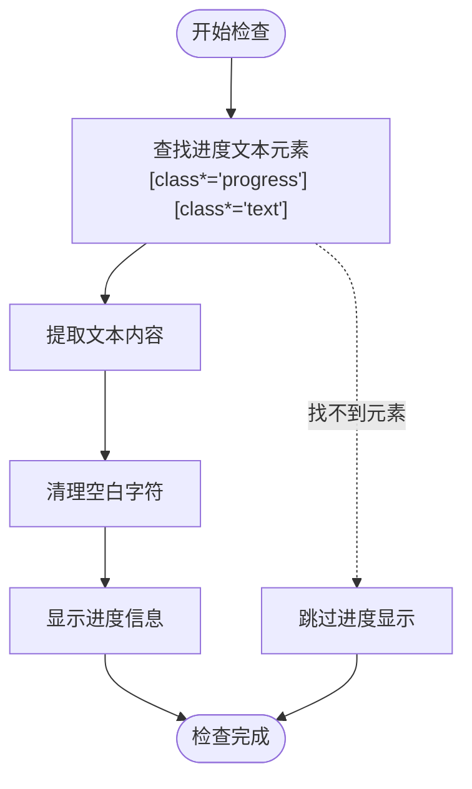
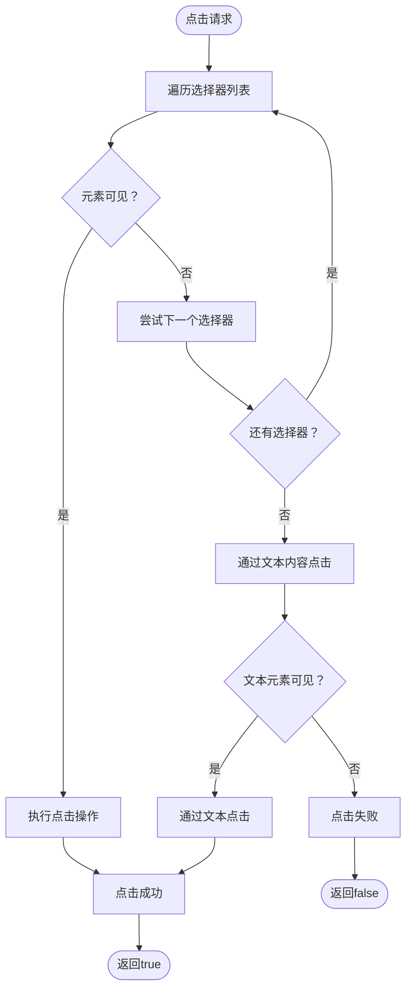
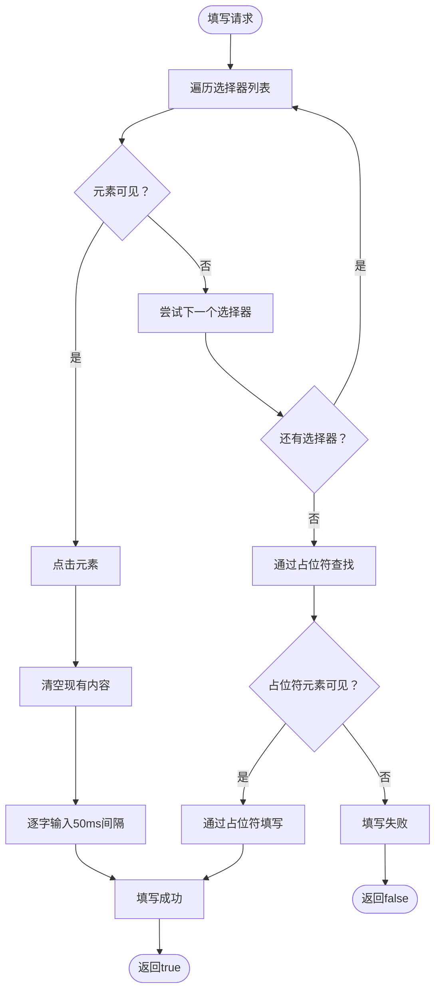
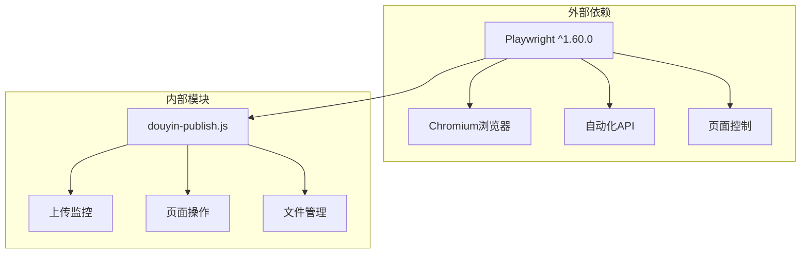
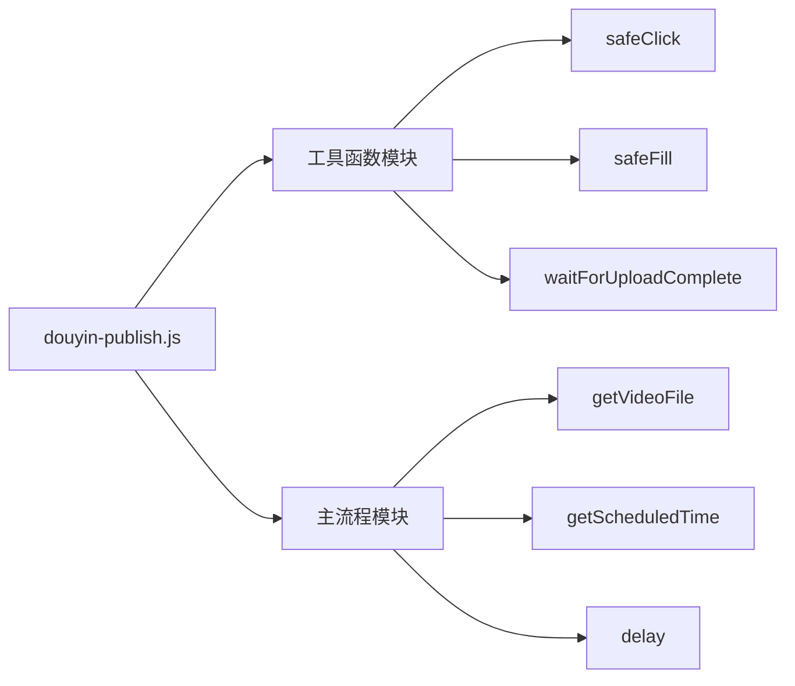

# 上传监控功能

<cite>
**本文档引用的文件**
- [douyin-publish.js](file://douyin-publish.js)
- [package.json](file://package.json)
</cite>

## 目录
1. [简介](#简介)
2. [项目结构](#项目结构)
3. [核心组件](#核心组件)
4. [架构概览](#架构概览)
5. [详细组件分析](#详细组件分析)
6. [依赖关系分析](#依赖关系分析)
7. [性能考虑](#性能考虑)
8. [故障排除指南](#故障排除指南)
9. [结论](#结论)

## 简介

本文档深入解析抖音自动发布脚本中的上传监控功能，重点分析 `waitForUploadComplete` 函数的工作机制。该功能负责监控视频上传过程，通过多种检测标准判断上传是否完成，包括上传进度条检测、上传成功标志识别和编辑器可用性判断。

该脚本使用 Playwright 自动化技术，实现了从视频上传到发布的完整自动化流程，其中上传监控功能是整个流程的关键环节。

## 项目结构

项目采用简洁的单文件架构设计：



**图表来源**
- [douyin-publish.js:25-53](file://douyin-publish.js#L25-L53)
- [douyin-publish.js:255-266](file://douyin-publish.js#L255-L266)

**章节来源**
- [douyin-publish.js:1-625](file://douyin-publish.js#L1-L625)
- [package.json:1-17](file://package.json#L1-L17)

## 核心组件

### 上传监控函数

`waitForUploadComplete` 是整个上传监控功能的核心组件，负责：

- **进度条检测**：监控上传进度条的可见性状态
- **成功标志识别**：检测上传完成的成功标识
- **编辑器可用性判断**：验证上传完成后编辑器是否可使用
- **超时处理**：设置合理的超时机制防止无限等待
- **状态轮询**：定期检查上传状态变化

### 工具函数体系

项目提供了完整的工具函数支持：

- **安全点击函数**：多策略点击元素，提高成功率
- **安全文本填写函数**：模拟真实用户输入行为
- **延迟函数**：控制操作节奏，避免过快操作
- **文件管理函数**：自动发现和验证视频文件

**章节来源**
- [douyin-publish.js:186-235](file://douyin-publish.js#L186-L235)
- [douyin-publish.js:113-143](file://douyin-publish.js#L113-L143)
- [douyin-publish.js:146-184](file://douyin-publish.js#L146-L184)
- [douyin-publish.js:107-110](file://douyin-publish.js#L107-L110)

## 架构概览

上传监控功能在整个发布流程中的位置：



**图表来源**
- [douyin-publish.js:409-418](file://douyin-publish.js#L409-L418)
- [douyin-publish.js:186-235](file://douyin-publish.js#L186-L235)

## 详细组件分析

### waitForUploadComplete 函数详解

#### 函数签名与参数



**图表来源**
- [douyin-publish.js:189-235](file://douyin-publish.js#L189-L235)

#### 上传状态监控逻辑

函数采用三层检测机制：

1. **进度条检测层**
   - 监控 `.progress-bar`、`.upload-progress` 等进度条元素
   - 通过 `isVisible()` 方法检测元素可见性
   - 超时时间为1秒，避免长时间阻塞

2. **成功标志识别层**
   - 检测 `[class*="success"]`、`[class*="done"]` 等成功标识
   - 支持多种成功状态的变体
   - 提供多种选择器以适应不同页面结构

3. **编辑器可用性判断层**
   - 检测 `.ql-editor`、`[contenteditable="true"]` 等编辑器元素
   - 验证上传完成后是否可以进行后续编辑
   - 作为最后的兜底判断标准

#### 进度文本提取机制



**图表来源**
- [douyin-publish.js:221-228](file://douyin-publish.js#L221-L228)

#### 超时处理机制

- **默认超时时间**：300,000毫秒（5分钟）
- **轮询间隔**：2,000毫秒（2秒）
- **进度更新频率**：每次轮询更新一次
- **超时处理**：返回 `false` 并输出错误信息

#### 多种上传完成判断标准

函数实现了三种相互独立的完成判断标准：

1. **进度条消失标准**
   - 当进度条不再可见时，认为上传可能已完成
   - 需要结合其他标准进行验证

2. **成功标识出现标准**
   - 检测到成功相关的视觉标识
   - 最直接的完成判断依据

3. **编辑器可用标准**
   - 上传完成后编辑器变为可编辑状态
   - 作为最终的完成确认

**章节来源**
- [douyin-publish.js:186-235](file://douyin-publish.js#L186-L235)

### 安全点击函数分析

#### 多策略点击机制



**图表来源**
- [douyin-publish.js:115-143](file://douyin-publish.js#L115-L143)

#### 选择器优先级策略

1. **精确选择器优先**：使用具体的CSS选择器
2. **模糊匹配次之**：使用包含特定类名的选择器
3. **文本匹配最后**：通过元素文本内容定位
4. **容错机制**：每个步骤都有异常处理

**章节来源**
- [douyin-publish.js:113-143](file://douyin-publish.js#L113-L143)

### 安全文本填写函数

#### 输入行为模拟



**图表来源**
- [douyin-publish.js:148-184](file://douyin-publish.js#L148-L184)

#### 输入行为真实性保证

- **逐字输入**：模拟真实用户输入速度
- **延迟控制**：每个字符输入间隔50毫秒
- **内容清理**：先清空再输入，避免残留字符
- **多次尝试**：提供多种定位策略

**章节来源**
- [douyin-publish.js:146-184](file://douyin-publish.js#L146-L184)

## 依赖关系分析

### 外部依赖

项目主要依赖 Playwright 自动化框架：



**图表来源**
- [package.json:13-15](file://package.json#L13-L15)

### 内部模块依赖



**图表来源**
- [douyin-publish.js:57-83](file://douyin-publish.js#L57-L83)
- [douyin-publish.js:85-103](file://douyin-publish.js#L85-L103)
- [douyin-publish.js:107-110](file://douyin-publish.js#L107-L110)

**章节来源**
- [package.json:1-17](file://package.json#L1-17)
- [douyin-publish.js:20-23](file://douyin-publish.js#L20-L23)

## 性能考虑

### 监控精度提升方案

1. **动态轮询间隔调整**
   ```javascript
   // 基于上传进度动态调整轮询间隔
   const interval = Math.max(1000, 5000 - progress * 10);
   ```

2. **多线程状态检查**
   - 并行检查多个关键元素状态
   - 减少单点检查的延迟影响

3. **智能超时计算**
   - 根据视频大小动态调整超时时间
   - 大文件增加超时时间，小文件减少等待

### 性能优化建议

1. **选择器优化**
   - 使用更精确的选择器减少DOM查询时间
   - 缓存常用元素引用

2. **内存管理**
   - 及时释放不再使用的元素引用
   - 控制日志输出频率

3. **网络优化**
   - 预加载必要的资源
   - 减少不必要的页面重绘

### 监控精度提升方案

1. **进度百分比提取**
   ```javascript
   // 提取更精确的进度信息
   const progressPercent = await page.evaluate(() => {
       const element = document.querySelector('[class*="progress"]');
       if (element) {
           return element.getAttribute('aria-valuenow') || 
                  element.style.width || 
                  element.textContent;
       }
       return '';
   });
   ```

2. **状态变化检测**
   - 监测进度条的数值变化
   - 检测成功标志的出现时机

3. **异常情况处理**
   - 网络中断恢复
   - 页面重新加载后的状态恢复

## 故障排除指南

### 常见问题及解决方案

#### 上传监控失败

**问题现象**：`waitForUploadComplete` 返回 `false`

**可能原因**：
1. 选择器匹配不到元素
2. 页面结构发生变化
3. 网络连接不稳定
4. 超时时间不足

**解决方法**：
1. 检查并更新选择器表达式
2. 增加超时时间参数
3. 添加更多的容错处理
4. 实现重试机制

#### 元素可见性检测失败

**问题现象**：`isVisible()` 方法总是返回 `false`

**可能原因**：
1. 元素在动画过程中不可见
2. 页面尚未完全加载
3. 选择器过于严格

**解决方法**：
1. 增加等待时间
2. 使用更宽松的选择器
3. 实现重试逻辑

#### 进度文本提取失败

**问题现象**：无法获取进度百分比

**可能原因**：
1. 进度文本不在预期位置
2. 文本内容格式变化
3. 页面国际化导致文本变化

**解决方法**：
1. 扩展文本提取范围
2. 使用正则表达式匹配
3. 实现多种提取策略

### 调试技巧

1. **启用详细日志**
   ```javascript
   // 在开发阶段启用详细调试信息
   const DEBUG = true;
   ```

2. **截图保存**
   ```javascript
   // 在关键节点保存页面截图
   await page.screenshot({ path: 'debug_' + Date.now() + '.png' });
   ```

3. **元素高亮**
   ```javascript
   // 高亮调试元素
   await page.evaluate(() => {
       const elements = document.querySelectorAll('.highlight');
       elements.forEach(el => el.style.border = '2px solid red');
   });
   ```

**章节来源**
- [douyin-publish.js:597-617](file://douyin-publish.js#L597-L617)

## 结论

抖音自动发布脚本的上传监控功能展现了现代Web自动化测试的最佳实践。通过 `waitForUploadComplete` 函数，实现了对复杂上传流程的可靠监控。

### 主要优势

1. **多层检测机制**：通过进度条、成功标志、编辑器可用性三重验证，提高了判断准确性
2. **容错性强**：多种选择器策略和异常处理机制确保了稳定性
3. **用户体验友好**：实时进度显示和详细的日志输出提升了可观测性
4. **性能优化**：合理的轮询间隔和超时控制平衡了准确性与效率

### 改进建议

1. **智能化监控**：根据视频大小和网络状况动态调整监控策略
2. **机器学习集成**：利用AI识别页面元素，提高选择器的鲁棒性
3. **分布式监控**：支持多浏览器并行监控，提高大规模部署能力
4. **云端集成**：与云服务集成，实现远程监控和告警

该上传监控功能为Web自动化测试提供了优秀的参考案例，其设计理念和实现方法值得在其他类似的自动化场景中借鉴和应用。