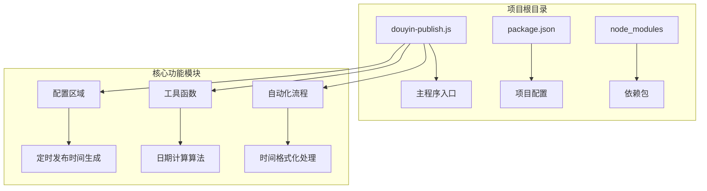
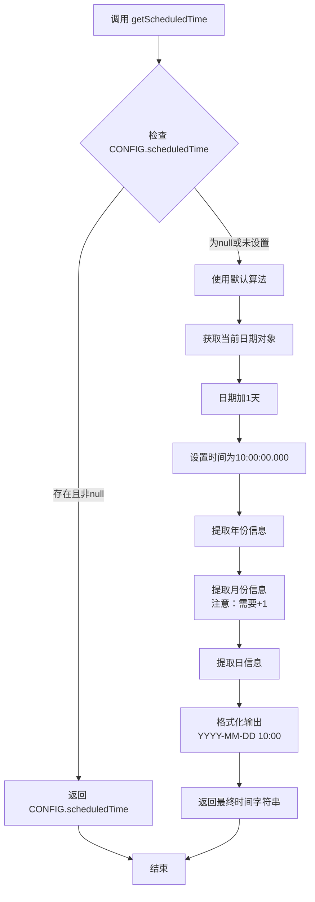
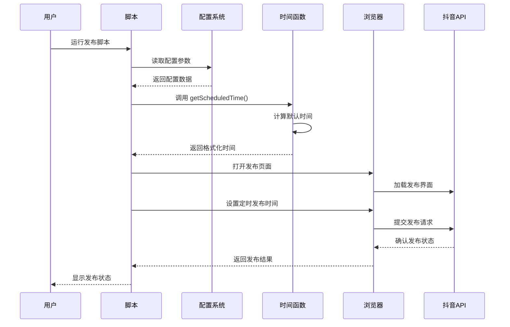
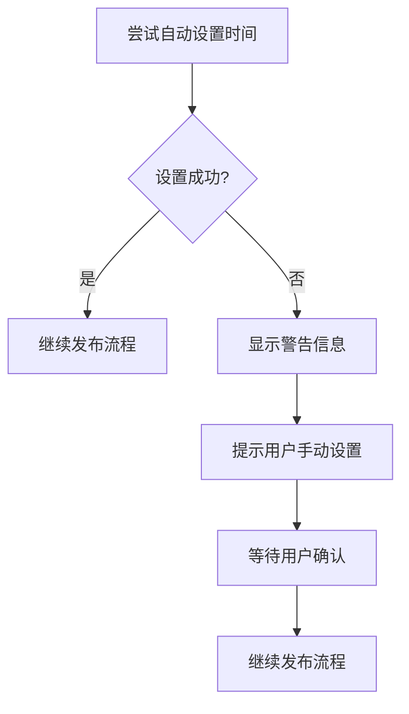
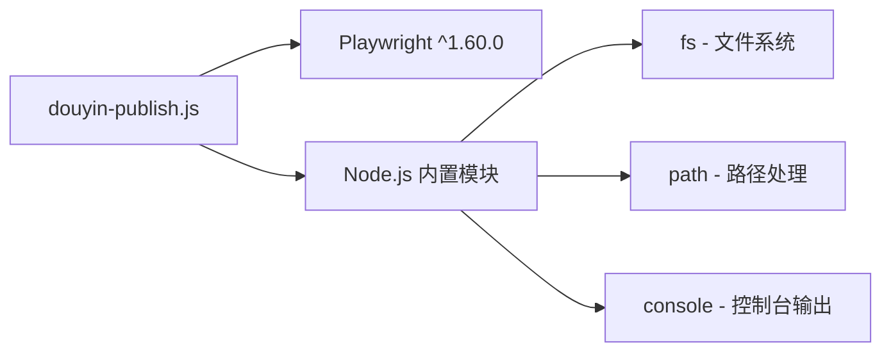
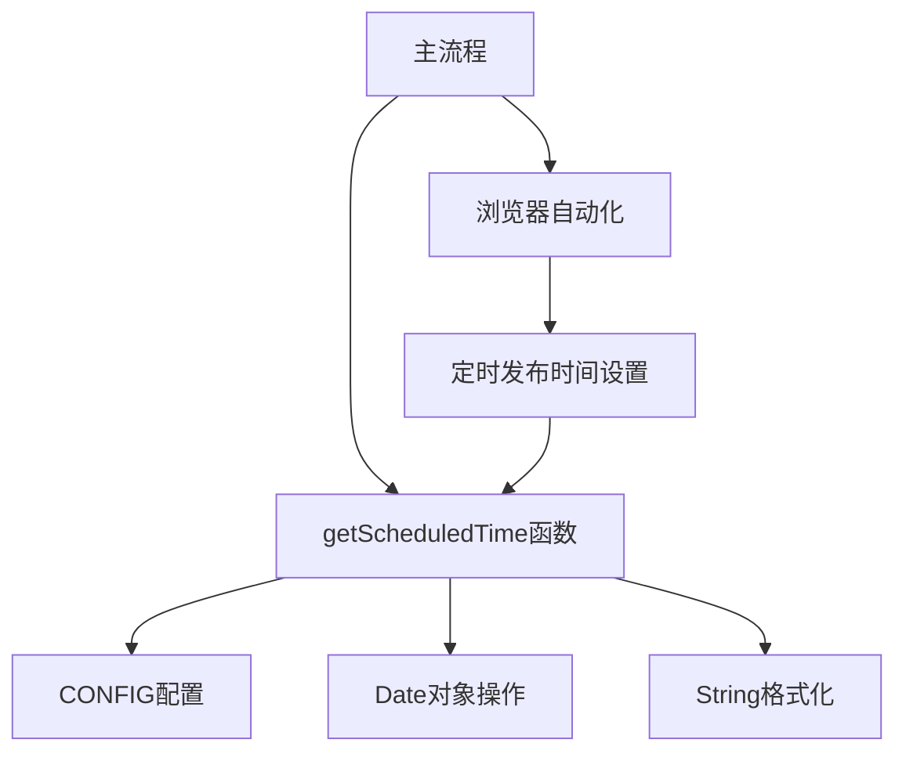

# 时间管理功能

<cite>
**本文档引用的文件**
- [douyin-publish.js](file://douyin-publish.js)
- [package.json](file://package.json)
</cite>

## 目录
1. [简介](#简介)
2. [项目结构](#项目结构)
3. [核心组件](#核心组件)
4. [架构概览](#架构概览)
5. [详细组件分析](#详细组件分析)
6. [依赖关系分析](#依赖关系分析)
7. [性能考虑](#性能考虑)
8. [故障排除指南](#故障排除指南)
9. [结论](#结论)

## 简介

本文档深入分析了抖音自动发布脚本中的时间管理功能，重点解析`getScheduledTime`函数的时间计算逻辑。该功能负责生成定时发布时间，默认设置为明天上午10:00，并支持自定义时间配置。文档详细说明了日期计算算法、时间格式化处理、时区考虑以及跨平台兼容性等技术细节。

## 项目结构

该项目采用单文件架构设计，所有功能集中在单一JavaScript文件中：



**图表来源**
- [douyin-publish.js:24-53](file://douyin-publish.js#L24-L53)
- [package.json:1-17](file://package.json#L1-L17)

**章节来源**
- [douyin-publish.js:1-625](file://douyin-publish.js#L1-L625)
- [package.json:1-17](file://package.json#L1-L17)

## 核心组件

### 配置区域 (CONFIG)

配置区域定义了整个脚本的运行参数，其中时间管理相关的关键配置包括：

- **videoDir**: 视频文件存储路径
- **scheduledTime**: 定时发布时间配置，支持null值表示自动计算
- **headless**: 是否显示浏览器界面
- **actionDelay**: 操作间隔时间

**章节来源**
- [douyin-publish.js:24-53](file://douyin-publish.js#L24-L53)

### 时间管理核心函数

#### getScheduledTime函数

这是时间管理功能的核心函数，实现了智能的时间计算逻辑：



**图表来源**
- [douyin-publish.js:88-103](file://douyin-publish.js#L88-L103)

**章节来源**
- [douyin-publish.js:88-103](file://douyin-publish.js#L88-L103)

## 架构概览

时间管理功能在整个自动化发布流程中的位置：



**图表来源**
- [douyin-publish.js:239-618](file://douyin-publish.js#L239-L618)

## 详细组件分析

### 时间计算算法详解

#### 默认时间策略

`getScheduledTime`函数实现了"明天10:00"的默认策略：

1. **日期计算**: 使用`new Date()`获取当前时间，然后通过`setDate(tomorrow.getDate() + 1)`实现日期加1
2. **时间设置**: 通过`setHours(10, 0, 0, 0)`将时间精确设置为10:00:00.000
3. **格式化输出**: 使用模板字符串将日期格式化为"YYYY-MM-DD 10:00"

#### 月份索引调整机制

关键的技术细节在于JavaScript Date对象的月份索引：

```javascript
// 重要：Date.getMonth() 返回 0-11 的索引
const month = String(tomorrow.getMonth() + 1).padStart(2, '0');
```

这个设计确保了月份从1-12的正确显示，而不是JavaScript内部的0-11索引。

#### 时间格式化处理

格式化过程包含多个步骤：

1. **年份提取**: `getFullYear()`获取4位年份数字
2. **月份提取与调整**: `getMonth() + 1`并使用`padStart(2, '0')`确保两位数显示
3. **日提取**: `getDate()`获取日数并保持个位数格式
4. **固定时间**: 固定为"10:00"作为默认发布时间

**章节来源**
- [douyin-publish.js:88-103](file://douyin-publish.js#L88-L103)

### 自定义时间配置

#### 配置参数说明

用户可以通过修改`CONFIG.scheduledTime`来设置自定义发布时间：

```javascript
// 支持的格式示例
CONFIG.scheduledTime = "2024-12-25 14:30";  // 圣诞节下午2:30
CONFIG.scheduledTime = "2024-01-01 09:00";  // 新年早上9点
CONFIG.scheduledTime = null;               // 使用默认算法
```

#### 时间格式验证机制

虽然代码中没有显式的格式验证，但通过以下机制确保时间格式的有效性：

1. **条件判断**: 当`CONFIG.scheduledTime`存在且非null时直接使用
2. **自动计算**: 当为null时触发默认算法
3. **字符串拼接**: 通过模板字符串确保格式一致性

**章节来源**
- [douyin-publish.js:88-103](file://douyin-publish.js#L88-L103)

### 时区处理与跨平台兼容性

#### 本地时区处理

脚本使用JavaScript原生的`Date`对象进行时间计算，这意味着：

- **本地时区**: 使用系统本地时区进行日期计算
- **夏令时**: 自动继承系统的夏令时设置
- **跨平台**: 在不同操作系统上保持一致的行为

#### 时区转换建议

如果需要精确的UTC时间处理，建议：

1. 使用专门的时区处理库（如moment-timezone）
2. 明确指定目标时区
3. 实现双向转换机制

**章节来源**
- [douyin-publish.js:88-103](file://douyin-publish.js#L88-L103)

### 错误处理与边界情况

#### 边界情况处理

脚本对以下边界情况进行了处理：

1. **空值检查**: `CONFIG.scheduledTime`为null时触发默认算法
2. **格式兼容**: 支持用户提供的自定义时间格式
3. **字符串安全**: 使用模板字符串避免格式错误

#### 异常处理机制

在主流程中，时间设置失败时提供了降级处理：



**图表来源**
- [douyin-publish.js:528-542](file://douyin-publish.js#L528-L542)

**章节来源**
- [douyin-publish.js:528-542](file://douyin-publish.js#L528-L542)

## 依赖关系分析

### 外部依赖

项目的主要外部依赖：



**图表来源**
- [package.json:13-15](file://package.json#L13-L15)

### 内部模块依赖

时间管理功能与其他模块的依赖关系：



**图表来源**
- [douyin-publish.js:239-618](file://douyin-publish.js#L239-L618)

**章节来源**
- [package.json:13-15](file://package.json#L13-L15)

## 性能考虑

### 时间计算性能

`getScheduledTime`函数具有以下性能特点：

- **时间复杂度**: O(1) - 常数时间操作
- **空间复杂度**: O(1) - 常数空间使用
- **内存占用**: 仅创建少量字符串和Date对象
- **执行频率**: 每次调用都会重新计算，确保时间准确性

### 优化建议

1. **缓存机制**: 可以考虑缓存当天的计算结果
2. **延迟计算**: 在实际需要时才进行时间计算
3. **批量处理**: 如果需要处理多个视频，可以复用计算结果

## 故障排除指南

### 常见问题及解决方案

#### 时间格式错误

**问题**: 定时发布时间显示不正确
**原因**: 自定义时间格式不符合预期
**解决方案**: 
- 确保使用"YYYY-MM-DD HH:mm"格式
- 检查时区设置是否正确
- 验证日期有效性

#### 日期计算偏差

**问题**: 计算出的日期与预期不符
**原因**: 本地时区设置或夏令时影响
**解决方案**:
- 检查系统时钟设置
- 验证夏令时状态
- 考虑使用UTC时间进行计算

#### 浏览器兼容性问题

**问题**: 在某些浏览器中时间设置失败
**原因**: 不同浏览器对日期输入的支持差异
**解决方案**:
- 使用统一的日期格式
- 提供手动设置的降级方案
- 增加错误处理和重试机制

**章节来源**
- [douyin-publish.js:528-542](file://douyin-publish.js#L528-L542)

## 结论

时间管理功能通过`getScheduledTime`函数实现了智能的定时发布时间生成机制。该功能具有以下特点：

1. **灵活性**: 支持自定义时间和默认算法两种模式
2. **可靠性**: 通过多重检查和降级处理确保稳定性
3. **可维护性**: 代码结构清晰，易于理解和扩展
4. **兼容性**: 跨平台支持，适应不同的运行环境

对于生产环境使用，建议：
- 添加更严格的时间格式验证
- 实现时区转换功能
- 增加日志记录和监控机制
- 提供配置文件支持