# 核心功能详解

<cite>
**本文档引用的文件**
- [douyin-publish.js](file://douyin-publish.js)
- [package.json](file://package.json)
- [package-lock.json](file://package-lock.json)
</cite>

## 目录
1. [简介](#简介)
2. [项目结构](#项目结构)
3. [核心组件](#核心组件)
4. [架构概览](#架构概览)
5. [详细组件分析](#详细组件分析)
6. [依赖分析](#依赖分析)
7. [性能考虑](#性能考虑)
8. [故障排除指南](#故障排除指南)
9. [结论](#结论)

## 简介

抖音自动发布工具是一个基于Playwright的自动化脚本，旨在简化抖音创作者中心的视频发布流程。该工具提供了完整的自动化发布解决方案，包括视频文件管理、浏览器自动化、页面交互处理、上传监控和定时发布时间设置等功能。

该工具的主要特点：
- **智能视频文件管理**：自动扫描指定目录并识别支持的视频格式
- **强大的浏览器自动化**：使用Playwright进行可靠的页面操作
- **容错的页面交互**：多选择器策略确保在页面结构变化时仍能正常工作
- **完善的上传监控**：实时监控上传进度并处理各种上传状态
- **灵活的发布时间设置**：支持自动计算和手动设置定时发布时间

## 项目结构

该项目采用简洁的单文件架构，所有功能都集中在同一个JavaScript文件中：

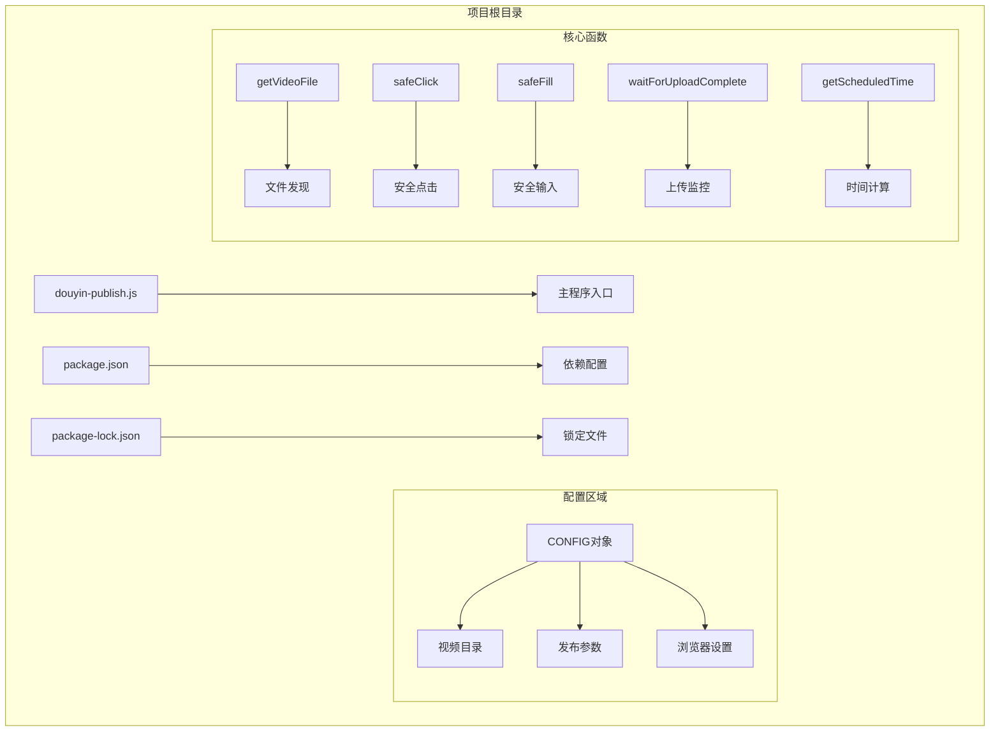

**图表来源**
- [douyin-publish.js:24-53](file://douyin-publish.js#L24-L53)
- [douyin-publish.js:57-103](file://douyin-publish.js#L57-L103)

**章节来源**
- [douyin-publish.js:1-18](file://douyin-publish.js#L1-L18)
- [package.json:1-17](file://package.json#L1-L17)

## 核心组件

### 视频文件管理组件

视频文件管理是整个自动化流程的基础，负责从指定目录中发现和验证视频文件。

#### 支持的视频格式
工具支持以下视频格式：
- MP4 (.mp4)
- MOV (.mov)  
- AVI (.avi)
- MKV (.mkv)
- FLV (.flv)
- WMV (.wmv)
- WebM (.webm)

#### 文件发现机制
getVideoFile函数实现了智能的文件发现算法：

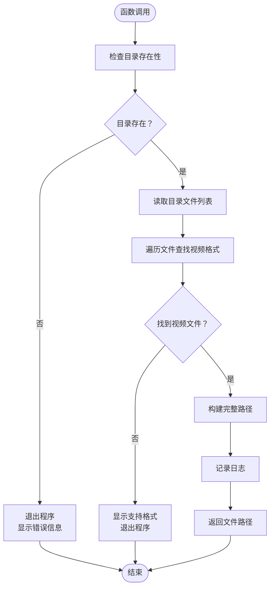

**图表来源**
- [douyin-publish.js:60-83](file://douyin-publish.js#L60-L83)

**章节来源**
- [douyin-publish.js:60-83](file://douyin-publish.js#L60-L83)

### 浏览器自动化组件

浏览器自动化是整个系统的核心，使用Playwright实现可靠的页面操作。

#### Playwright初始化配置

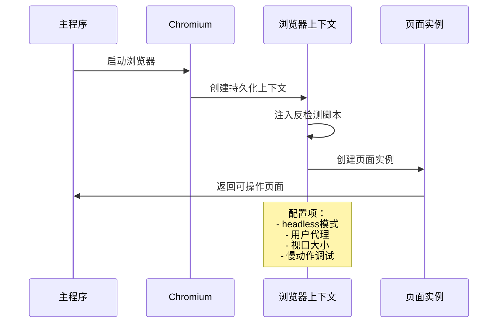

**图表来源**
- [douyin-publish.js:252-286](file://douyin-publish.js#L252-L286)

#### 反检测配置

工具实现了多层次的反检测机制：

1. **WebDriver检测绕过**：通过修改navigator.webdriver属性
2. **Chrome运行时检测绕过**：模拟window.chrome对象
3. **权限检测绕过**：重写permissions.query方法
4. **自动化特征隐藏**：禁用blink自动化特性

**章节来源**
- [douyin-publish.js:252-286](file://douyin-publish.js#L252-L286)

### 页面交互处理组件

页面交互处理组件提供了安全可靠的DOM元素操作能力。

#### 安全点击策略

safeClick函数实现了多层点击策略：

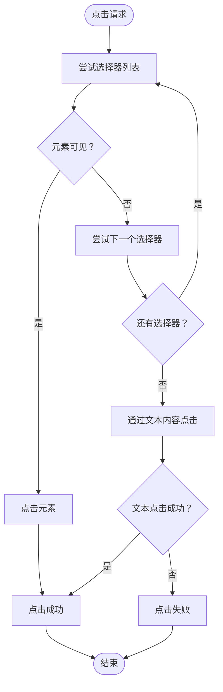

**图表来源**
- [douyin-publish.js:115-143](file://douyin-publish.js#L115-L143)

#### 安全文本输入

safeFill函数提供了智能的文本输入机制：

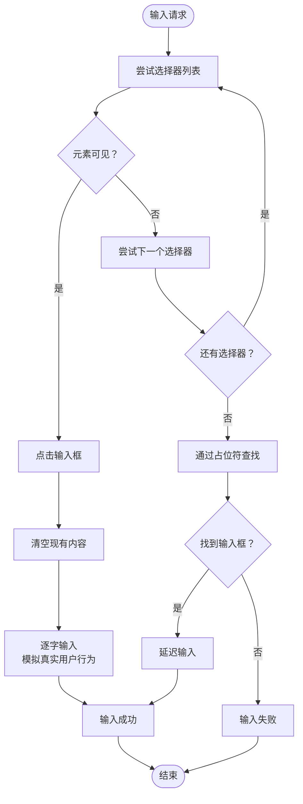

**图表来源**
- [douyin-publish.js:148-184](file://douyin-publish.js#L148-L184)

**章节来源**
- [douyin-publish.js:115-184](file://douyin-publish.js#L115-L184)

### 上传监控组件

上传监控功能提供了实时的上传状态检测和进度跟踪。

#### 上传状态检测机制

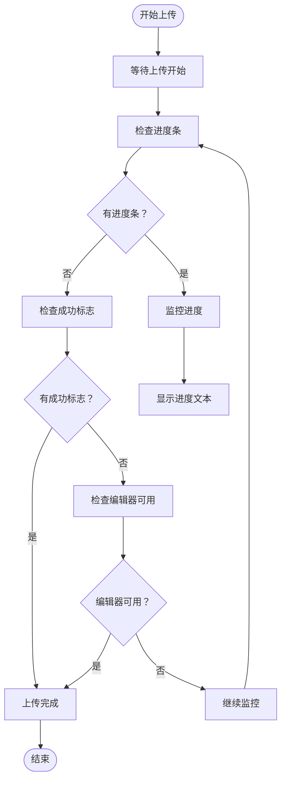

**图表来源**
- [douyin-publish.js:189-235](file://douyin-publish.js#L189-L235)

#### 超时处理机制

上传监控实现了智能的超时处理：
- **最大等待时间**：默认5分钟
- **进度反馈**：每2秒更新一次上传进度
- **状态检测**：通过多种CSS类名检测上传状态
- **错误恢复**：超时后提供详细的错误信息

**章节来源**
- [douyin-publish.js:189-235](file://douyin-publish.js#L189-L235)

### 时间设置组件

定时发布时间设置提供了灵活的时间管理和格式处理功能。

#### 时间计算逻辑

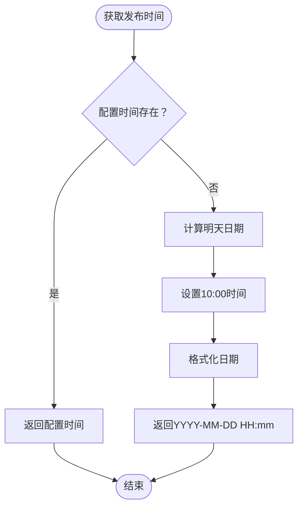

**图表来源**
- [douyin-publish.js:88-103](file://douyin-publish.js#L88-L103)

**章节来源**
- [douyin-publish.js:88-103](file://douyin-publish.js#L88-L103)

## 架构概览

整个系统采用模块化的架构设计，各个组件协同工作完成完整的发布流程：

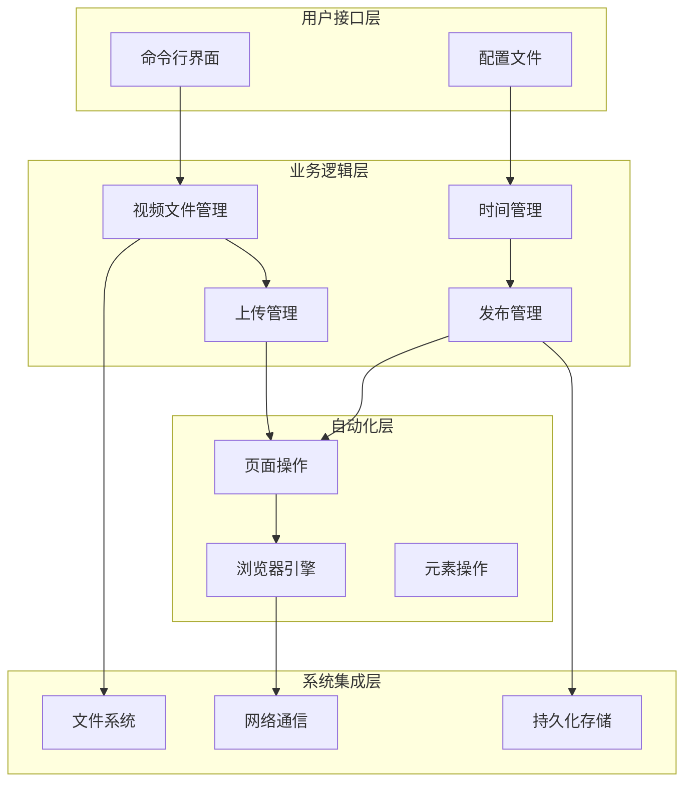

**图表来源**
- [douyin-publish.js:24-53](file://douyin-publish.js#L24-L53)
- [douyin-publish.js:239-618](file://douyin-publish.js#L239-L618)

## 详细组件分析

### 主流程组件

主流程是整个自动化脚本的核心执行逻辑，按照严格的步骤顺序执行：

#### 发布流程序列图

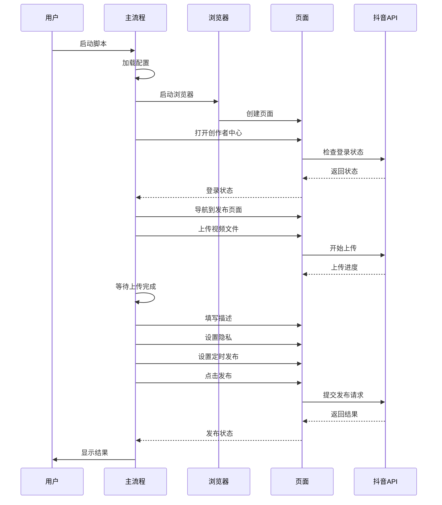

**图表来源**
- [douyin-publish.js:239-618](file://douyin-publish.js#L239-L618)

#### 登录检测机制

系统实现了智能的登录状态检测：

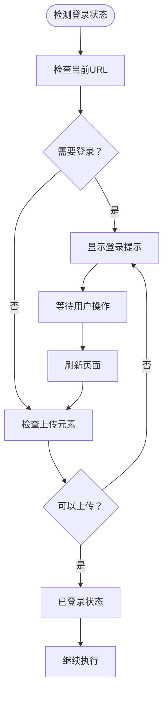

**图表来源**
- [douyin-publish.js:294-319](file://douyin-publish.js#L294-L319)

**章节来源**
- [douyin-publish.js:239-618](file://douyin-publish.js#L239-L618)

### 错误处理机制

系统实现了多层次的错误处理和恢复机制：

#### 错误处理策略

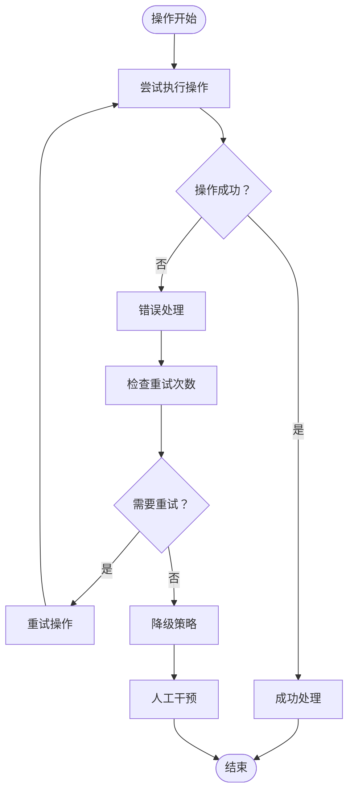

**图表来源**
- [douyin-publish.js:597-618](file://douyin-publish.js#L597-L618)

**章节来源**
- [douyin-publish.js:597-618](file://douyin-publish.js#L597-L618)

## 依赖分析

### 外部依赖

项目使用Playwright作为主要的浏览器自动化框架：

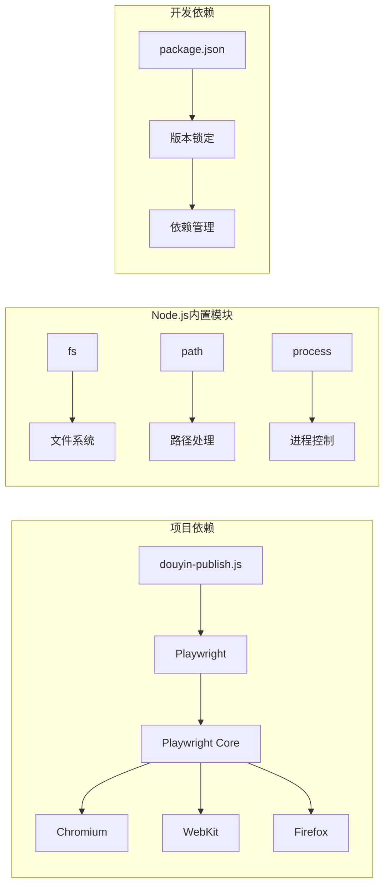

**图表来源**
- [package.json:13-15](file://package.json#L13-L15)
- [package-lock.json:29-58](file://package-lock.json#L29-L58)

### 版本兼容性

系统要求Node.js版本18或更高版本，以确保Playwright的最佳兼容性。

**章节来源**
- [package.json:13-15](file://package.json#L13-L15)
- [package-lock.json:29-58](file://package-lock.json#L29-L58)

## 性能考虑

### 优化策略

1. **异步操作优化**：所有I/O操作都是异步的，避免阻塞主线程
2. **超时控制**：为每个操作设置合理的超时时间，防止无限等待
3. **内存管理**：及时释放浏览器资源，避免内存泄漏
4. **网络优化**：合理设置等待时间和重试策略

### 性能监控

系统提供了实时的进度反馈：
- 上传进度百分比显示
- 操作状态日志记录
- 错误信息详细输出

## 故障排除指南

### 常见问题及解决方案

#### 浏览器启动问题
- **问题**：浏览器无法启动
- **解决方案**：检查Node.js版本，确保满足Playwright要求

#### 登录问题
- **问题**：自动登录检测失败
- **解决方案**：手动登录后按回车继续，或检查网络连接

#### 上传失败
- **问题**：视频上传超时
- **解决方案**：检查网络连接，确认视频文件格式正确

#### 元素定位失败
- **问题**：页面元素找不到
- **解决方案**：检查选择器配置，等待页面加载完成

**章节来源**
- [douyin-publish.js:597-618](file://douyin-publish.js#L597-L618)

## 结论

抖音自动发布工具是一个功能完整、设计合理的自动化解决方案。它通过精心设计的架构和健壮的错误处理机制，为用户提供了一个可靠、高效的视频发布自动化平台。

### 主要优势

1. **可靠性强**：多层容错设计确保在页面结构变化时仍能正常工作
2. **用户体验好**：提供详细的进度反馈和错误信息
3. **扩展性强**：模块化设计便于功能扩展和维护
4. **安全性高**：实现了完善的反检测机制

### 改进建议

1. **配置文件化**：将硬编码的配置迁移到外部配置文件
2. **日志系统**：实现结构化的日志记录系统
3. **测试覆盖**：增加单元测试和集成测试
4. **国际化支持**：支持多语言界面

该工具为抖音内容创作者提供了一个强大而易用的自动化发布解决方案，显著提高了内容发布的效率和一致性。