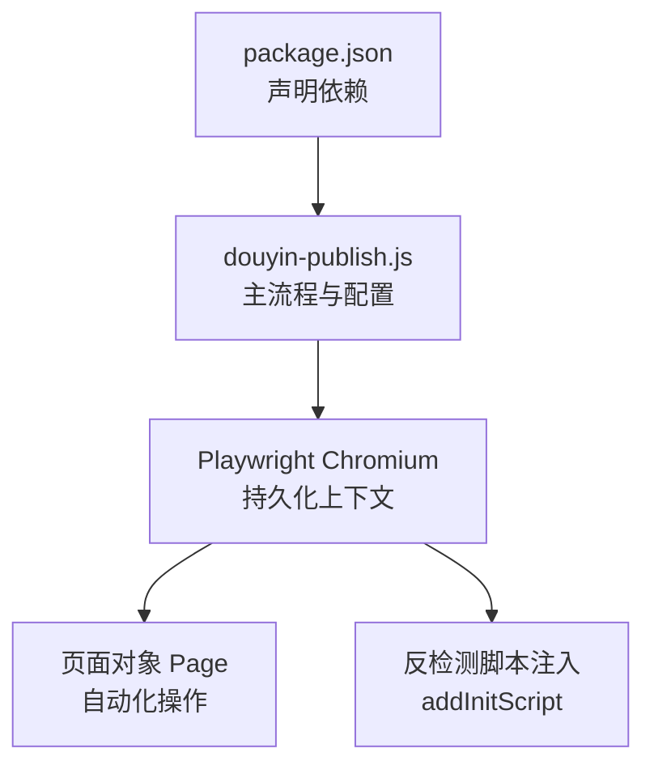
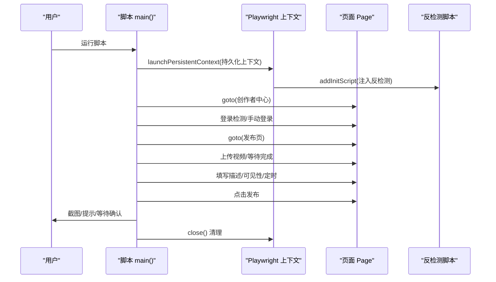
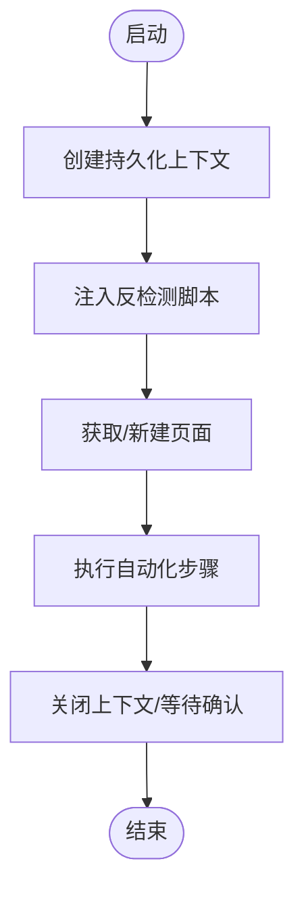
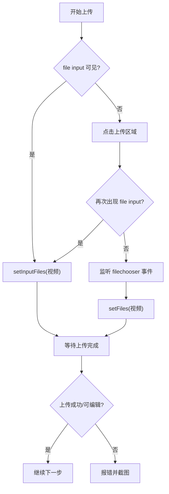
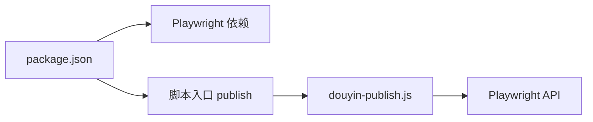

# 浏览器自动化流程

<cite>
**本文引用的文件**
- [douyin-publish.js](file://douyin-publish.js)
- [package.json](file://package.json)
</cite>

## 目录
1. [简介](#简介)
2. [项目结构](#项目结构)
3. [核心组件](#核心组件)
4. [架构总览](#架构总览)
5. [详细组件分析](#详细组件分析)
6. [依赖关系分析](#依赖关系分析)
7. [性能考虑](#性能考虑)
8. [故障排查指南](#故障排查指南)
9. [结论](#结论)
10. [附录](#附录)

## 简介
本文件面向浏览器自动化流程的技术文档，围绕基于 Playwright 的抖音自动发布脚本进行系统性解析。重点涵盖：
- Playwright 初始化与配置：chromium 启动参数、headless 模式、slowMo 延迟控制、浏览器通道选择
- 反检测机制：navigator.webdriver 覆盖、window.chrome 模拟、permissions.query 重写、User-Agent 设置
- 浏览器上下文配置：视口大小、User-Agent、locale、自定义 HTTP 头注入
- 生命周期管理：上下文创建、页面初始化、脚本注入、资源清理
- 性能优化与调试技巧

该脚本以“持久化上下文”方式启动浏览器，结合多策略点击与文本填充、上传进度监控等能力，实现从登录到定时发布的全流程自动化。

## 项目结构
项目采用单文件入口的最小化结构，便于快速运行与维护：
- 核心脚本：douyin-publish.js（包含配置、工具函数、主流程）
- 依赖声明：package.json（声明 Playwright 依赖）

图表来源
- [package.json:1-17](file://package.json#L1-L17)
- [douyin-publish.js:20-284](file://douyin-publish.js#L20-L284)

章节来源
- [package.json:1-17](file://package.json#L1-L17)
- [douyin-publish.js:1-625](file://douyin-publish.js#L1-L625)

## 核心组件
- 配置区 CONFIG：集中管理视频目录、主题、描述、可见性、定时时间、URL、headless 模式、操作延迟等
- 工具函数：
  - getVideoFile：扫描指定目录获取首个视频文件
  - getScheduledTime：计算默认定时发布时间
  - delay：通用延时
  - safeClick/safeFill：多策略点击与文本输入
  - waitForUploadComplete：上传完成检测
- 主流程 main：串联登录检测、进入发布页、上传视频、填写描述、设置可见性、定时发布、最终发布

章节来源
- [douyin-publish.js:24-53](file://douyin-publish.js#L24-L53)
- [douyin-publish.js:57-83](file://douyin-publish.js#L57-L83)
- [douyin-publish.js:85-103](file://douyin-publish.js#L85-L103)
- [douyin-publish.js:105-110](file://douyin-publish.js#L105-L110)
- [douyin-publish.js:113-143](file://douyin-publish.js#L113-L143)
- [douyin-publish.js:145-184](file://douyin-publish.js#L145-L184)
- [douyin-publish.js:186-235](file://douyin-publish.js#L186-L235)
- [douyin-publish.js:239-618](file://douyin-publish.js#L239-L618)

## 架构总览
整体流程由“配置 -> 启动浏览器 -> 注入反检测 -> 页面自动化 -> 结束清理”构成。关键节点如下：
- 启动持久化上下文：保存登录态，复用浏览器实例
- 反检测注入：在页面加载前注入脚本，覆盖常见检测点
- 页面自动化：登录检测、跳转发布页、上传、填写、设置、发布
- 清理：等待用户确认后关闭上下文

图表来源
- [douyin-publish.js:252-284](file://douyin-publish.js#L252-L284)
- [douyin-publish.js:288-319](file://douyin-publish.js#L288-L319)
- [douyin-publish.js:321-339](file://douyin-publish.js#L321-L339)
- [douyin-publish.js:344-418](file://douyin-publish.js#L344-L418)
- [douyin-publish.js:422-448](file://douyin-publish.js#L422-L448)
- [douyin-publish.js:452-484](file://douyin-publish.js#L452-L484)
- [douyin-publish.js:488-542](file://douyin-publish.js#L488-L542)
- [douyin-publish.js:546-595](file://douyin-publish.js#L546-L595)
- [douyin-publish.js:608-617](file://douyin-publish.js#L608-L617)

## 详细组件分析

### Playwright 初始化与配置
- 启动模式：使用持久化上下文，路径为项目根目录下的“.browser-data”，可保留登录态与扩展
- 浏览器通道：channel 指定为 chrome，使用系统已安装的 Chrome
- 视口：viewport 宽高固定为 1440x900
- User-Agent：显式设置为现代 Chrome UA
- locale：zh-CN
- slowMo：100ms，降低自动化速度，提升稳定性
- args：禁用 Blink 自动化特征，减少被检测概率
- headless：由 CONFIG.headless 控制，当前为 false（显示界面）

章节来源
- [douyin-publish.js:252-266](file://douyin-publish.js#L252-L266)
- [douyin-publish.js:48-49](file://douyin-publish.js#L48-L49)

### 反检测配置机制
- navigator.webdriver 覆盖：通过 defineProperty 将其值设为 false
- window.chrome 模拟：注入空的 chrome.runtime 对象，满足部分站点对 chrome 对象的判断
- permissions.query 重写：拦截通知权限查询，返回当前通知权限状态，绕过权限检测
- User-Agent 设置：在上下文中统一设置 UA，避免页面动态修改导致的不一致

章节来源
- [douyin-publish.js:268-284](file://douyin-publish.js#L268-L284)
- [douyin-publish.js:255-261](file://douyin-publish.js#L255-L261)

### 浏览器上下文配置要点
- 视口大小：1440x900，适配桌面端创作者中心布局
- User-Agent：统一设置为现代 Chrome UA，避免指纹差异
- locale：zh-CN，确保界面语言与时间格式符合预期
- 自定义 HTTP 头注入：当前未在上下文中显式添加额外头字段；如需可扩展至 httpCredentials 或 extraHTTPHeaders（需根据目标站点需求）

章节来源
- [douyin-publish.js:255-261](file://douyin-publish.js#L255-L261)

### 浏览器生命周期管理
- 创建：launchPersistentContext 创建持久化上下文
- 初始化：addInitScript 注入反检测脚本
- 页面：获取现有页面或新建页面
- 自动化：按步骤执行登录、跳转、上传、填写、设置、发布
- 清理：finally 分支中关闭上下文，等待用户确认后退出

图表来源
- [douyin-publish.js:252-284](file://douyin-publish.js#L252-L284)
- [douyin-publish.js:286-286](file://douyin-publish.js#L286-L286)
- [douyin-publish.js:608-617](file://douyin-publish.js#L608-L617)

章节来源
- [douyin-publish.js:252-284](file://douyin-publish.js#L252-L284)
- [douyin-publish.js:286-286](file://douyin-publish.js#L286-L286)
- [douyin-publish.js:608-617](file://douyin-publish.js#L608-L617)

### 上传与交互流程
- 上传策略：优先 file input 直接设置文件；否则点击上传区域触发 input；最后监听 filechooser 事件
- 上传完成检测：轮询进度条、成功标志、编辑器可用性等
- 文本输入：安全填充，先清空再逐字输入，模拟真实用户行为
- 点击策略：多选择器尝试 + 文本匹配兜底

图表来源
- [douyin-publish.js:344-418](file://douyin-publish.js#L344-L418)
- [douyin-publish.js:186-235](file://douyin-publish.js#L186-L235)
- [douyin-publish.js:145-184](file://douyin-publish.js#L145-L184)
- [douyin-publish.js:113-143](file://douyin-publish.js#L113-L143)

章节来源
- [douyin-publish.js:344-418](file://douyin-publish.js#L344-L418)
- [douyin-publish.js:186-235](file://douyin-publish.js#L186-L235)
- [douyin-publish.js:145-184](file://douyin-publish.js#L145-L184)
- [douyin-publish.js:113-143](file://douyin-publish.js#L113-L143)

### 登录检测与人工干预
- 多种元素检测：登录/注册、扫码登录、验证码登录、上传相关元素
- URL 判断：若包含 login/passport，则判定需要登录
- 人工登录：阻塞等待用户在终端按回车，随后刷新页面确认登录状态

章节来源
- [douyin-publish.js:294-319](file://douyin-publish.js#L294-L319)

### 发布前与发布后截图
- 发布前截图：保存 before_publish.png，便于核对设置
- 发布后截图：保存 after_publish.png，便于核对结果
- 错误截图：异常时保存 error_screenshot.png

章节来源
- [douyin-publish.js:549-552](file://douyin-publish.js#L549-L552)
- [douyin-publish.js:588-591](file://douyin-publish.js#L588-L591)
- [douyin-publish.js:600-607](file://douyin-publish.js#L600-L607)

## 依赖关系分析
- 依赖 Playwright：版本 ^1.60.0
- 运行入口：package.json scripts.publish 指向 node douyin-publish.js
- 运行环境：需要已安装 Chromium/Chrome 浏览器（npx playwright install chromium）

图表来源
- [package.json:1-17](file://package.json#L1-L17)
- [douyin-publish.js:20-20](file://douyin-publish.js#L20-L20)

章节来源
- [package.json:1-17](file://package.json#L1-L17)
- [douyin-publish.js:20-20](file://douyin-publish.js#L20-L20)

## 性能考虑
- slowMo：100ms，平衡稳定性与效率；在高并发或长链路场景可适当增大
- 视口：1440x900 适配桌面端，避免移动端布局差异带来的定位误差
- User-Agent：统一 UA，减少指纹波动；如需多设备模拟，可在循环中切换 UA
- 上传等待：waitForUploadComplete 采用轮询与超时控制，避免死等；可根据网络情况调整最大等待时间
- 点击与输入：safeClick/safeFill 提供多策略兜底，建议在复杂页面中保留备用选择器
- 日志输出：进度与警告信息有助于定位瓶颈，但过多日志会影响性能，可按需精简

## 故障排查指南
- 上传失败
  - 现象：无法定位 file input 或上传未完成
  - 排查：确认页面元素是否存在、上传区域是否可点击、filechooser 事件是否触发
  - 建议：增加更多选择器与容错分支，必要时启用错误截图
- 定时时间设置失败
  - 现象：日期时间选择器不可见或输入无效
  - 排查：确认页面结构变化、输入格式是否正确
  - 建议：提供手动设置提示，或在失败时截图记录当前状态
- 权限检测
  - 现象：站点检测到通知权限异常
  - 排查：确认反检测脚本是否成功注入
  - 建议：在页面加载后执行一次 permissions.query 返回值校验
- 登录问题
  - 现象：页面仍要求登录
  - 排查：确认持久化数据目录有效、Chrome 通道可用
  - 建议：清理 .browser-data 后重新登录，或临时开启 headless 观察登录流程

章节来源
- [douyin-publish.js:344-418](file://douyin-publish.js#L344-L418)
- [douyin-publish.js:488-542](file://douyin-publish.js#L488-L542)
- [douyin-publish.js:268-284](file://douyin-publish.js#L268-L284)
- [douyin-publish.js:294-319](file://douyin-publish.js#L294-L319)

## 结论
本脚本通过“持久化上下文 + 反检测注入 + 多策略自动化”的组合，实现了从登录到定时发布的完整流程。其配置清晰、扩展性强，适合在生产环境中作为基础模板进行二次开发。建议后续增强：
- 反检测脚本的模块化与可配置化
- 多 UA 与多地区模拟
- 更完善的错误恢复与重试机制
- 上传进度与网络状态的动态反馈

## 附录
- 运行方式：npm run publish
- 依赖安装：npm install playwright；安装浏览器：npx playwright install chromium
- 配置项说明：见 CONFIG 区域注释与默认值

章节来源
- [package.json:5-8](file://package.json#L5-L8)
- [douyin-publish.js:13-17](file://douyin-publish.js#L13-L17)
- [douyin-publish.js:24-53](file://douyin-publish.js#L24-L53)