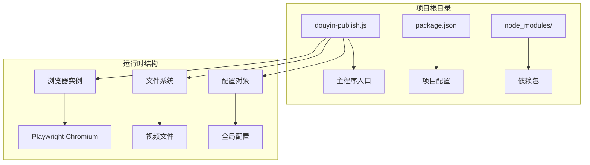
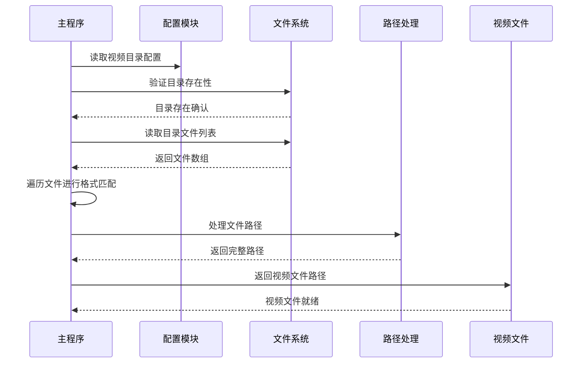
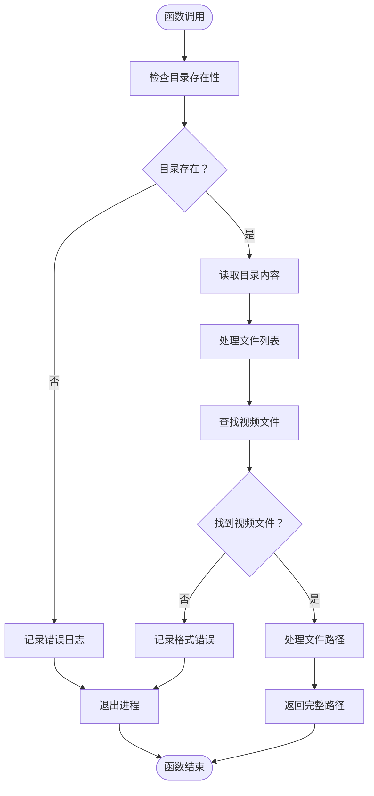
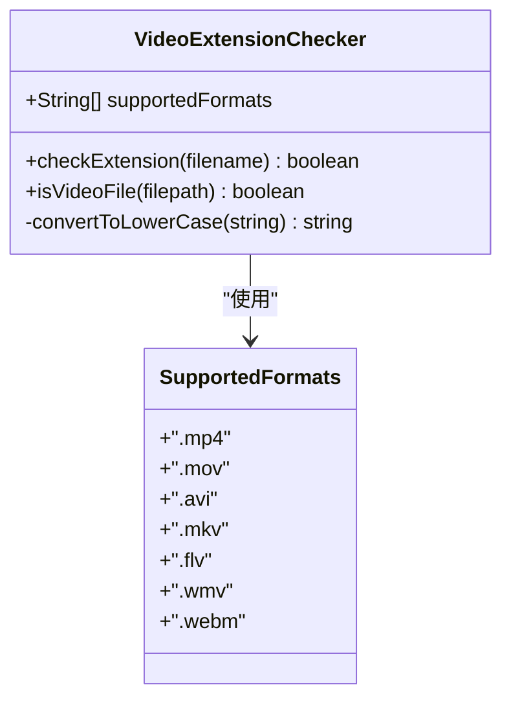
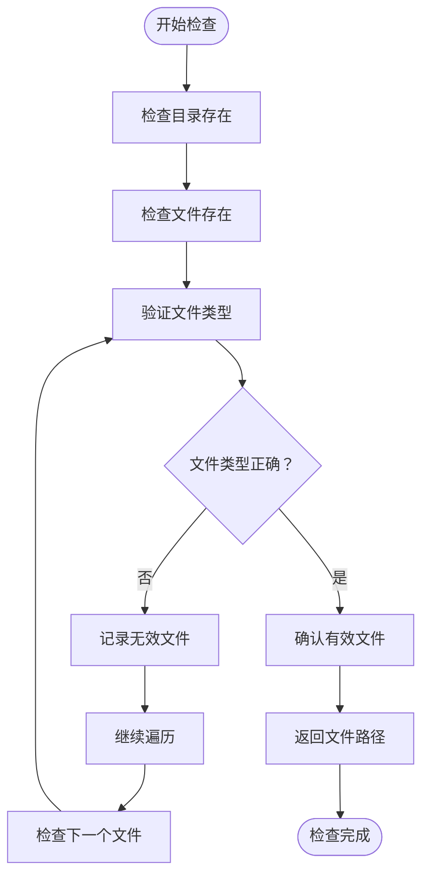
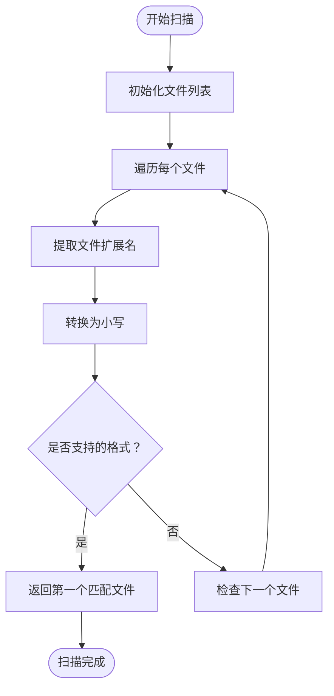
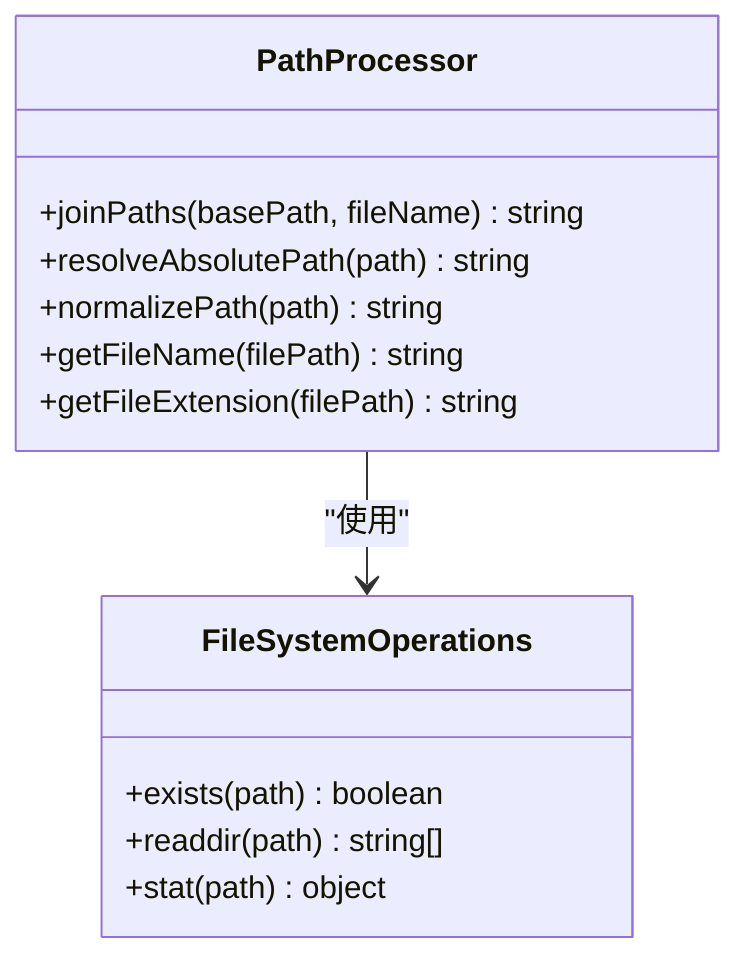
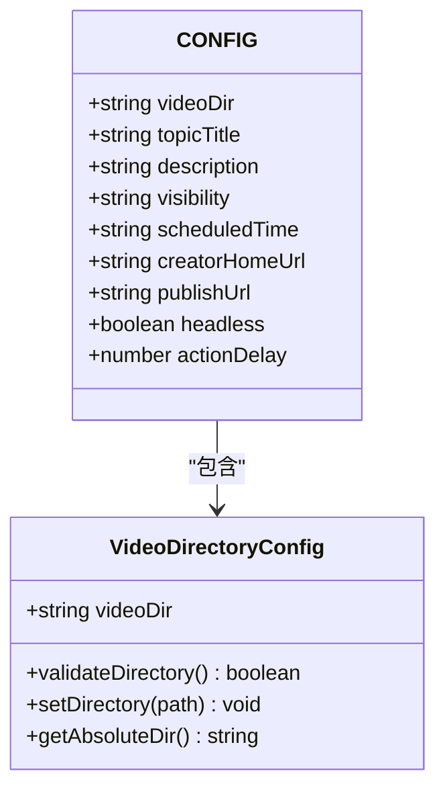
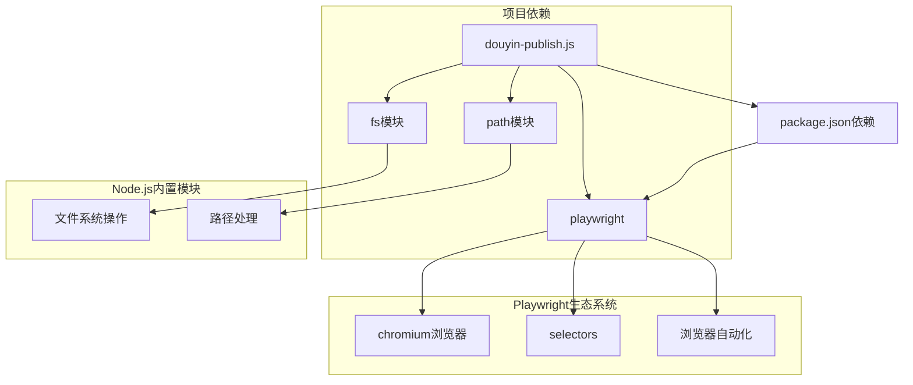
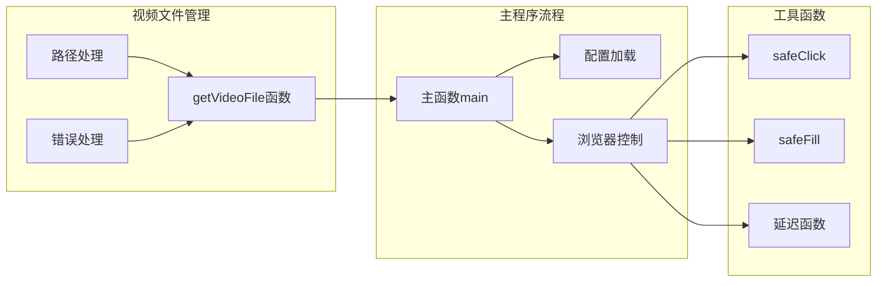

# 视频文件管理

<cite>
**本文档引用的文件**
- [douyin-publish.js](file://douyin-publish.js)
- [package.json](file://package.json)
</cite>

## 目录
1. [简介](#简介)
2. [项目结构](#项目结构)
3. [核心组件](#核心组件)
4. [架构概览](#架构概览)
5. [详细组件分析](#详细组件分析)
6. [依赖关系分析](#依赖关系分析)
7. [性能考虑](#性能考虑)
8. [故障排除指南](#故障排除指南)
9. [结论](#结论)

## 简介

本文档深入解析了抖音自动发布视频脚本中的视频文件管理功能，重点分析了`getVideoFile`函数的工作原理。该函数负责从指定目录中自动发现和选择第一个符合要求的视频文件，支持多种主流视频格式，并提供了完善的错误处理机制。

该脚本是一个基于Playwright的自动化工具，能够自动完成抖音创作者中心的视频发布流程，包括自动登录、视频上传、内容编辑、隐私设置和定时发布等操作。

## 项目结构

项目采用简洁的单文件架构设计：



**图表来源**
- [douyin-publish.js:1-625](file://douyin-publish.js#L1-L625)
- [package.json:1-17](file://package.json#L1-L17)

**章节来源**
- [douyin-publish.js:1-625](file://douyin-publish.js#L1-L625)
- [package.json:1-17](file://package.json#L1-L17)

## 核心组件

### 视频文件管理核心函数

`getVideoFile`函数是整个视频文件管理功能的核心组件，负责以下关键任务：

#### 主要职责
- **目录验证**：检查目标目录是否存在且可访问
- **文件扫描**：遍历目录中的所有文件
- **格式匹配**：识别支持的视频文件格式
- **路径处理**：返回完整文件路径
- **错误处理**：提供详细的错误信息和退出机制

#### 支持的视频格式
函数支持以下七种主流视频格式：
- `.mp4` - MPEG-4 Part 14格式
- `.mov` - QuickTime电影格式  
- `.avi` - Audio Video Interleave格式
- `.mkv` - Matroska多媒体容器
- `.flv` - Flash视频格式
- `.wmv` - Windows Media Video格式
- `.webm` - Google开发的开放视频格式

**章节来源**
- [douyin-publish.js:57-83](file://douyin-publish.js#L57-L83)

## 架构概览

视频文件管理功能在整个自动化发布流程中的位置：



**图表来源**
- [douyin-publish.js:249-250](file://douyin-publish.js#L249-L250)
- [douyin-publish.js:60-83](file://douyin-publish.js#L60-L83)

## 详细组件分析

### getVideoFile函数深度解析

#### 函数签名与参数
```javascript
function getVideoFile(dir) {
    // 参数: dir - 视频文件所在目录的路径
    // 返回: 符合条件的第一个视频文件的完整路径
}
```

#### 文件夹路径验证机制

函数首先执行严格的目录存在性检查：



**图表来源**
- [douyin-publish.js:63-78](file://douyin-publish.js#L63-L78)

#### 视频文件扩展名检测机制

函数使用预定义的扩展名列表进行精确匹配：



**图表来源**
- [douyin-publish.js:61](file://douyin-publish.js#L61)

检测过程的关键步骤：
1. **大小写标准化**：将文件扩展名转换为小写
2. **精确匹配**：使用数组包含检查进行格式验证
3. **快速筛选**：一次性过滤出所有支持的视频文件

#### 文件存在性检查策略

函数采用双重检查机制确保文件完整性：



**图表来源**
- [douyin-publish.js:68-72](file://douyin-publish.js#L68-L72)

#### 错误处理策略

函数实现了多层次的错误处理机制：

| 错误类型 | 检测点 | 处理方式 | 用户反馈 |
|---------|--------|----------|----------|
| 目录不存在 | 目录存在性检查 | 记录错误并退出进程 | 显示"视频文件夹不存在" |
| 无视频文件 | 文件扫描阶段 | 记录错误并退出进程 | 显示支持的格式列表 |
| 权限不足 | 文件访问权限 | 记录错误并退出进程 | 显示权限相关错误 |
| 路径无效 | 路径解析阶段 | 记录错误并退出进程 | 显示路径错误信息 |

#### 文件发现算法详解

函数采用线性扫描算法实现高效的文件发现：



**图表来源**
- [douyin-publish.js:68-72](file://douyin-publish.js#L68-L72)

算法特点：
- **时间复杂度**：O(n)，其中n为目录中文件数量
- **空间复杂度**：O(1)，不依赖于文件数量
- **最优策略**：找到第一个匹配文件即停止，提高效率
- **确定性结果**：始终返回相同的结果（按文件名排序）

#### 文件路径处理机制

函数提供完整的路径处理功能：



**图表来源**
- [douyin-publish.js:80](file://douyin-publish.js#L80)

路径处理的关键功能：
- **绝对路径转换**：确保返回完整可访问的文件路径
- **相对路径解析**：正确处理相对路径输入
- **平台兼容性**：自动适配不同操作系统的路径分隔符

### 配置管理

#### 全局配置对象



**图表来源**
- [douyin-publish.js:25-53](file://douyin-publish.js#L25-L53)

配置项说明：
- **videoDir**：指定包含视频文件的目录路径
- **topicTitle**：视频主题标题
- **description**：视频描述内容
- **visibility**：可见性设置（仅自己可见）
- **scheduledTime**：定时发布时间
- **headless**：是否以无头模式运行

**章节来源**
- [douyin-publish.js:57-83](file://douyin-publish.js#L57-L83)
- [douyin-publish.js:25-53](file://douyin-publish.js#L25-L53)

## 依赖关系分析

### 外部依赖

项目依赖关系图：



**图表来源**
- [douyin-publish.js:20-22](file://douyin-publish.js#L20-L22)
- [package.json:13-15](file://package.json#L13-L15)

### 内部模块依赖

视频文件管理功能与其他模块的交互关系：



**图表来源**
- [douyin-publish.js:239-250](file://douyin-publish.js#L239-L250)
- [douyin-publish.js:60-83](file://douyin-publish.js#L60-L83)

**章节来源**
- [douyin-publish.js:20-22](file://douyin-publish.js#L20-L22)
- [package.json:13-15](file://package.json#L13-L15)

## 性能考虑

### 时间复杂度分析

视频文件发现算法的时间复杂度为O(n)，其中n为目录中文件数量：

- **最佳情况**：O(1) - 第一个文件就是视频文件
- **平均情况**：O(n/2) - 需要检查一半的文件
- **最坏情况**：O(n) - 所有文件都不是视频文件

### 空间复杂度分析

算法的空间复杂度为O(1)，不依赖于文件数量：
- 固定大小的扩展名数组（7个元素）
- 常量级别的中间变量
- 不创建额外的数据结构

### 性能优化建议

1. **目录预过滤**：在大型目录中先检查文件扩展名再进行详细验证
2. **缓存机制**：缓存最近使用的目录结果
3. **并发处理**：对于多目录场景，考虑并行处理多个目录
4. **增量更新**：监控目录变化，只重新扫描变更的文件

## 故障排除指南

### 常见问题及解决方案

#### 问题1：目录不存在
**症状**：程序立即退出并显示目录不存在错误
**原因**：配置的videoDir路径不正确或不存在
**解决方案**：
- 验证路径拼写是否正确
- 检查路径权限是否足够
- 使用绝对路径而非相对路径

#### 问题2：未找到视频文件
**症状**：显示支持的格式列表但程序退出
**原因**：目录中没有支持的视频文件
**解决方案**：
- 确认文件扩展名正确（区分大小写）
- 检查文件是否被其他程序占用
- 验证文件完整性

#### 问题3：权限不足
**症状**：文件系统访问被拒绝
**原因**：程序没有足够的文件系统权限
**解决方案**：
- 以管理员权限运行程序
- 检查文件和目录的访问权限
- 确保磁盘空间充足

#### 问题4：路径解析错误
**症状**：返回的路径无法访问
**原因**：相对路径解析失败
**解决方案**：
- 使用绝对路径配置
- 检查路径分隔符的正确性
- 验证路径字符编码

### 调试技巧

1. **启用详细日志**：在开发环境中临时修改日志级别
2. **手动验证路径**：使用操作系统命令验证路径有效性
3. **文件权限检查**：使用文件管理器检查文件属性
4. **环境变量验证**：确认工作目录和环境变量设置

**章节来源**
- [douyin-publish.js:63-78](file://douyin-publish.js#L63-L78)

## 结论

视频文件管理功能通过`getVideoFile`函数实现了高效、可靠的视频文件发现机制。该函数具有以下优势：

1. **可靠性**：完善的错误处理和验证机制
2. **效率**：线性时间复杂度的文件扫描算法
3. **兼容性**：支持多种主流视频格式
4. **易用性**：简单的API接口和清晰的错误信息

该功能为整个抖音自动发布系统提供了坚实的基础，确保了视频文件处理的稳定性和准确性。通过合理的配置和适当的错误处理，用户可以轻松地集成视频文件管理功能到自己的自动化工作流中。