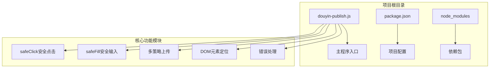
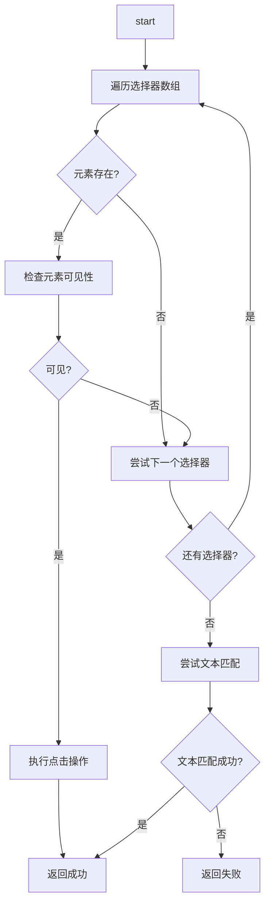
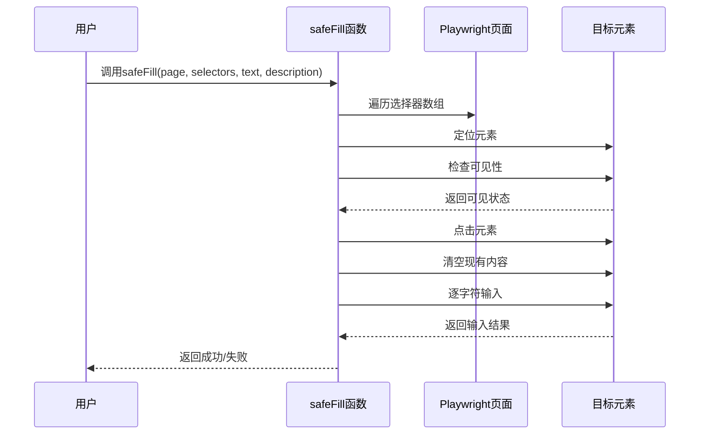
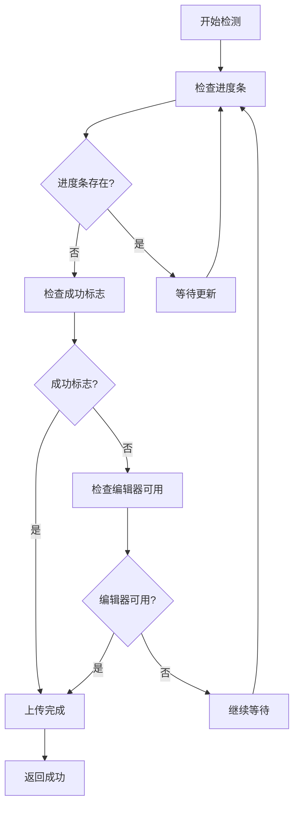
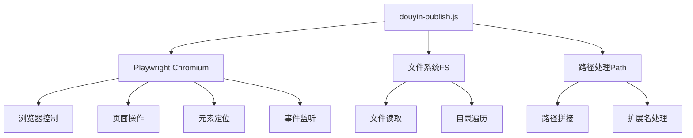
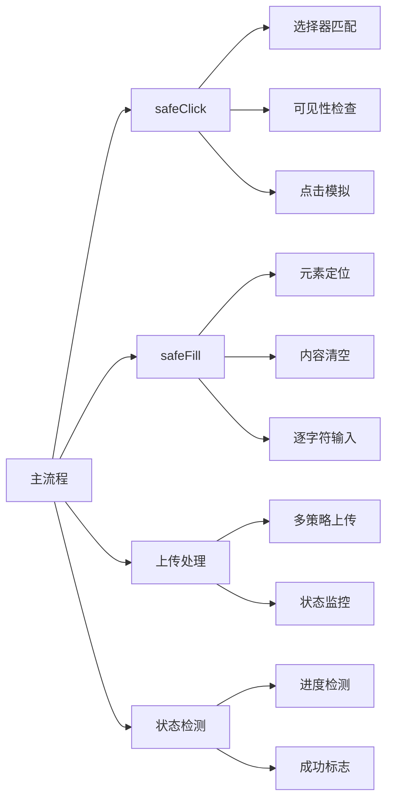
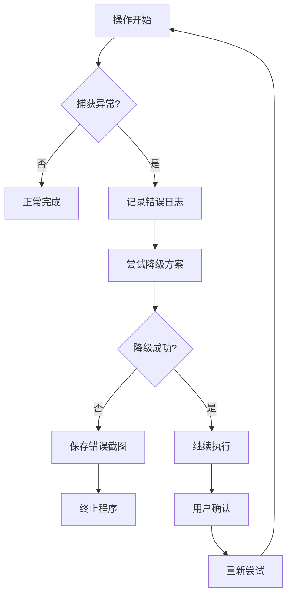

# 页面交互处理

<cite>
**本文档引用的文件**
- [douyin-publish.js](file://douyin-publish.js)
- [package.json](file://package.json)
</cite>

## 目录
1. [简介](#简介)
2. [项目结构](#项目结构)
3. [核心组件](#核心组件)
4. [架构概览](#架构概览)
5. [详细组件分析](#详细组件分析)
6. [依赖关系分析](#依赖关系分析)
7. [性能考虑](#性能考虑)
8. [故障排除指南](#故障排除指南)
9. [结论](#结论)

## 简介

本文档详细解析了基于Playwright的抖音自动发布脚本中的页面交互处理功能。该脚本实现了完整的自动化发布流程，包括安全点击策略、安全文本输入、多策略上传机制以及智能DOM元素定位。本文档重点关注以下核心技术：

- **safeClick安全点击策略**：多选择器容错机制、元素可见性检测、点击事件模拟和失败重试逻辑
- **safeFill安全文本输入功能**：DOM元素定位、内容清空处理、逐字符输入模拟和输入延迟控制
- **多策略上传实现**：file input直接上传、上传区域点击触发、file chooser事件监听和上传状态检测
- **完整DOM元素定位方法**：CSS选择器、XPath表达式、文本内容匹配和属性选择器的使用技巧
- **错误处理策略和用户体验优化方案**

## 项目结构

该项目采用简洁的单文件架构设计，所有功能集中在单一JavaScript文件中，便于维护和部署。



**图表来源**
- [douyin-publish.js:1-625](file://douyin-publish.js#L1-L625)
- [package.json:1-17](file://package.json#L1-L17)

**章节来源**
- [douyin-publish.js:1-625](file://douyin-publish.js#L1-L625)
- [package.json:1-17](file://package.json#L1-L17)

## 核心组件

### 配置管理模块

系统采用集中式配置管理，所有可调参数都定义在CONFIG对象中，便于统一管理和修改。

**关键配置项：**
- 视频文件夹路径：`D:\test`
- 作品主题和描述：支持中文内容
- 可见性设置：仅自己可见
- 定时发布时间：默认明天10:00
- 浏览器配置：headless模式、操作间隔等

**章节来源**
- [douyin-publish.js:24-53](file://douyin-publish.js#L24-L53)

### 工具函数模块

提供基础工具函数支持，包括文件处理、时间计算和异步等待。

**核心工具函数：**
- `getVideoFile()`: 视频文件查找和验证
- `getScheduledTime()`: 定时发布时间计算
- `delay()`: 异步延迟函数
- `delay(ms)`: Promise包装的setTimeout

**章节来源**
- [douyin-publish.js:57-110](file://douyin-publish.js#L57-L110)

## 架构概览

整个系统采用模块化设计，每个核心功能都是独立的函数模块，通过主流程协调工作。

```mermaid
flowchart TD
A[主流程 main()] --> B[启动浏览器]
B --> C[打开创作者中心]
C --> D[检测登录状态]
D --> E{需要登录?}
E --> |是| F[等待手动登录]
E --> |否| G[进入发布页面]
F --> G
G --> H[上传视频]
H --> I[等待上传完成]
I --> J[填写描述]
J --> K[设置可见性]
K --> L[设置定时发布]
L --> M[确认发布]
M --> N[截图保存]
N --> O[程序结束]
```

**图表来源**
- [douyin-publish.js:239-618](file://douyin-publish.js#L239-L618)

## 详细组件分析

### safeClick安全点击策略

safeClick函数实现了robust的元素点击机制，通过多策略容错设计确保在复杂的网页环境中能够稳定地定位和点击目标元素。

#### 核心算法流程



**图表来源**
- [douyin-publish.js:115-143](file://douyin-publish.js#L115-L143)

#### 多选择器容错机制

系统提供了多层次的选择器策略，确保在不同页面状态下都能找到目标元素：

1. **链接选择器优先级**：
   - `a[href*="publish"]` - 发布相关链接
   - `a[href*="upload"]` - 上传相关链接
   - `a:has-text("发布视频")` - 文本匹配

2. **按钮类选择器**：
   - `button:has-text("发布")`
   - `[class*="publish"]` - 包含publish的类名
   - `[class*="release"]` - 包含release的类名

3. **复合选择器**：
   - `'[class*="creator-home-publish"]'` - 特定页面的标识

#### 元素可见性检测

采用异步可见性检查机制，每个元素都有独立的超时控制：

- **可见性检查超时**：2000毫秒
- **点击操作超时**：5000毫秒
- **多层重试机制**：最多3层容错

#### 点击事件模拟

系统支持多种点击触发方式：

1. **标准点击**：`element.click()`
2. **文本点击**：通过`page.getByText()`定位文本元素
3. **属性点击**：通过精确的CSS选择器匹配

#### 失败重试逻辑

当所有选择器都失败时，系统会尝试基于描述文本进行智能匹配：

- **文本清理**：移除"点击"、"按钮"、"选项"等干扰词汇
- **模糊匹配**：使用`exact: false`进行宽松匹配
- **降级策略**：从最精确到最宽松的匹配顺序

**章节来源**
- [douyin-publish.js:115-143](file://douyin-publish.js#L115-L143)

### safeFill安全文本输入功能

safeFill函数提供了robust的文本输入解决方案，专门针对富文本编辑器和表单输入场景设计。

#### 输入流程分析



**图表来源**
- [douyin-publish.js:148-184](file://douyin-publish.js#L148-L184)

#### DOM元素定位策略

系统支持多种编辑器类型和输入场景：

1. **富文本编辑器**：
   - `.ql-editor` - Quill编辑器
   - `.editor-kit-editor` - 抖音专用编辑器

2. **普通文本输入**：
   - `[contenteditable="true"]` - 可编辑div
   - `textarea` - 标准文本域

3. **占位符匹配**：
   - `page.getByPlaceholder(/描述|标题|说说/)`
   - 支持正则表达式的动态匹配

#### 内容清空处理

采用两阶段清空策略确保输入环境的纯净：

1. **快速清空**：`await element.fill('')`
2. **延迟确认**：`await delay(200)`确保清空操作完成

#### 逐字符输入模拟

为了模拟真实用户行为，系统采用逐字符输入：

- **输入延迟**：50毫秒/字符
- **真实感增强**：避免一次性输入大量字符
- **字符级控制**：支持特殊字符和表情符号

#### 输入延迟控制

系统在关键节点设置了合理的延迟：

- **点击后延迟**：300毫秒
- **清空后延迟**：200毫秒
- **字符间延迟**：50毫秒

**章节来源**
- [douyin-publish.js:148-184](file://douyin-publish.js#L148-L184)

### 多策略上传实现

系统实现了三种不同的文件上传策略，确保在各种页面布局下都能成功上传视频文件。

#### 上传策略对比

```mermaid
graph LR
A[上传开始] --> B{策略1: 直接上传}
A --> C{策略2: 点击触发}
A --> D{策略3: 事件监听}
B --> E[input[type="file"]存在?]
E --> |是| F[直接setInputFiles]
E --> |否| G[切换到策略2]
C --> H[点击上传区域]
H --> I[再次查找file input]
I --> J[setInputFiles]
D --> K[等待filechooser事件]
K --> L[触发点击]
L --> M[setFiles]
F --> N[上传成功]
J --> N
M --> N
G --> O[上传失败]
N --> P[等待完成]
O --> Q[结束]
P --> R[检查状态]
R --> S[返回结果]
```

**图表来源**
- [douyin-publish.js:350-401](file://douyin-publish.js#L350-L401)

#### 策略1：Direct File Input Upload

这是最直接和可靠的方法：

1. **元素检测**：`page.locator('input[type="file"]').first()`
2. **可见性验证**：确保元素在页面上可见
3. **直接上传**：`await fileInput.setInputFiles(videoPath)`

#### 策略2：点击触发上传

适用于隐藏file input的场景：

1. **上传区域定位**：`'[class*="upload"], [class*="drag"], [class*="drop"]'`
2. **点击触发**：模拟用户点击上传区域
3. **二次查找**：重新定位file input元素
4. **文件设置**：`await fileInputAfterClick.setInputFiles(videoPath)`

#### 策略3：File Chooser Event Listener

处理动态生成的上传界面：

1. **事件监听**：`page.waitForEvent('filechooser', { timeout: 5000 })`
2. **异步等待**：同时等待filechooser事件和点击操作
3. **文件选择**：`await fileChooser.setFiles(videoPath)`

#### 上传状态检测

系统实现了智能的上传完成检测机制：



**图表来源**
- [douyin-publish.js:189-235](file://douyin-publish.js#L189-L235)

**章节来源**
- [douyin-publish.js:350-401](file://douyin-publish.js#L350-L401)
- [douyin-publish.js:189-235](file://douyin-publish.js#L189-L235)

### DOM元素定位方法

系统实现了完整的DOM元素定位策略，涵盖了现代Web开发的各种场景。

#### CSS选择器策略

1. **类名选择器**：
   - `[class*="upload"]` - 包含特定关键词的类名
   - `[class*="publish-btn"]` - 发布按钮标识
   - `[class*="semi-select"]` - UI框架特定样式

2. **属性选择器**：
   - `input[type="file"]` - 文件输入框
   - `[contenteditable="true"]` - 可编辑元素
   - `input[placeholder*="描述"]` - 占位符匹配

3. **组合选择器**：
   - `button:has-text("发布")` - 文本内容匹配
   - `div:has-text("谁可以看") + div [class*="select"]` - 兄弟元素选择

#### XPath表达式使用

虽然主要使用CSS选择器，但系统也支持XPath表达式用于复杂场景：

- `//input[@type='file']` - 标准XPath语法
- `//*[contains(@class, 'upload')]` - 动态类名匹配

#### 文本内容匹配

系统提供了强大的文本匹配能力：

1. **精确匹配**：`page.getByText("发布按钮", { exact: true })`
2. **模糊匹配**：`page.getByText(textContent, { exact: false })`
3. **正则匹配**：`page.getByPlaceholder(/描述|标题|说说/)`

#### 属性选择器技巧

- **包含匹配**：`[class*="upload"]` - 匹配包含特定字符串的属性
- **前缀匹配**：`[id^="btn-"]` - 匹配特定前缀的ID
- **后缀匹配**：`[src$=".png"]` - 匹配特定后缀的资源

**章节来源**
- [douyin-publish.js:348-401](file://douyin-publish.js#L348-L401)
- [douyin-publish.js:428-440](file://douyin-publish.js#L428-L440)

## 依赖关系分析

### 外部依赖

项目依赖于Playwright测试框架，提供了强大的浏览器自动化能力。



**图表来源**
- [douyin-publish.js:20-22](file://douyin-publish.js#L20-L22)
- [package.json:13-15](file://package.json#L13-L15)

### 内部模块依赖

系统内部模块之间具有清晰的职责划分：



**图表来源**
- [douyin-publish.js:115-184](file://douyin-publish.js#L115-L184)
- [douyin-publish.js:350-401](file://douyin-publish.js#L350-L401)

**章节来源**
- [package.json:13-15](file://package.json#L13-L15)
- [douyin-publish.js:20-22](file://douyin-publish.js#L20-L22)

## 性能考虑

### 异步操作优化

系统大量使用Promise和async/await模式，确保操作的非阻塞特性：

- **并发等待**：`Promise.all([page.waitForEvent(), page.click()])`
- **超时控制**：每个操作都有独立的超时设置
- **渐进式等待**：根据操作复杂度调整等待时间

### 内存管理

- **及时释放**：操作完成后及时释放元素引用
- **批量操作**：合并多个小操作减少通信开销
- **错误恢复**：异常情况下自动清理资源

### 网络优化

- **重试机制**：网络不稳定时自动重试
- **超时设置**：合理设置超时避免长时间等待
- **状态检查**：定期检查网络连接状态

## 故障排除指南

### 常见问题及解决方案

#### 1. 元素定位失败

**症状**：safeClick或safeFill函数返回失败

**诊断步骤**：
1. 检查选择器是否正确
2. 验证元素是否在页面上可见
3. 确认页面加载完成状态

**解决方案**：
- 使用更通用的选择器
- 增加等待时间
- 检查页面动态加载情况

#### 2. 上传失败

**症状**：视频无法上传或上传超时

**诊断步骤**：
1. 检查文件路径和权限
2. 验证网络连接
3. 确认浏览器兼容性

**解决方案**：
- 切换到其他上传策略
- 增加超时时间
- 检查防火墙设置

#### 3. 登录状态异常

**症状**：脚本检测到需要登录

**诊断步骤**：
1. 检查持久化数据目录
2. 验证浏览器版本
3. 确认Cookie状态

**解决方案**：
- 删除`.browser-data`目录重新登录
- 更新浏览器版本
- 检查代理设置

### 错误处理策略

系统实现了多层次的错误处理机制：



**图表来源**
- [douyin-publish.js:597-618](file://douyin-publish.js#L597-L618)

**章节来源**
- [douyin-publish.js:597-618](file://douyin-publish.js#L597-L618)

### 用户体验优化

#### 可视化反馈

系统提供了丰富的用户反馈机制：

- **实时进度显示**：上传进度百分比
- **详细日志输出**：每一步操作的详细信息
- **截图保存**：关键节点的屏幕截图

#### 交互优化

- **手动干预点**：重要决策点允许用户确认
- **智能等待**：根据操作复杂度调整等待时间
- **优雅降级**：部分功能失败时继续执行其他功能

## 结论

本项目展示了现代Web自动化测试的最佳实践，通过精心设计的安全点击策略、robust的文本输入机制和智能的上传处理流程，实现了高度可靠的页面交互自动化。

### 技术亮点

1. **多策略容错设计**：通过多种定位和操作策略确保在复杂环境下也能稳定运行
2. **智能状态检测**：实时监控页面状态变化，自动适应页面结构变化
3. **用户体验优化**：提供丰富的反馈机制和手动干预选项
4. **错误处理完善**：多层次的错误检测和恢复机制

### 应用价值

该技术方案不仅适用于抖音视频发布自动化，还可以扩展应用到其他类似的Web应用自动化场景中，为开发者提供了宝贵的参考模板。

### 改进建议

1. **配置化管理**：将更多硬编码的值提取到配置文件中
2. **插件化架构**：支持自定义扩展和插件
3. **监控告警**：集成更完善的监控和告警机制
4. **测试覆盖**：增加单元测试和集成测试覆盖率