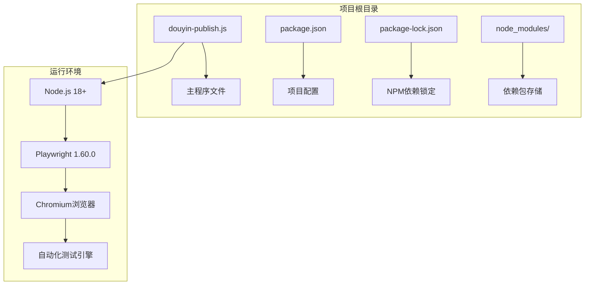
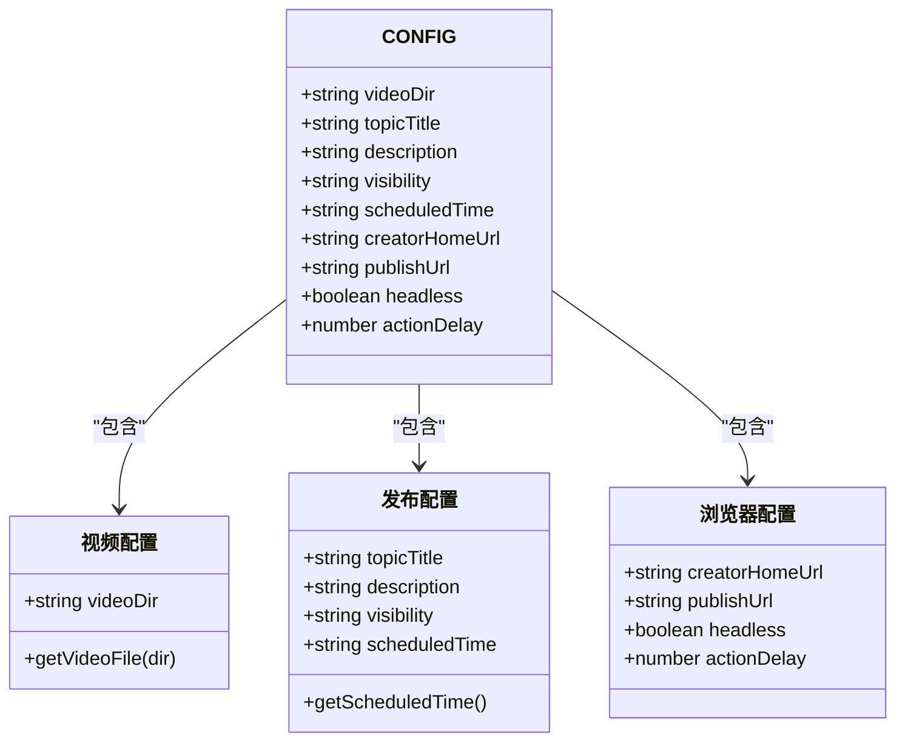
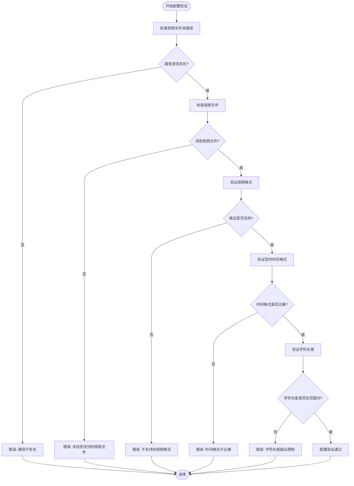

# 配置指南

<cite>
**本文档引用的文件**
- [douyin-publish.js](file://douyin-publish.js)
- [package.json](file://package.json)
- [package-lock.json](file://package-lock.json)
</cite>

## 目录
1. [简介](#简介)
2. [项目结构](#项目结构)
3. [核心配置对象](#核心配置对象)
4. [配置参数详解](#配置参数详解)
5. [最佳实践建议](#最佳实践建议)
6. [配置示例](#配置示例)
7. [配置验证与调试](#配置验证与调试)
8. [故障排除指南](#故障排除指南)
9. [总结](#总结)

## 简介

抖音自动发布工具是一个基于Playwright的自动化脚本，用于自动发布视频到抖音创作者中心。该工具通过模拟人工操作的方式，自动完成视频上传、描述填写、隐私设置和定时发布等流程。

本工具的核心是CONFIG配置对象，它包含了所有可定制的参数设置。通过合理配置这些参数，用户可以根据不同的使用场景和需求来定制发布行为。

## 项目结构



**图表来源**
- [douyin-publish.js:1-20](file://douyin-publish.js#L1-L20)
- [package.json:13-15](file://package.json#L13-L15)
- [package-lock.json:29-46](file://package-lock.json#L29-L46)

**章节来源**
- [douyin-publish.js:1-626](file://douyin-publish.js#L1-L626)
- [package.json:1-17](file://package.json#L1-L17)
- [package-lock.json:1-61](file://package-lock.json#L1-L61)

## 核心配置对象

CONFIG对象是整个脚本的核心配置中心，定义了所有可定制的行为参数。该对象位于脚本的第25-53行，包含了以下主要配置项：



**图表来源**
- [douyin-publish.js:25-53](file://douyin-publish.js#L25-L53)

**章节来源**
- [douyin-publish.js:25-53](file://douyin-publish.js#L25-L53)

## 配置参数详解

### 视频文件夹路径 (videoDir)

**数据类型**: 字符串 (String)
**默认值**: `'D:\\test'`
**有效范围**: 有效的文件系统路径
**作用域**: 全局配置

该参数指定包含待发布视频的文件夹路径。脚本会自动扫描该文件夹并选择第一个支持的视频文件进行发布。

**支持的视频格式**:
- MP4 (.mp4)
- MOV (.mov)  
- AVI (.avi)
- MKV (.mkv)
- FLV (.flv)
- WMV (.wmv)
- WebM (.webm)

**章节来源**
- [douyin-publish.js:27](file://douyin-publish.js#L27)
- [douyin-publish.js:60-83](file://douyin-publish.js#L60-L83)

### 作品主题 (topicTitle)

**数据类型**: 字符串 (String)
**默认值**: `'这是一个水'`
**有效范围**: 1-50个字符
**作用域**: 发布配置

作品主题是视频的标题或标签，将与描述一起显示在发布内容中。

**章节来源**
- [douyin-publish.js:30](file://douyin-publish.js#L30)
- [douyin-publish.js:426](file://douyin-publish.js#L426)

### 作品描述 (description)

**数据类型**: 字符串 (String)
**默认值**: `'这是一个水瓶'`
**有效范围**: 1-200个字符
**作用域**: 发布配置

作品描述是视频的详细说明，将与主题一起组合显示。

**章节来源**
- [douyin-publish.js:33](file://douyin-publish.js#L33)
- [douyin-publish.js:426](file://douyin-publish.js#L426)

### 隐私设置 (visibility)

**数据类型**: 字符串 (String)
**默认值**: `'仅自己可见'`
**有效范围**: `'仅自己可见' | '公开' | '朋友'`
**作用域**: 发布配置

隐私设置控制视频的可见性范围。当前版本支持"仅自己可见"模式。

**章节来源**
- [douyin-publish.js:36](file://douyin-publish.js#L36)
- [douyin-publish.js:471-485](file://douyin-publish.js#L471-L485)

### 定时发布时间 (scheduledTime)

**数据类型**: 字符串 (String) 或 null
**默认值**: null
**有效范围**: `'YYYY-MM-DD HH:mm'` 格式或 null
**作用域**: 发布配置

定时发布时间采用标准日期时间格式。当设置为null时，脚本会自动计算为明天上午10:00。

**时间格式**: `YYYY-MM-DD HH:mm` (例如: `2024-12-25 14:30`)

**章节来源**
- [douyin-publish.js:40](file://douyin-publish.js#L40)
- [douyin-publish.js:88-103](file://douyin-publish.js#L88-L103)

### 创作者中心URL (creatorHomeUrl)

**数据类型**: 字符串 (String)
**默认值**: `'https://creator.douyin.com/creator-micro/home'`
**有效范围**: 有效的HTTPS URL
**作用域**: 浏览器配置

抖音创作者中心的主页URL。

**章节来源**
- [douyin-publish.js:43](file://douyin-publish.js#L43)

### 发布页面URL (publishUrl)

**数据类型**: 字符串 (String)
**默认值**: `'https://creator.douyin.com/creator-micro/content/upload'`
**有效范围**: 有效的HTTPS URL
**作用域**: 浏览器配置

视频上传页面的URL。

**章节来源**
- [douyin-publish.js:46](file://douyin-publish.js#L46)

### 浏览器模式 (headless)

**数据类型**: 布尔值 (Boolean)
**默认值**: false
**有效范围**: true | false
**作用域**: 浏览器配置

控制是否以无头模式运行浏览器：
- false: 显示浏览器界面，便于观察操作过程
- true: 无头模式运行，不显示界面

**章节来源**
- [douyin-publish.js:49](file://douyin-publish.js#L49)

### 操作延迟 (actionDelay)

**数据类型**: 数字 (Number)
**默认值**: 1000
**有效范围**: 500-5000毫秒
**作用域**: 浏览器配置

各操作步骤之间的等待时间，单位为毫秒。适当增加此值可以提高稳定性。

**章节来源**
- [douyin-publish.js:52](file://douyin-publish.js#L52)

## 最佳实践建议

### 路径格式规范

1. **Windows路径**: 使用双反斜杠 `\\` 或正斜杠 `/`
   ```javascript
   // 推荐
   videoDir: 'D:/test'
   videoDir: 'D:\\\\test'
   
   // 不推荐
   videoDir: 'D:\test'  // 需要转义
   ```

2. **相对路径**: 建议使用绝对路径，避免路径解析问题

3. **特殊字符**: 避免在路径中使用特殊字符和空格

### 字符限制与格式要求

1. **主题长度**: 建议不超过30个字符，确保在移动端显示完整
2. **描述长度**: 建议不超过150个字符，避免被截断
3. **时间格式**: 严格遵循 `YYYY-MM-DD HH:mm` 格式
4. **字符集**: 支持中文、英文、数字和常用标点符号

### 性能优化建议

1. **操作延迟**: 根据网络状况调整 `actionDelay` 参数
   - 网络良好: 800-1200ms
   - 网络一般: 1200-2000ms
   - 网络较差: 2000-3000ms

2. **浏览器模式**: 开发调试时使用非无头模式，生产环境可考虑无头模式

3. **视频质量**: 建议使用1080p以下的视频，提高上传成功率

## 配置示例

### 基础配置示例

```javascript
// 最简配置 - 适合快速测试
const CONFIG = {
  videoDir: 'D:\\test',
  topicTitle: '我的第一条视频',
  description: '这是我的第一个抖音视频',
  visibility: '仅自己可见',
  scheduledTime: null,
  headless: false,
  actionDelay: 1000
};
```

**章节来源**
- [douyin-publish.js:25-53](file://douyin-publish.js#L25-L53)

### 高级配置示例

```javascript
// 生产环境配置
const CONFIG = {
  videoDir: '/home/user/videos',  // Linux路径示例
  topicTitle: '旅行日记 - 北京故宫',
  description: '周末带家人游览北京故宫，感受历史文化的魅力。#旅行 #北京 #故宫',
  visibility: '仅自己可见',
  scheduledTime: '2024-12-25 19:00',  // 指定具体发布时间
  creatorHomeUrl: 'https://creator.douyin.com/creator-micro/home',
  publishUrl: 'https://creator.douyin.com/creator-micro/content/upload',
  headless: true,  // 生产环境使用无头模式
  actionDelay: 1500  // 增加延迟提高稳定性
};
```

### 多场景配置模板

#### 个人学习使用
```javascript
const PERSONAL_CONFIG = {
  videoDir: './videos',
  topicTitle: '学习记录',
  description: '记录学习过程，分享经验',
  visibility: '仅自己可见',
  scheduledTime: null,
  headless: false,
  actionDelay: 1200
};
```

#### 团队协作使用
```javascript
const TEAM_CONFIG = {
  videoDir: 'D:\\shared\\videos',
  topicTitle: '团队项目进展',
  description: '本周工作汇报和项目更新',
  visibility: '公开',
  scheduledTime: '2024-12-26 09:00',
  headless: true,
  actionDelay: 2000
};
```

#### 临时发布使用
```javascript
const TEMP_CONFIG = {
  videoDir: 'C:\\temp\\videos',
  topicTitle: '临时分享',
  description: '临时内容，仅供内部参考',
  visibility: '仅自己可见',
  scheduledTime: '2024-12-25 15:30',
  headless: false,
  actionDelay: 1000
};
```

## 配置验证与调试

### 配置验证流程



**图表来源**
- [douyin-publish.js:63-83](file://douyin-publish.js#L63-L83)
- [douyin-publish.js:88-103](file://douyin-publish.js#L88-L103)

### 调试技巧

#### 日志监控
1. **启用详细日志**: 将 `headless` 设置为 `false` 观察浏览器操作
2. **查看控制台输出**: 注意每个步骤的执行状态和警告信息
3. **截图保存**: 错误时自动保存截图便于分析

#### 常见问题排查

1. **视频上传失败**
   - 检查视频格式是否在支持列表中
   - 确认网络连接稳定
   - 增加 `actionDelay` 值

2. **定时发布设置失败**
   - 确认 `scheduledTime` 格式正确
   - 检查目标时间是否在未来
   - 手动设置作为备选方案

3. **隐私设置不生效**
   - 确认选择了正确的隐私选项
   - 检查页面元素选择器是否匹配

**章节来源**
- [douyin-publish.js:598-618](file://douyin-publish.js#L598-L618)

## 故障排除指南

### 常见错误及解决方案

#### 1. 路径相关错误
**错误现象**: `视频文件夹不存在`
**解决方案**:
- 使用绝对路径而非相对路径
- 确保路径中的特殊字符正确转义
- 检查文件夹权限

#### 2. 视频格式错误
**错误现象**: `未找到视频文件`
**解决方案**:
- 确认视频文件扩展名在支持列表中
- 检查视频文件是否损坏
- 确保视频文件大小适中

#### 3. 时间格式错误
**错误现象**: 定时发布时间设置失败
**解决方案**:
- 严格按照 `YYYY-MM-DD HH:mm` 格式设置
- 确认目标时间在未来
- 检查时区设置

#### 4. 页面元素匹配失败
**错误现象**: 自动点击或填写失败
**解决方案**:
- 增加 `actionDelay` 值
- 手动完成相应步骤
- 更新页面元素选择器

### 性能优化建议

#### 网络优化
1. **CDN加速**: 使用稳定的网络连接
2. **代理设置**: 在网络受限环境下考虑代理
3. **重试机制**: 实现自动重试逻辑

#### 资源管理
1. **内存监控**: 定期检查内存使用情况
2. **CPU优化**: 合理设置并发数量
3. **磁盘空间**: 确保有足够的存储空间

**章节来源**
- [douyin-publish.js:189-235](file://douyin-publish.js#L189-L235)

## 总结

抖音自动发布工具通过CONFIG配置对象提供了灵活而强大的自定义能力。通过合理配置各个参数，用户可以根据不同的使用场景和需求来定制发布行为。

### 关键要点回顾

1. **配置对象结构**: CONFIG对象采用模块化设计，分为视频配置、发布配置和浏览器配置三大类
2. **参数验证**: 脚本内置了完整的参数验证机制，确保配置的有效性
3. **错误处理**: 提供了完善的错误处理和调试功能
4. **性能优化**: 通过合理的参数设置和优化建议，提高工具的稳定性和效率

### 使用建议

1. **初学者**: 从基础配置开始，逐步了解各个参数的作用
2. **进阶用户**: 根据具体需求调整参数，实现个性化的发布策略
3. **企业用户**: 建立配置模板库，支持多场景的批量发布需求

通过本指南，用户应该能够熟练掌握CONFIG配置对象的使用方法，并能够根据自己的需求进行相应的调整和优化。