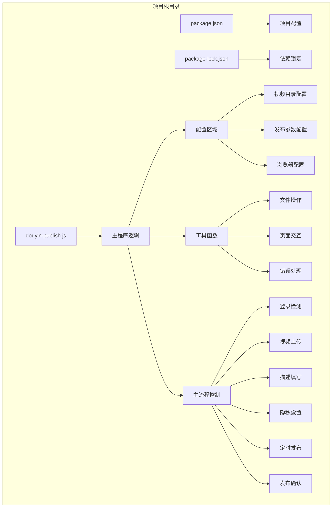
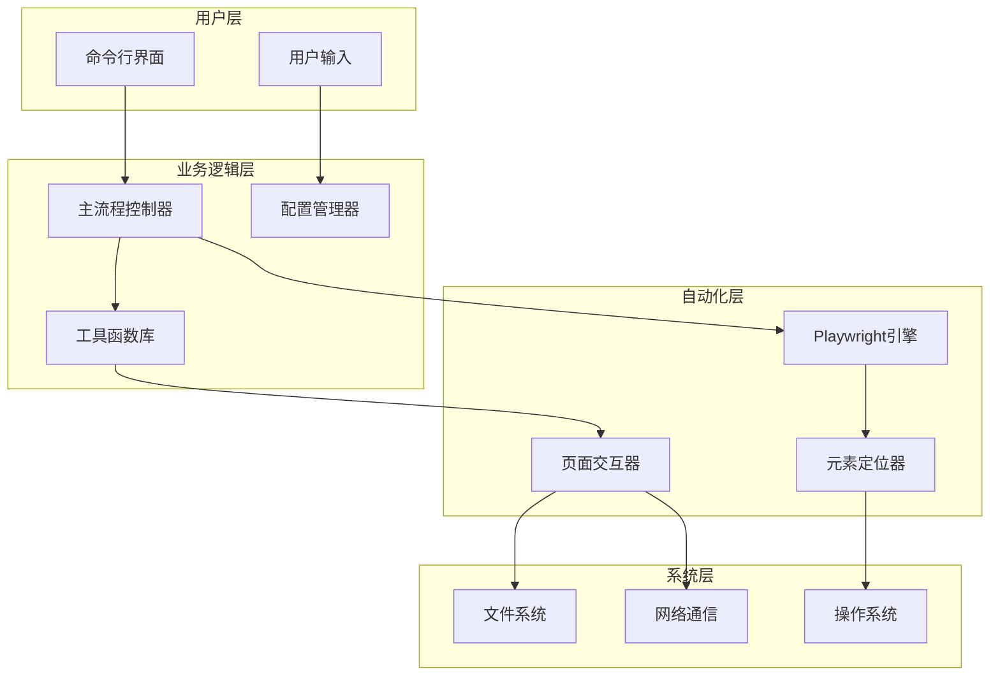
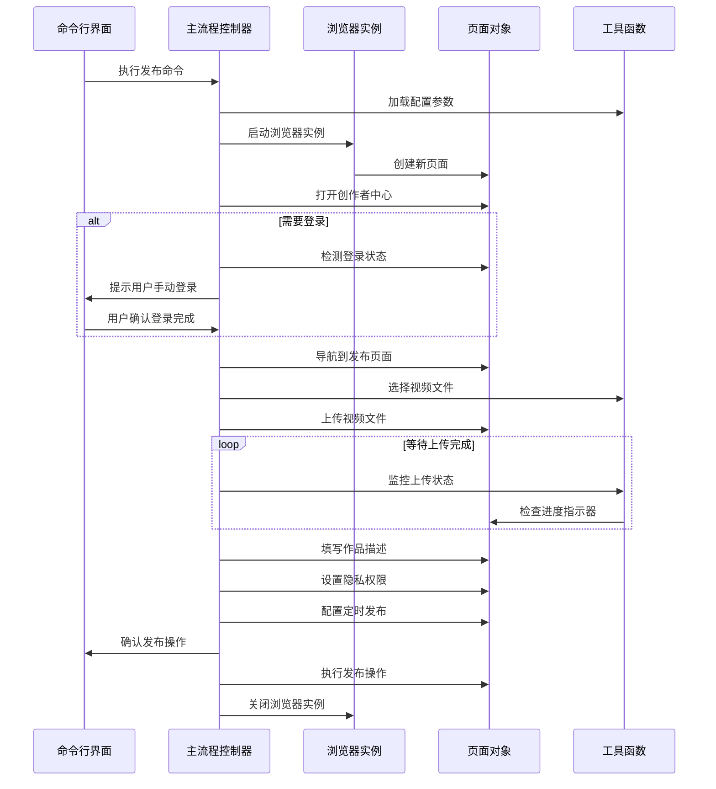
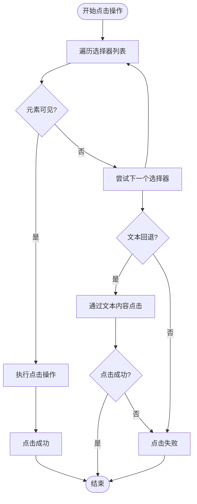
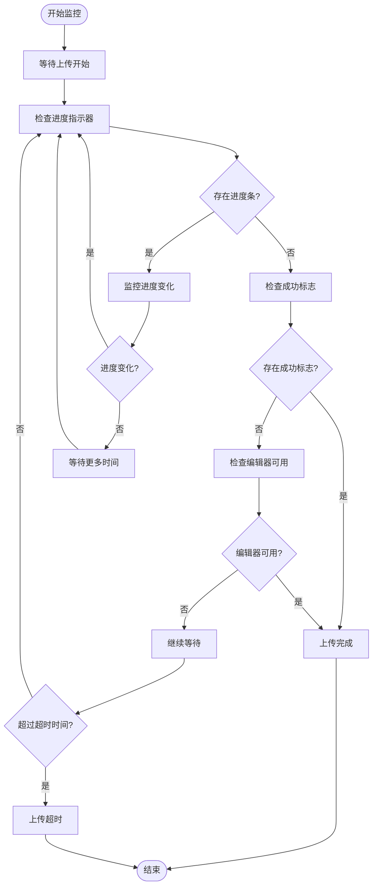
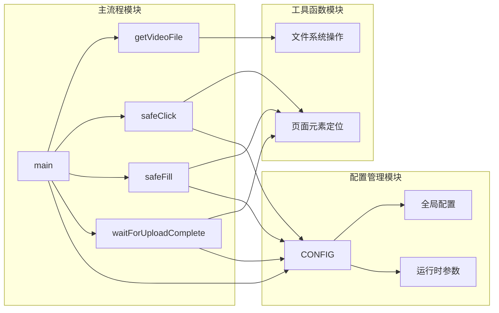

# 项目概述

<cite>
**本文档引用的文件**
- [douyin-publish.js](file://douyin-publish.js)
- [package.json](file://package.json)
- [package-lock.json](file://package-lock.json)
</cite>

## 目录
1. [项目简介](#项目简介)
2. [项目结构](#项目结构)
3. [核心组件](#核心组件)
4. [架构概览](#架构概览)
5. [详细组件分析](#详细组件分析)
6. [依赖关系分析](#依赖关系分析)
7. [性能考虑](#性能考虑)
8. [故障排除指南](#故障排除指南)
9. [结论](#结论)

## 项目简介

抖音自动发布工具是一个基于Playwright的CLI自动化工具，专为内容创作者设计，旨在简化抖音视频发布的重复性工作。该工具通过模拟人工操作的方式，自动完成从登录检测、视频上传、描述填写到定时发布的完整流程，显著提升内容发布的效率和一致性。

### 核心价值与目标

该项目的核心价值在于：
- **效率提升**：自动化重复性的发布流程，减少人工操作时间
- **一致性保证**：标准化的发布流程，确保每次发布都遵循相同的规范
- **可扩展性**：模块化的架构设计，便于添加新的功能特性
- **易用性**：简洁的命令行接口，降低使用门槛

### 设计理念与应用场景

该工具采用"智能自动化"的设计理念，通过以下策略实现可靠的自动化：
- **多策略容错机制**：针对不同的页面元素提供多种定位策略
- **智能等待机制**：根据页面状态动态调整等待时间
- **反检测技术**：通过修改浏览器特征避免被平台识别为自动化
- **用户交互集成**：在必要时与用户进行交互确认

典型应用场景包括：
- 内容创作者批量发布视频内容
- 营销团队定期发布推广内容
- 社交媒体运营者维护多个账号的内容日程

## 项目结构

项目采用极简的单文件架构设计，所有功能集中在单一JavaScript文件中：



**图表来源**
- [douyin-publish.js:24-53](file://douyin-publish.js#L24-L53)
- [douyin-publish.js:55-184](file://douyin-publish.js#L55-L184)
- [douyin-publish.js:239-619](file://douyin-publish.js#L239-L619)

**章节来源**
- [douyin-publish.js:1-626](file://douyin-publish.js#L1-L626)
- [package.json:1-17](file://package.json#L1-L17)

## 核心组件

### 配置管理系统

系统采用集中式配置管理模式，所有可定制参数都统一管理：

| 配置项 | 类型 | 默认值 | 说明 |
|--------|------|--------|------|
| videoDir | 字符串 | 'D:\\test' | 视频文件存储目录 |
| topicTitle | 字符串 | '这是一个水' | 作品主题标题 |
| description | 字符串 | '这是一个水瓶' | 作品描述内容 |
| visibility | 字符串 | '仅自己可见' | 隐私设置选项 |
| scheduledTime | 字符串/Null | null | 定时发布时间 |
| creatorHomeUrl | 字符串 | 创作者中心URL | 平台主页地址 |
| publishUrl | 字符串 | 发布页面URL | 发布页面地址 |
| headless | 布尔值 | false | 是否显示浏览器界面 |
| actionDelay | 数值 | 1000 | 操作间隔时间 |

### 工具函数模块

系统提供了七个核心工具函数，每个函数都针对特定的自动化任务：

1. **getVideoFile()** - 视频文件发现与验证
2. **getScheduledTime()** - 定时发布时间计算
3. **delay()** - 异步延迟执行
4. **safeClick()** - 智能点击操作
5. **safeFill()** - 安全文本填充
6. **waitForUploadComplete()** - 上传状态监控

**章节来源**
- [douyin-publish.js:57-83](file://douyin-publish.js#L57-L83)
- [douyin-publish.js:85-103](file://douyin-publish.js#L85-L103)
- [douyin-publish.js:108-110](file://douyin-publish.js#L108-L110)
- [douyin-publish.js:115-143](file://douyin-publish.js#L115-L143)
- [douyin-publish.js:148-184](file://douyin-publish.js#L148-L184)
- [douyin-publish.js:189-235](file://douyin-publish.js#L189-L235)

## 架构概览

系统采用分层架构设计，从底层到顶层依次为：



**图表来源**
- [douyin-publish.js:20-22](file://douyin-publish.js#L20-L22)
- [douyin-publish.js:254-287](file://douyin-publish.js#L254-L287)
- [douyin-publish.js:349-402](file://douyin-publish.js#L349-L402)

### 技术栈选择

项目采用以下核心技术栈：

- **Node.js运行时**：提供稳定的JavaScript执行环境
- **Playwright框架**：实现跨浏览器的自动化测试能力
- **Chromium浏览器**：作为主要的Web浏览引擎
- **文件系统API**：处理本地视频文件操作
- **异步编程模型**：基于Promise和async/await

**章节来源**
- [douyin-publish.js:20-22](file://douyin-publish.js#L20-L22)
- [package.json:13-15](file://package.json#L13-L15)

## 详细组件分析

### 主流程控制组件

主流程控制器是整个系统的中枢，负责协调各个子系统的协作：



**图表来源**
- [douyin-publish.js:239-619](file://douyin-publish.js#L239-L619)

### 安全点击机制

安全点击机制是系统的核心功能之一，通过多策略容错确保点击操作的可靠性：



**图表来源**
- [douyin-publish.js:115-143](file://douyin-publish.js#L115-L143)

### 上传状态监控系统

上传状态监控系统采用多指标检测策略，确保能够准确判断上传状态：



**图表来源**
- [douyin-publish.js:189-235](file://douyin-publish.js#L189-L235)

**章节来源**
- [douyin-publish.js:239-619](file://douyin-publish.js#L239-L619)
- [douyin-publish.js:115-143](file://douyin-publish.js#L115-L143)
- [douyin-publish.js:189-235](file://douyin-publish.js#L189-L235)

## 依赖关系分析

### 外部依赖关系

项目对外部依赖的管理采用精确版本锁定策略：

```mermaid
graph TB
subgraph "项目依赖树"
A[douyin-publish-tool] --> B[playwright@1.60.0]
B --> C[playwright-core@1.60.0]
C --> D[node >= 18]
subgraph "可选依赖"
E[fsevents@2.3.2]
end
B -.-> E
end
subgraph "运行时要求"
F[Node.js >= 18]
G[Chromium浏览器]
H[操作系统支持]
end
D --> F
B --> G
F --> H
```

**图表来源**
- [package.json:13-15](file://package.json#L13-L15)
- [package-lock.json:29-58](file://package-lock.json#L29-L58)

### 内部模块依赖

系统内部模块之间的依赖关系相对简单，主要体现为函数调用关系：



**图表来源**
- [douyin-publish.js:25-53](file://douyin-publish.js#L25-L53)
- [douyin-publish.js:239-619](file://douyin-publish.js#L239-L619)

**章节来源**
- [package.json:1-17](file://package.json#L1-L17)
- [package-lock.json:1-61](file://package-lock.json#L1-L61)

## 性能考虑

### 执行效率优化

系统在性能方面采用了多项优化策略：

1. **异步并发处理**：利用Promise和async/await避免阻塞操作
2. **智能等待机制**：根据页面状态动态调整等待时间
3. **资源复用**：重用浏览器实例和页面对象
4. **内存管理**：及时释放不需要的变量和对象引用

### 网络性能优化

- **超时控制**：为每个网络请求设置合理的超时时间
- **重试机制**：对关键操作实施有限次数的重试
- **进度反馈**：实时显示上传进度，提升用户体验

### 内存使用优化

- **渐进式加载**：按需加载和处理视频文件
- **及时清理**：操作完成后及时清理临时数据
- **监控告警**：监控内存使用情况，防止内存泄漏

## 故障排除指南

### 常见问题诊断

| 问题类型 | 症状表现 | 可能原因 | 解决方案 |
|----------|----------|----------|----------|
| 登录失败 | 无法跳转到发布页面 | 未完成手动登录 | 按提示完成手动登录 |
| 上传失败 | 视频文件无法选择 | 文件路径错误 | 检查视频目录配置 |
| 点击失效 | 按钮无法点击 | 元素定位失败 | 手动点击确认 |
| 发布失败 | 发布按钮点击无效 | 页面元素变更 | 手动确认发布 |
| 超时错误 | 操作超时 | 网络连接问题 | 检查网络状况 |

### 错误恢复机制

系统实现了多层次的错误恢复机制：

1. **自动重试**：关键操作具备有限次数的自动重试能力
2. **降级策略**：当高级功能不可用时启用基础功能
3. **用户干预**：在必要时暂停执行等待用户确认
4. **状态保存**：记录执行状态以便后续恢复

### 调试工具支持

- **截图功能**：在关键节点自动保存页面截图
- **进度输出**：详细的执行进度和状态信息
- **错误日志**：完整的错误堆栈和上下文信息

**章节来源**
- [douyin-publish.js:598-619](file://douyin-publish.js#L598-L619)
- [douyin-publish.js:601-608](file://douyin-publish.js#L601-L608)

## 结论

抖音自动发布工具是一个设计精良的CLI自动化解决方案，它成功地将复杂的Web自动化任务封装为简单的命令行操作。通过采用Playwright框架的强大功能和精心设计的容错机制，该工具能够在保持高可靠性的同时提供优秀的用户体验。

### 主要优势

1. **高可靠性**：多策略容错机制确保操作成功率
2. **易用性强**：简洁的配置和直观的操作流程
3. **扩展性好**：模块化设计便于功能扩展和维护
4. **安全性高**：内置反检测机制避免被平台识别

### 技术特色

- **智能自动化**：能够适应页面元素的变化和更新
- **用户友好**：提供丰富的进度反馈和错误提示
- **稳定可靠**：完善的错误处理和恢复机制
- **性能优化**：高效的资源管理和执行效率

### 应用前景

该工具为内容创作者、营销团队和社交媒体运营者提供了强大的技术支持，能够显著提升内容发布的效率和质量。随着功能的不断完善和技术的持续演进，该工具有望成为社交媒体内容管理的重要基础设施。