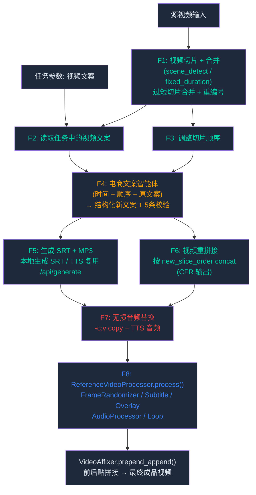

# 视频文案剪辑模式 — 产品需求文档

## 1. 产品概述

在现有「图生视频」和「参考生视频」两种模式基础上，新增第三种剪辑模式——**视频文案剪辑**（`video-copywriting-clip`）。该模式面向需要对已有视频素材进行**智能拆解、文案重组、再创作**的内容创作者：将源视频切片后，结合任务传入的原始视频文案，调用电商文案智能体生成结构化新文案，完成视频重拼接、TTS 配音替换，最后复用参考生视频的视觉效果、字幕烧录、BGM、前后贴等后处理管线，输出全新叙事结构的成品视频。

### 1.1 与现有模式对比

| 维度 | 图生视频 | 参考生视频 | **视频文案剪辑（新增）** |
|------|---------|-----------|----------------------|
| 输入素材 | 图片 | 参考视频 + 图片 | 源视频 + 视频文案（任务参数传入） |
| 字幕/配音来源 | 管线外预生成（`GenerateMediaClient`） | 管线外预生成 | 管线内 F4→F5 生成（智能体驱动） |
| 核心动作 | 图片→视频→效果 | 拼接→效果→叠加 | 切片→调序→智能体文案→配音→拼接→效果→字幕→BGM→前后贴 |
| 输出产物 | 带 BGM/效果的视频 | 带参考视频效果的视频 | 全新文案、配音、字幕的视频（含效果+BGM+前后贴） |
| 后处理 | BGM + 效果 + 前后贴 | BGM + 效果 + 前后贴 | 同参考生视频：效果 + 字幕 + BGM + 前后贴 |

---

## 2. 核心功能

### 2.1 功能模块

| 编号 | 模块 | 功能描述 |
|------|------|---------|
| F1 | 视频切片 | 将源视频按场景切换点或固定时长切分为多个片段（clip） |
| F2 | 获取视频文案内容 | 从剪辑任务的参数中读取原始视频文案内容（文案由任务分发系统附带传入） |
| F3 | 调整切片顺序 | 按预设策略调整切片排列顺序 |
| F4 | 电商文案智能体 | 将切片时间信息、调整后的顺序以及原始视频文案一并发送给电商文案智能体，获取结构化新文案 |
| F5 | 生成 SRT 字幕和 MP3 音频 | 基于智能体返回的新文案内容，生成 SRT 字幕文件和 TTS MP3 配音文件 |
| F6 | 视频重拼接 | 按智能体返回的新顺序将切片重新拼接为完整视频 |
| F7 | 无损音频替换 | 将重拼接视频的原音频轨替换为 TTS 新配音（视频流无损拷贝，仅重编码音频轨） |
| F8 | 视频效果 + 字幕 + BGM | 复用 `ReferenceVideoProcessor.process()`：FrameRandomizer 视觉效果、字幕烧录、Overlay 水印贴纸、AudioProcessor BGM 混音/语速/变调、循环播放 |
| — | 前后贴拼接 | 复用管线公共路径的 `VideoAffixer.prepend_append()` |

### 2.2 输入/输出定义

**输入**：
- 源视频文件路径（由任务分发系统指定，来源于 `MaterialIndex.videos` 的第一个视频）
- 视频文案内容（从任务参数 `Task` 中获取，如 `productTitle`、`productCategoryName` 或专用文案字段 `copywriting_text`）
- 服务端配置（切片策略、重排策略、智能体调用开关、用户特效开关等）
- 本地配置（切片参数、字幕样式、随机化参数、BGM 目录等）

**输出**：
- 最终视频文件：`task_{task_id}_output.mp4`，位于 `dirs.output_dir` 目录
- 电商文案智能体返回的新文案（JSON 结构化数据）
- 新字幕文件（SRT 格式）
- 新配音文件（MP3 格式）

---

## 3. 核心流程

### 3.1 主流程

```
任务分配到 video-copywriting-clip 模式
    │
    ▼
┌─────────────────────────────┐
│ F1: 视频切片                 │
│ 源视频 → N 个切片片段        │
│ 切片策略：场景检测 / 固定时长  │
│ 过短切片自动合并 + 重编号     │
└──────────┬──────────────────┘
           │
           ▼
┌─────────────────────────────┐
│ F2: 获取视频文案内容          │
│ 从任务参数读取原始视频文案     │
│ (productTitle / 文案字段等)   │
└──────────┬──────────────────┘
           │
           ▼
┌─────────────────────────────┐
│ F3: 调整切片顺序             │
│ 按策略重排切片排列            │
│ 输出: 新切片顺序             │
└──────────┬──────────────────┘
           │
           ▼
┌─────────────────────────────┐
│ F4: 调用电商文案智能体        │
│ 传入：切片时间 + 顺序 +       │
│       原始视频文案            │
│ 返回：结构化新文案内容         │
│ 响应校验：5 条规则            │
└──────────┬──────────────────┘
           │
           ├──────────────────────────┐
           ▼                          ▼
┌─────────────────────┐  ┌─────────────────────────┐
│ F5: 生成 SRT + MP3   │  │ F6: 视频重拼接            │
│ segments → SRT 字幕  │  │ 按 new_slice_order concat │
│ full_script → TTS    │  │ (CFR 输出 + -c copy)      │
│ (复用 /api/generate)  │  │ 输出: reordered.mp4       │
└──────────┬──────────┘  └──────────┬──────────────┘
           │                        │
           └────────┬───────────────┘
                    ▼
┌─────────────────────────────┐
│ F7: 无损音频替换             │  ← 视频流 -c:v copy，仅重编码音频
│ 新配音 → 替换原音频轨        │
│ 输出: _audio_replaced.mp4   │
└──────────┬──────────────────┘
           │
           ▼
┌─────────────────────────────┐
│ F8: ReferenceVideoProcessor  │  ← 同参考生视频的完整后处理
│ .process()                  │     （一次 FFmpeg 调用）
│ FrameRandomizer 视频效果     │
│ 字幕烧录（F5 产出的 SRT）    │
│ Overlay 水印/贴纸            │
│ AudioProcessor BGM/语速/变调 │
│ Loop 循环                   │
│ 输出: _pre_affix.mp4        │
└──────────┬──────────────────┘
           │
           ▼
┌─────────────────────────────┐
│ VideoAffixer.prepend_append  │  ← 管线公共路径（run 方法）
│ 前后贴拼接 → 最终成品视频     │
└─────────────────────────────┘
```

### 3.2 流程详解



---

## 4. 各模块详细说明

### 4.1 F1：视频切片

**功能**：将源视频切分为多个独立片段。

**切片策略**（由服务端配置控制）：

| 策略 | 说明 | 适用场景 |
|------|------|---------|
| `scene_detect` | 两步实现：(1) ffmpeg `select`+`showinfo` 探测场景切换时间点；(2) 按时间点用 `-ss -to` 分段切割 | 多场景叙事视频 |
| `fixed_duration` | 按固定时长切割（如每 30 秒一切片），用 `-ss -to` 循环切割 | 长视频均匀拆解 |
| `silence_detect` | 基于 ffmpeg `silencedetect` 滤镜检测静音区间，在区间边界切割 | 口播/讲解类视频 |

**切片最短合并规则**：
- 若某切片时长 < `copywriting.slice_min_duration_sec`（默认 3s），自动合并到相邻切片中（优先合并到前一个切片）
- 合并后全部切片重新编号（`index` 从 0 连续递增），更新每个切片的 `start_time`（在合并后视频时间线上的位置）
- 若所有切片合并后仅剩 1 个切片，不报错，视为"对整个视频做文案替换"

**切片输出**：
- 每个切片保存为独立 MP4 文件到 `scratch_dir/slices/`，文件命名 `slice_{index:03d}.mp4`
- 生成切片清单文件（`slice_manifest.json`），记录每个切片的：
  - `index`: 重编号后的序号
  - `path`: 切片文件路径
  - `start_time`: 在合并重排后序列中的累积起始时间（秒）
  - `duration`: 时长（秒）

**示例切片清单**：

```json
{
  "source_video": "/path/to/source.mp4",
  "slice_strategy": "scene_detect",
  "total_duration": 35.8,
  "slices": [
    {"index": 0, "path": "slice_000.mp4", "start_time": 0.0, "duration": 12.5},
    {"index": 1, "path": "slice_001.mp4", "start_time": 12.5, "duration": 8.3},
    {"index": 2, "path": "slice_002.mp4", "start_time": 20.8, "duration": 15.0}
  ]
}
```

---

### 4.2 F2：获取视频文案内容

**功能**：从剪辑任务的参数中读取原始视频文案内容，无需通过 ASR 从音频中提取。

**文案来源**（从 `Task` 对象中获取）：

| 来源字段 | 说明 |
|----------|------|
| `Task.productTitle` | 产品标题（如"纯棉短袖七分裤运动套装女夏季2026新款"） |
| `Task.productCategoryName` | 产品品类名称 |
| `Task.copywriting_text`（新增） | 专用视频文案字段，优先级最高 |

**优先级规则**：
- 若 `copywriting_text` 字段存在且非空，使用该字段作为视频文案
- 否则回退使用 `productTitle` + `productCategoryName` 拼接作为文案内容
- 若以上均无有效内容，抛出 `PipelineError`（文案是该模式必需输入）

---

### 4.3 F3：调整切片顺序

**功能**：按预设策略调整切片排列顺序，确定视频片段的最终展示次序。

**重排策略**（由服务端配置控制）：

| 策略 | 说明 |
|------|------|
| `keep_original` | 保持原始顺序不变 |
| `reverse` | 完全反转顺序 |
| `ai_reorder` | 交由电商文案智能体决定最优顺序（在 F4 步骤中一并处理） |
| `shuffle` | 随机打乱顺序 |

**输出格式**：

```json
{
  "strategy": "reverse",
  "order": [2, 1, 0]
}
```

> 当策略为 `ai_reorder` 时，F3 暂不改变切片顺序，而是将 `[0, 1, 2, ..., n-1]` 原始顺序传递到 F4，由智能体在生成新文案的同时决定最优切片顺序。

---

### 4.4 F4：电商文案智能体

**功能**：将切片时间信息、切片顺序以及原始视频文案发送给电商文案智能体，获取结构化新文案内容。

**输入参数**：

```json
{
  "task_id": "task_001",
  "slices": [
    {"index": 0, "start_time": 0.0, "duration": 12.5},
    {"index": 1, "start_time": 12.5, "duration": 8.3},
    {"index": 2, "start_time": 20.8, "duration": 15.0}
  ],
  "slice_order": [2, 1, 0],
  "original_copywriting": "纯棉短袖七分裤运动套装女夏季2026新款广场舞服装团体休闲两件套",
  "product_info": {
    "title": "纯棉短袖七分裤运动套装女夏季2026新款",
    "category": "服装",
    "selling_points": ["纯棉短袖七分裤运动套装女夏季2026新款广场舞服装团体休闲两件套"]
  }
}
```

> `selling_points` 来源：直接取 `Task.productTitle` 的值（与现有 `_generate_subtitle_audio` 中 `selling_points=product_title` 一致）。若 `Task.productTitle` 为空则使用 `Task.copywriting_text`。

**智能体输出（结构化新文案）**：

```json
{
  "new_slice_order": [1, 0, 2],
  "segments": [
    {
      "slice_index": 1,
      "start_time": 0.0,
      "duration": 8.3,
      "text": "这款运动套装采用纯棉面料，亲肤透气，夏日穿着不闷汗"
    },
    {
      "slice_index": 0,
      "start_time": 8.3,
      "duration": 12.5,
      "text": "短袖上衣搭配七分裤，两件套设计方便省心，日常休闲和运动都合适"
    },
    {
      "slice_index": 2,
      "start_time": 20.8,
      "duration": 15.0,
      "text": "多种颜色可选，版型宽松不挑身材，舞蹈队姐妹人手一套"
    }
  ],
  "full_script": "这款运动套装采用纯棉面料，亲肤透气，夏日穿着不闷汗。短袖上衣搭配七分裤，两件套设计方便省心，日常休闲和运动都合适。多种颜色可选，版型宽松不挑身材，舞蹈队姐妹人手一套。"
}
```

**接口契约**：

`segments` 数组中各字段约定：
| 字段 | 含义 |
|------|------|
| `slice_index` | 引用的原始切片索引（F1 产物中的 `index`） |
| `start_time` | **重排后时间线上的起始时间（秒）**，必须从 0 开始连续累加 |
| `duration` | 该 segment 的文本对应时长，应 ≤ 对应切片的实际时长 |
| `text` | 该 segment 对应的文案文本 |

**校验规则**（接收智能体响应后立即执行）：
1. `new_slice_order` 长度必须等于 `slices` 长度，且为原始索引的排列
2. 每个 `segments[].slice_index` 必须在 `new_slice_order` 中出现
3. `sum(segments[].duration)` ≤ `sum(slices[].duration)`（允许略短，不允许超过）
4. `segments[].start_time` 必须从 0 开始且递增连续（允许微小间隙，由 F5 填充）
5. `full_script` 必须非空

**智能体接口**：
- 端点：`POST /api/copywriting/reorder`
- 认证：`Authorization: Bearer {access_token}`
- 请求体：`AiCopywritingRequest` JSON
- 响应体：`AiCopywritingResponse` JSON
- 超时：`copywriting.ai_timeout_sec`（默认 60s）
- 可复用现有 `GenerateMediaClient` 的 HTTP Session + Bearer Token 模式

---

### 4.5 F5：生成 SRT 字幕和 MP3 音频

**功能**：基于智能体返回的结构化新文案（`segments`），生成 SRT 字幕文件和 TTS MP3 配音文件。

**步骤**：
1. **字幕生成**（本地）：根据 `segments` 数组中每段文本的 `start_time` 和 `duration`，生成 SRT 格式字幕文件
   - 字幕序号按 segment 顺序递增
   - 时间戳格式：`HH:MM:SS,mmm`
   - 相邻 segment 之间若有间隙（前一个 `start_time + duration` < 后一个 `start_time`），自动用空白字幕条目填补
   - 所有时间值做 `round(time, 3)` 毫秒精度舍入，防止智能体返回的浮点累积误差导致微小间隙（< 1ms）
   - 填充间隙的空白条目若 duration < 0.001s（四舍五入后为 0ms），则跳过不生成
   - 输出路径：`scratch_dir/subtitles/copywriting_{safe_task_id}.srt`（命名风格与现有 `generated_{task_id}.srt` 保持一致）

2. **配音生成**（TTS）：调用 `/api/generate`，将 `full_script` 作为 `title` 传入，**忽略返回的 SRT**（因为 F5 已本地生成），仅下载 MP3
   - 复用现有 `GenerateMediaClient.generate()`，参数映射：

   | 参数 | 值 |
   |------|-----|
   | `task_id` | `Task.id` |
   | `product_id` | `Task.productId` |
   | `config_id` | `Task.config_id` |
   | `duration` | `SliceManifest.total_duration`（取整） |
   | `category` | `Task.productCategoryName` |
   | `title` | **`AiCopywritingResponse.full_script`**（关键：用智能体生成的新文案作为 TTS 文本源） |
   | `selling_points` | `Task.productTitle` |

   - `/api/generate` 服务端以 `title` 为核心文案生成 TTS 语音，返回的 MP3 即为基于新文案的配音
   - 输出路径：`scratch_dir/audio/copywriting_{safe_task_id}.mp3`

> 为什么复用 `/api/generate` 而非新增 `/api/tts`：最小化服务端改动。`/api/generate` 已具备从文本生成 TTS MP3 并上传 OSS 的完整链路。将 `full_script` 作为 `title` 传入即可获得基于新文案的配音。

**TTS 时长与视频时长对齐策略**：

| 场景 | 处理方式 |
|------|---------|
| TTS 时长 ≤ 视频时长 | 正常使用，F7 中用 `-shortest` 以视频长度为准 |
| TTS 时长 > 视频时长 | F7 中 `-shortest` 截断音频到视频长度（TTS 末尾可能被截断） |
| TTS 时长 < 视频时长但差值 ≤ 2s | 可接受，视频末尾短暂静音 |
| TTS 时长 < 视频时长且差值 > 2s | 在 TTS 末尾追加静音填充（`apad` 滤镜），避免过长的无声段 |

**SRT 字幕生成示例**：

```
1
00:00:00,000 --> 00:00:08,300
这款运动套装采用纯棉面料，亲肤透气，夏日穿着不闷汗

2
00:00:08,300 --> 00:00:20,800
短袖上衣搭配七分裤，两件套设计方便省心，日常休闲和运动都合适

3
00:00:20,800 --> 00:00:35,800
多种颜色可选，版型宽松不挑身材，舞蹈队姐妹人手一套
```

---

### 4.6 F6：视频重拼接

**功能**：按智能体返回的新切片顺序，将所有切片重新拼接为一段完整视频。

**实现方式**：
- 使用 ffmpeg `concat` demuxer，按 `new_slice_order` 生成 concat 文件列表
- 添加 `-fflags +genpts -vsync cfr` 确保输出为恒定帧率（CFR），避免后续 F8 字幕滤镜在可变帧率（VFR）视频上出现时间戳问题
- 使用 `-c copy` 实现无损拼接（同编码格式下）
- 若切片编码不一致，则降级为转码拼接

**输出**：拼接后的视频文件 `scratch_dir/reordered/reordered.mp4`

**concat 文件列表示例**（按 `new_slice_order: [1, 0, 2]`）：

```
file 'slice_001.mp4'
file 'slice_000.mp4'
file 'slice_002.mp4'
```

---

### 4.7 F7：无损音频替换

**功能**：将重拼接视频的原音频轨替换为 TTS 新配音，**视频流无损拷贝，仅重编码音频轨**。

**设计理由**：
- F7 不做字幕烧录，字幕延迟到 F8 与视觉效果一并处理
- 视频流使用 `-c:v copy` 避免双重 H.264 编码导致的画质损失
- F8（`ReferenceVideoProcessor.process()`）已内置字幕烧录能力（`subtitle_srt_path` 参数），将字幕与视觉效果在一次 FFmpeg 调用中完成

**无声源视频场景**：若源视频本身无音频轨，F6 拼接后的 `reordered.mp4` 也无音频。F7 中 `-map 0:v:0 -map 1:a:0` 仍然有效——从输入 0 取视频轨，从输入 1（TTS）取音频轨，ffmpeg 不会报错。输出视频将只有 TTS 配音作为唯一音频轨，属于预期正确行为。

**ffmpeg 命令要点**：
```
ffmpeg -i reordered.mp4 -i copywriting_xxx.mp3 \
  -c:v copy \              # 视频流无损拷贝
  -c:a aac \               # 仅音频轨重新编码
  -map 0:v:0 -map 1:a:0 \  # 取原视频的视频轨 + TTS 音频轨
  -shortest \              # 以较短的流为准，防止 TTS 过长导致视频尾部黑屏
  _audio_replaced.mp4
```

**输出**：`scratch_dir/copywriting_clip/_audio_replaced.mp4`

---

### 4.8 F8：视频效果 + 字幕 + BGM（`ReferenceVideoProcessor.process()`）

**功能**：F7 输出的视频（已含 TTS 新配音，视频流无损）调用 `ReferenceVideoProcessor.process()`，字幕烧录在此步骤与视觉效果、BGM 混音合并为**一次 FFmpeg 调用**，避免二次编码。

调用方式：
```
ReferenceVideoProcessor.process(
    reference_video=F7 输出视频,
    subtitle_srt_path=F5 产出的 SRT,    # 字幕在此一并烧录
    video_filters=帧随机化效果,
    overlay_filters/inputs=水印贴纸,
    audio_filters/inputs=BGM/语速/变调,
    loop_count=循环次数,
    replacement_audio_path=None,         # F7 已完成音频替换
    output_path=_pre_affix.mp4,
)
```

#### 4.8.1 FrameRandomizer 视频效果

对视频应用随机化视觉滤镜链，参数由服务端 `UserConfig.video_items` 和本地 `RandomizationConfig.frame` 共同控制：

| 效果 | 配置开关 | FFmpeg 滤镜 |
|------|---------|------------|
| 抽帧 | `frame_extraction` | `select` + `setpts` |
| 裁剪 | `cropping` | `crop` |
| 模糊 | `blur` | `boxblur` / `gblur` |
| 抖动 | `shake` | `rotate` + `random` |
| 亮度 | `brightness` | `eq=brightness` |
| 对比度 | `contrast` | `eq=contrast` |
| 饱和度 | `saturation` | `eq=saturation` |
| 色彩平衡 | `color_balance` | `colorbalance` |
| Gamma | `gamma` | `eq=gamma` |
| 复古黑白 | `vintage_bw` | `hue=s=0` + `eq` |

#### 4.8.2 字幕烧录

通过 `ReferenceVideoProcessor.process()` 的 `subtitle_srt_path` 参数传入 F5 生成的 SRT 字幕文件。字幕样式复用现有常量 `_SUBTITLE_FORCE_STYLE`（`Fontsize=9,Outline=1,Shadow=0,MarginV=24,Alignment=2,WrapStyle=2`）。

若 `loop_count > 1`，`ReferenceVideoProcessor` 会自动将字幕按循环次数展开（现有逻辑 `_expand_srt_for_loop`）。

#### 4.8.3 Overlay 叠加元素

| 元素 | 配置开关 | 说明 |
|------|---------|------|
| 水印 | `UserConfig.video_items.watermark` | 从 `watermark_dir` 随机选取，叠加到视频上 |
| 贴纸 | `UserConfig.text_items.sticker_enabled` | 从 `sticker_dir` 随机选取，叠加到视频上 |

> Overlay 元素叠加需要视频分辨率。通过 `ffprobe` 探测 F7 输出视频的分辨率（复用 `_probe_resolution` 静态方法）。

#### 4.8.4 AudioProcessor 音频处理

在 F7 已替换为 TTS 新配音的基础上，进一步叠加 BGM 和音频效果：

| 处理 | 配置开关 | 说明 |
|------|---------|------|
| 背景音乐 | `UserConfig.audio.background_music_enabled` | 从 `bgm_dir` 随机选取 BGM，按随机音量（0.08~0.18）混入 |
| 语速调整 | `UserConfig.audio.speed_adjustment_enabled` | 随机变速（0.90x~1.10x），包含 BGM 同步变速 |
| 变调 | `UserConfig.audio.pitch_enabled` | 通过 rubberband 滤镜对原音频进行 pitch shift |

> BGM 混音以 F7 输出的 TTS 新配音为「原音频轨」，BGM 作为第二音轨混入。最终音频输出 = TTS 新配音 + BGM 背景音乐。

#### 4.8.5 Loop 循环播放

若服务端配置 `UserConfig.repetition.loop_count > 1`，则对视频和音频进行循环播放（通过 `-stream_loop`），字幕也会按循环次数展开。

---

## 5. 管线集成

### 5.0 Pipeline 网络能力扩展（关键架构决策）

**问题**：`VideoEditingPipeline` 当前不持有 HTTP 会话或 access token，而 F4（智能体）和 F5（TTS）需要网络能力。现有架构约定网络依赖步骤在管线外执行（参考生视频的 `_generate_subtitle_audio`）。

**决策**：为保持 F1-F8 顺序完整性且不破坏管线封装，采用**最小化侵入方案**——为 `VideoEditingPipeline` 增加可选的网络参数：

```python
class VideoEditingPipeline:
    def __init__(
        self,
        local_config,
        randomization_config,
        dirs: EditDirs,
        logger: "Logger | None" = None,
        # ── 新增：可选的网络能力（仅 video-copywriting-clip 模式需要）──
        http_session: requests.Session | None = None,
        access_token: str | None = None,
        base_url: str = "",
    ):
        self._http = http_session
        self._access_token = access_token
        self._base_url = base_url
```

> `http_session` 使用 `session_factory` 模式：`TaskProcessor` 在构造 Pipeline 时注入当前的 session 引用。注意 `requests.Session` 非线程安全，当前 `TaskProcessor` 单线程运行无此问题；若未来支持并发，需改为每次调用创建新 session 或使用 session_factory 回调。

### 5.1 五层改动点

#### 5.1.1 Layer 1 — `pipeline.py`：mode 三分支 + `_run_copywriting_clip` 方法

**`run()` 方法分发**：

```python
# 当前: 二元 if/else
if ctx.task.mode == "image-to-video":
    pre_affix_path = self._run_image_to_video(
        ctx, video_filters, audio_filters, audio_inputs, loop_count,
    )
    target_size = None
else:
    pre_affix_path, target_size = self._run_reference_video(
        ctx, video_filters, audio_filters, audio_inputs, loop_count,
    )

# 修改后: 三分支
if ctx.task.mode == "image-to-video":
    pre_affix_path = self._run_image_to_video(...)
    target_size = None
elif ctx.task.mode == "video-copywriting-clip":
    pre_affix_path, target_size = self._run_copywriting_clip(
        ctx, video_filters, audio_filters, audio_inputs, loop_count,
    )
else:
    pre_affix_path, target_size = self._run_reference_video(...)

# 公共后处理（三个模式共用）：
affixer = VideoAffixer(...)
result = affixer.prepend_append(pre_affix_path, output_path, target_size=target_size)
```

**`_run_copywriting_clip` 方法结构**（与 `_run_reference_video` 同层级）：

```python
def _run_copywriting_clip(
    self,
    ctx: PipelineContext,
    video_filters: list[str],
    audio_filters: list[str],
    audio_inputs: list[str],
    loop_count: int,
) -> tuple[Path, tuple[int, int] | None]:
    """视频文案剪辑模式：F1-F8
    
    步骤: F1切片→F2读文案→F3调序→F4智能体→F5生成SRT+MP3
          →F6拼接→F7音频替换→F8效果+字幕+BGM
    返回: (pre_affix_path, target_size) 供公共前后贴拼接使用
    
    网络依赖: self._http + self._access_token + self._base_url
    用于 F4 智能体调用 + F5 TTS 生成。若未注入则抛出 PipelineError。
    """
    if self._http is None or self._access_token is None:
        raise PipelineError("video-copywriting-clip 模式需要注入 http_session 和 access_token")
    
    videos = [m.path for m in ctx.material_index.videos]
    if not videos:
        raise PipelineError("视频文案剪辑模式需要至少一个源视频素材")
    
    source_video = videos[0]
    target_size = self._probe_resolution(source_video)
    
    temp_dir = ctx.scratch_dir / "copywriting_clip"
    temp_dir.mkdir(parents=True, exist_ok=True)
    
    # ── F1: 切片 ──
    manifest = self._slice_video(source_video, temp_dir, ctx.clip_config)
    ctx.slice_manifest = manifest
    
    # ── F2: 读取文案 ──
    original_text = ctx.task.copywriting_text
    if not original_text:
        original_text = "%s %s" % (
            ctx.task.productTitle or "",
            ctx.task.productCategoryName or "",
        ).strip()
    if not original_text:
        raise PipelineError("视频文案剪辑模式需要视频文案内容")
    ctx.original_copywriting = original_text
    
    # ── F3: 重排顺序 ──
    strategy = ctx.clip_config.reorder_strategy if ctx.clip_config else "keep_original"
    slice_order = self._compute_slice_order(strategy, len(manifest.slices))
    
    # ── F4: 电商文案智能体 ──
    # 使用 self._http / self._access_token / self._base_url
    ai_response = self._call_ai_agent(ctx, manifest, slice_order)
    ctx.ai_response = ai_response
    
    # ── F5: 生成 SRT + MP3 ──
    srt_path = self._generate_srt_from_segments(
        ai_response.segments, temp_dir, ctx.task.id,
    )
    # 使用 self._http / self._access_token / self._base_url
    mp3_path = self._generate_tts_from_full_script(
        ctx.task, ai_response.full_script, manifest.total_duration,
    )
    
    # ── F6: 视频重拼接 ──
    reordered_path = temp_dir / "reordered.mp4"
    self._concat_slices(manifest, ai_response.new_slice_order, reordered_path)
    
    # ── F7: 无损音频替换 ──
    audio_replaced_path = temp_dir / "_audio_replaced.mp4"
    self._replace_audio_lossless(reordered_path, mp3_path, audio_replaced_path)
    
    # ── F8: ReferenceVideoProcessor (效果 + 字幕 + BGM) ──
    pre_affix_path = temp_dir / "_pre_affix.mp4"
    overlay_filters, overlay_inputs = self._build_overlay_elements(ctx)
    processor = ReferenceVideoProcessor(logger=ctx.logger)
    processor.process(
        reference_video=audio_replaced_path,
        output_path=pre_affix_path,
        video_filters=video_filters,
        overlay_filters=overlay_filters,
        overlay_inputs=overlay_inputs,
        audio_filters=audio_filters,
        audio_inputs=audio_inputs,
        loop_count=loop_count,
        subtitle_srt_path=srt_path,       # F5 产出的 SRT
        replacement_audio_path=None,       # F7 已完成音频替换
    )
    
    return pre_affix_path, target_size
```

> 关键：`_run_copywriting_clip` 与 `_run_reference_video` 完全对称——都内部调用 `ReferenceVideoProcessor.process()` 并返回 `(pre_affix_path, target_size)`，前后贴拼接由 `run()` 公共路径统一处理。F4/F5 的网络调用通过构造函数注入的 `self._http` + `self._access_token` + `self._base_url` 实现。

#### 5.1.2 Layer 2 — `task_processor.py`：跳过预生成 + 素材验证

**改动 1**：对 `video-copywriting-clip` 模式跳过管线外的字幕/音频预生成：

```python
# 现有代码
if user_config.text_items.subtitles:
    generated = self._generate_subtitle_audio(...)

# 修改为
if user_config.text_items.subtitles and mode != "video-copywriting-clip":
    generated = self._generate_subtitle_audio(...)
```

理由：copywriting-clip 的字幕和配音由管线内 F4→F5 基于智能体返回的文案生成，预生成的字幕/配音是错误的。

**改动 2**：素材验证新增分支：

```python
if mode == "video-copywriting-clip" and not material_index.videos:
    raise RuntimeError("视频文案剪辑模式需要至少一个源视频素材")
if mode == "video-copywriting-clip" and not task.copywriting_text and not task.productTitle:
    raise RuntimeError("视频文案剪辑模式需要视频文案内容")
```

**改动 3**：构造 Pipeline 时注入网络参数：

```python
# 现有代码
pipeline = VideoEditingPipeline(
    local_config=...,
    randomization_config=...,
    dirs=...,
    logger=...,
)

# 修改为（仅 video-copywriting-clip 模式需要注入）：
if mode == "video-copywriting-clip":
    pipeline = VideoEditingPipeline(
        local_config=...,
        randomization_config=...,
        dirs=...,
        logger=...,
        http_session=self._http_session,
        access_token=self._access_token,
        base_url=self._base_url,
    )
else:
    pipeline = VideoEditingPipeline(...)  # 其他模式不变
```

#### 5.1.3 Layer 3 — `duplicate_detection.py`：跳过 copywriting-clip 模式的帧哈希去重

**问题**：现有重复检测使用视频中点帧的 pHash（感知哈希）。对于 copywriting-clip 模式，同一源视频的不同文案重排版本在视觉帧上完全相同（即使配音/文案不同），会被误判为重复。

**决策**：初版跳过 copywriting-clip 模式的 pHash 去重。同一源视频被不同文案重排剪辑本身就是合法产出。后续版本可考虑将 `full_script` 哈希加入去重依据（组合键 `phash + text_hash`）。

```python
# duplicate_detection.py 或 task_processor.py 中的调用点：
if ctx.task.mode == "video-copywriting-clip":
    is_duplicate = False  # 跳过 pHash 去重
else:
    is_duplicate = self._detector.check_duplicate(video_path, clip_mode)
```

#### 5.1.4 Layer 4 — `cleanup.py`：增强递归清理能力

**问题**：现有 `cleanup_temp()` 只做单层遍历，无法清理 copywriting-clip 模式的嵌套子目录产物（`slices/`、`copywriting_clip/`、`subtitles/`、`audio/`）。

**决策**：增强 `cleanup_temp()` 支持递归清理子目录中的文件，并保留空目录结构（不删除目录本身，因为其他任务可能仍在共享子目录结构）。

```python
def cleanup_temp(temp_dir: Path, max_age_hours: int = 24) -> int:
    temp_dir = Path(temp_dir)
    now = time.time()
    max_age_seconds = max_age_hours * 3600
    deleted_count = 0
    
    if not temp_dir.exists():
        return 0
    
    # 改为递归遍历所有文件
    for item in temp_dir.rglob("*"):
        if item.is_file():
            mtime = item.stat().st_mtime
            if now - mtime > max_age_seconds:
                item.unlink()
                deleted_count += 1
    
    return deleted_count
```

> 改为 `rglob("*")` 递归遍历，影响面极小 —— 仅改变删除范围从"顶层文件"到"所有层级文件"，向上兼容现有行为。

#### 5.1.5 Layer 5 — `task_queue.py`：Task 模型扩展

`Task.from_dict()` 新增字段读取：

```python
@dataclass
class Task:
    # ... 现有字段 ...
    copywriting_text: str | None = None  # 新增

    @staticmethod
    def from_dict(data: dict) -> "Task":
        return Task(
            # ... 现有字段 ...
            copywriting_text=data.get("copywriting_text"),  # 新增
        )
```

---

## 6. 数据模型

### 6.1 Task 模型扩展

```python
# task_queue.py
@dataclass
class Task:
    # ... 现有字段 ...

    copywriting_text: str | None = None  # 原始视频文案内容（任务参数传入）
```

### 6.2 切片数据模型

```python
@dataclass
class VideoSlice:
    """单个视频切片"""
    index: int
    path: Path
    start_time: float
    duration: float


@dataclass
class SliceManifest:
    """切片清单"""
    source_video: Path
    slice_strategy: str
    slices: list[VideoSlice]
    total_duration: float  # 所有切片总时长（用于校验智能体返回的 segments）


@dataclass
class CopywritingClipConfig:
    """视频文案剪辑配置 — 服务端下发"""
    slice_strategy: str = "scene_detect"
    reorder_strategy: str = "keep_original"
    fixed_duration_sec: float = 30.0
    ai_agent_enabled: bool = True
```

### 6.3 电商文案智能体交互模型

```python
@dataclass
class AiCopywritingRequest:
    task_id: str
    slices: list[dict]           # [{index, start_time, duration}, ...]
    slice_order: list[int]
    original_copywriting: str
    product_info: dict           # {title, category, selling_points}
    # selling_points 来源: Task.productTitle


@dataclass
class AiCopywritingResponse:
    new_slice_order: list[int]
    segments: list[dict]         # [{slice_index, start_time, duration, text}, ...]
    full_script: str

    def validate(self, manifest: SliceManifest) -> None:
        """校验智能体返回的结构化文案是否合法。

        校验规则：
        1. new_slice_order 长度为切片数，且为原始索引的排列
        2. 每个 segment 的 slice_index 在 new_slice_order 中出现
        3. segments 总时长 ≤ 切片总时长
        4. segments.start_time 从 0 开始且递增连续
        5. full_script 非空
        """
```

### 6.4 管线上下文扩展

```python
@dataclass
class PipelineContext:
    # ... 现有字段 ...
    # subtitle_srt_path: Path | None = None   # 现有字段，copywriting-clip 不使用
    # replacement_audio_path: Path | None = None  # 现有字段，copywriting-clip 不使用

    # 视频文案剪辑模式专用
    clip_config: CopywritingClipConfig | None = None
    slice_manifest: SliceManifest | None = None
    original_copywriting: str = ""
    ai_response: AiCopywritingResponse | None = None
```

> `subtitle_srt_path` 和 `replacement_audio_path` 在 copywriting-clip 模式中由 `_run_copywriting_clip` 内部管理，不通过 `ctx` 中转。

---

## 7. 配置项

### 7.1 服务端配置（ClipModeConfig 扩展）

**改动 1**：`ServerConfig` 新增 `copywriting_clip` 字段：

```python
# config_sync.py — ServerConfig 新增 frozen 字段
@dataclass(frozen=True)
class CopywritingClipServerConfig:
    """视频文案剪辑服务端配置"""
    slice_strategy: str = "scene_detect"
    reorder_strategy: str = "keep_original"
    fixed_duration_sec: float = 30.0
    ai_agent_enabled: bool = True

    @staticmethod
    def from_dict(data: dict | None) -> "CopywritingClipServerConfig":
        if not data:
            return CopywritingClipServerConfig()
        return CopywritingClipServerConfig(
            slice_strategy=data.get("slice_strategy", "scene_detect"),
            reorder_strategy=data.get("reorder_strategy", "keep_original"),
            fixed_duration_sec=float(data.get("fixed_duration_sec", 30.0)),
            ai_agent_enabled=bool(data.get("ai_agent_enabled", True)),
        )


@dataclass(frozen=True)
class ServerConfig:
    # ... 现有字段 ...
    copywriting_clip: CopywritingClipServerConfig = CopywritingClipServerConfig()  # 新增

    @staticmethod
    def from_dict(data: dict) -> "ServerConfig":
        return ServerConfig(
            # ... 现有字段 ...
            copywriting_clip=CopywritingClipServerConfig.from_dict(
                data.get("copywriting_clip")
            ),  # 新增
        )
```

> 若服务端 JSON 中尚无 `copywriting_clip` 段，则全部使用默认值（scene_detect + keep_original + 30s + ai enabled）。向后兼容。

**现有配置项**（无需改动）：

| 配置项 | 类型 | 默认值 | 说明 |
|--------|------|--------|------|
| `clip_mode.mode` | string | — | **新增值** `"video-copywriting-clip"` |
| `copywriting_clip.slice_strategy` | string | `scene_detect` | 切片策略 |
| `copywriting_clip.reorder_strategy` | string | `keep_original` | 重排策略 |
| `copywriting_clip.fixed_duration_sec` | float | `30.0` | 固定时长切片时的每段秒数 |
| `copywriting_clip.ai_agent_enabled` | bool | `true` | 是否调用电商文案智能体 |

> F8 的视频效果、Overlay、Audio、Loop、前后贴开关全部复用现有 `UserConfig` 中的 `video_items`、`text_items`、`audio`、`repetition`、`affix` 等已有配置项，与参考生视频模式共享。

### 7.2 本地配置补充

| 配置项 | 类型 | 默认值 | 说明 |
|--------|------|--------|------|
| `copywriting.slice_max_duration_sec` | float | `60.0` | 切片最大时长 |
| `copywriting.slice_min_duration_sec` | float | `3.0` | 切片最小时长（小于此值的合并至相邻切片） |
| `copywriting.ai_timeout_sec` | int | `60` | 电商文案智能体调用超时 |
| `copywriting.tts_timeout_sec` | int | `120` | TTS 生成超时（文案可能长达数百字，需更长超时） |
| `copywriting.ai_base_url` | string | `http://localhost:8000` | 智能体服务基础 URL |

---

## 8. 错误处理与降级策略

| 场景 | 降级策略 |
|------|---------|
| 切片数为 0 | 抛出 `PipelineError`，任务标记失败 |
| 任务未传入视频文案内容 | 抛出 `PipelineError`（文案是该模式必需输入） |
| 电商文案智能体调用失败（网络/超时） | 保持原切片顺序，使用原始文案按切片时长均匀分配 segment，直接生成字幕+配音 |
| 智能体返回数据校验不通过 | 抛出 `PipelineError`，输出具体校验失败原因 |
| TTS 生成失败（`/api/generate` 返回非 200 或 MP3 下载失败） | 保留 F6 拼接视频的原音频轨，跳过 F7 音频替换，仅做 F8 字幕烧录（字幕文案使用原始文案） |
| TTS 时长 > 视频时长 | F7 用 `-shortest` 截断，记录 warning 日志 |
| F8 视频效果/BGM 失败 | 与参考生视频相同的错误处理：抛出 `PipelineError` |
| 前后贴拼接失败 | 与现有逻辑相同：抛出 `PipelineError` |
| 切片编码不一致 | 降级为转码拼接模式 |

---

## 9. 产物清单与清理策略

### 9.1 产物清单

| 产物 | 路径 | 说明 |
|------|------|------|
| 最终视频 | `output_dir/task_{task_id}_output.mp4` | 成品视频（含效果+字幕+BGM+前后贴） |
| 切片文件 | `scratch_dir/slices/` | 中间产物，任务完成后可清理 |
| 切片清单 | `scratch_dir/slice_manifest.json` | 切片元数据 |
| 重排顺序 | `scratch_dir/slice_order.json` | 当前切片排列顺序 |
| 智能体请求 | `scratch_dir/ai_request.json` | 调试用 |
| 智能体响应 | `scratch_dir/ai_response.json` | 调试用 |
| 新文案全文 | `scratch_dir/new_script.txt` | 智能体生成的全文案 |
| 新字幕 | `scratch_dir/subtitles/copywriting_{task_id}.srt` | SRT 字幕文件 |
| 新配音 | `scratch_dir/audio/copywriting_{task_id}.mp3` | TTS 生成的配音 |
| 拼接视频 | `scratch_dir/copywriting_clip/reordered.mp4` | 重排拼接后的中间视频 |
| F7 输出 | `scratch_dir/copywriting_clip/_audio_replaced.mp4` | 音频替换后的中间视频（F8 输入） |
| F8 输出 | `scratch_dir/copywriting_clip/_pre_affix.mp4` | F8 处理后的中间视频（前后贴输入） |

### 9.2 清理策略

| 保留 | 清理（任务成功后可删除） |
|------|------------------------|
| 最终视频、新字幕 SRT、智能体响应 JSON | 切片文件、切片清单、重排顺序、智能体请求、新文案 txt、新配音 MP3、拼接视频、F7 输出、F8 输出 |

> 清理由现有 `cleanup.py` 模块统一管理，在任务成功后调用。智能体响应保留用于问题回溯。

---

## 10. 任务状态流转

新增模式复用现有 `TaskStatus` 状态流转体系，不引入新状态：

```
待剪辑 → 剪辑中 → 待发布 (成功)
               → 剪辑失败 (失败)
               → retrying (重试)
```

在「剪辑中」状态下，通过 `current_step` 字段区分当前进度：

| step 值 | 对应模块 | 说明 |
|---------|---------|------|
| `slicing` | F1 | 正在切片 |
| `reordering` | F3 | 正在调整切片顺序 |
| `ai_copywriting` | F4 | 正在调用电商文案智能体 |
| `generating_assets` | F5 | 正在生成 SRT 字幕和 MP3 配音 |
| `concatenating` | F6 | 正在视频重拼接 |
| `audio_replace` | F7 | 正在无损音频替换 |
| `applying_effects` | F8 | 正在应用视频效果、字幕、BGM |

---

## 11. 重试机制说明

### 11.1 现有重试机制的限制

现有 `retry_mechanism.py` 的 `ParameterPerturber` 扰动维度为：滤镜、时长、BGM、文字样式。对于 video-copywriting-clip 模式：

| 扰动维度 | 适用性 | 说明 |
|---------|--------|------|
| 滤镜 | 适用 | 影响 F8 视觉效果 |
| BGM | 适用 | 影响 F8 音频处理 |
| 文字样式 | 不适用 | copywriting-clip 不涉及文字样式参数 |
| 时长 | 不适用 | 时长由切片总长度决定，不可通过参数扰动改变 |

### 11.2 建议策略

初版暂不做重试机制的深度适配。首次生成后若被标记为重复，重试时保持文案不变，仅扰动 F8 的视觉效果和 BGM 参数。后续版本可考虑增加「请求智能体生成文案变体」的扰动维度。

---

## 12. 依赖

| 依赖 | 用途 | 说明 |
|------|------|------|
| ffmpeg | 视频切片、视频拼接、音频替换、F8 效果/字幕/混音 | 现有依赖 |
| ffprobe | 视频信息探测、分辨率获取 | 现有依赖 |
| `ReferenceVideoProcessor` | F8 视频效果、字幕烧录、Overlay、音频处理 | 现有模块，复用 |
| `VideoAffixer` | 前后贴拼接（公共路径） | 现有模块，复用 |
| `FrameRandomizer` | F8 视频随机化效果 | 现有模块，复用 |
| `AudioProcessor` | F8 BGM/语速/变调 | 现有模块，复用 |
| `OverlayElementBuilder` | F8 水印/贴纸叠加 | 现有模块，复用 |
| `GenerateMediaClient` | F5 TTS 配音（`/api/generate`，`full_script` 作为 `title`） | 现有模块，复用 |
| `requests.Session` | F4 智能体 + F5 TTS 的 HTTP 会话（注入到 Pipeline） | 现有依赖，注入路径新增 |
| `ServerConfig` + `CopywritingClipServerConfig` | 服务端配置解析（新增 `copywriting_clip` 段） | 现有模块，扩展 |
| `cleanup.py` | 中间产物递归清理（`rglob` 替代 `iterdir`） | 现有模块，增强 |
| 电商文案智能体 API | `POST /api/copywriting/reorder` | **新增依赖** |
| `duplicate_detection.py` | copywriting-clip 模式跳过 pHash 去重 | 现有模块，调用点修改 |
