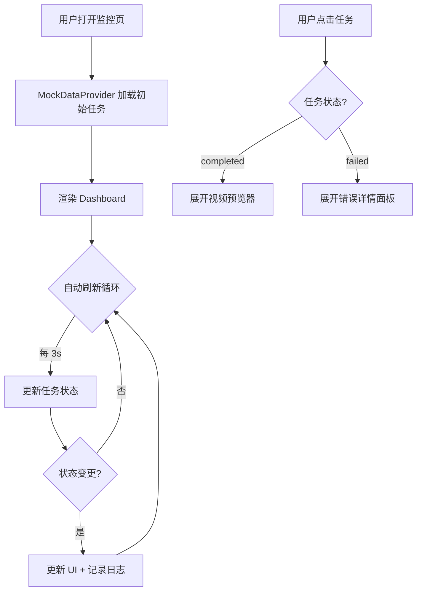

# 任务监控 UI — 产品需求文档

## 1. 产品概述

为视频智能剪辑客户端构建可视化任务监控仪表盘（Dashboard），提供任务列表展示、实时状态追踪、视频预览播放、错误告警和进度指示能力。面向内容创作者，使其能实时掌握批量视频剪辑任务的执行状态与产出结果。

## 2. 核心功能

### 2.1 用户角色

| 角色 | 核心权限 |
|------|---------|
| 内容创作者 | 查看所有任务状态、预览已完成视频、查看错误详情 |

### 2.2 功能模块

1. **任务监控仪表盘**：全局概览 + 任务列表 + 视频预览 + 操作日志
2. **模拟数据引擎**：内置 Mock 数据驱动，无需后端即可完整演示

### 2.3 页面功能清单

| 页面/区域 | 模块 | 功能描述 |
|----------|------|---------|
| 顶部统计栏 | Summary | 总数/待处理/处理中/已完成/失败，带动态计数动画 |
| 任务列表 | TaskList | 卡片式任务行，每行显示 ID、类型标签、状态徽章、当前步骤 |
| 视频预览 | VideoPreview | 已完成任务展开后显示 HTML5 video 播放器 |
| 错误面板 | ErrorPanel | 失败任务显示红色错误提示卡片 |
| 操作日志 | ActivityLog | 底部时间线式日志流，记录步骤变更/完成/失败事件 |

## 3. 核心流程

```
用户打开页面
    ↓
加载模拟任务数据 (Mock Data Provider)
    ↓
渲染统计摘要 + 任务列表
    ↓
[自动轮询] 每 3 秒刷新任务状态 → 界面自动更新
    ↓
用户交互:
  ├─ 点击已完成任务 → 展开视频预览播放器
  ├─ 点击失败任务 → 展开错误详情
  └─ 查看底部操作日志 → 追踪全量事件流
```



## 4. UI 设计规范

### 4.1 设计风格：**深色控制台 / 指挥中心**

- **主色调**：深邃墨蓝底 (`#0a0f1c`) + 青色荧光强调 (`#00d4aa`) + 琥珀警告 (`#f59e0b`) + 珊红错误 (`#ef4444`)
- **按钮**：微圆角胶囊形，hover 发光边框效果
- **字体**：`JetBrains Mono`（等宽数据/代码感）+ `Outfit`（标题/UI 文字）
- **布局**：单页仪表盘，顶部统计条 + 主内容区（左侧任务列表 + 右侧详情面板）+ 底部日志流
- **图标**：lucide-react 图标集
- **动效**：
  - 页面加载时统计数字滚动递增动画
  - 状态变更时卡片闪烁高亮
  - 处理中任务脉冲呼吸灯效果
  - 日志条目滑入动画

### 4.2 区域设计

| 区域 | UI 元素 | 布局/色彩/字体/动效 |
|------|--------|-------------------|
| 统计栏 | 5 个指标卡片 | 横向等分，玻璃拟态背景，大号数字 + 小字标签，数字变化时缩放弹跳 |
| 任务列表 | 可滚动的任务卡片列 | 左侧主区域占 60% 宽度，每张卡片含类型标签(彩色pill)、状态徽章(发光)、进度文字 |
| 详情面板 | 视频/错误/步骤信息 | 右侧 40% 宽度，选中任务时滑入，未选中时显示空态插画 |
| 日志流 | 时间线条目 | 底部固定高度可滚动，新条目从上方淡入，不同事件类型用不同颜色竖线标记 |

### 4.3 响应式

桌面优先（≥1280px），支持 1024px+ 平板自适应（详情面板变为底部抽屉）。

### 4.4 数据模型映射

UI 直接消费现有 `TaskMonitor` / `TaskDisplayInfo` 数据结构：

```typescript
interface TaskDisplayInfo {
  task_id: string
  task_type: '图生视频' | '原视频参考' | '未知类型'
  status: 'pending' | 'processing' | 'retrying' | 'completed' | 'failed'
  current_step: string
  error_message: string
  video_preview_path: string
}

interface TaskSummary {
  total: number
  pending: number
  processing: number
  retrying: number
  completed: number
  failed: number
}
```