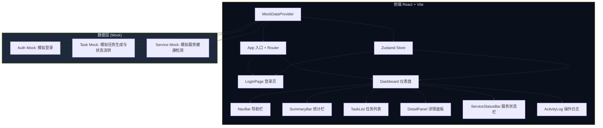

# 任务监控 UI — 技术架构文档

## 1. 架构设计



## 2. 技术选型

| 类别 | 技术 | 版本 |
|------|------|------|
| 框架 | React | ^18 |
| 语言 | TypeScript | ^5 |
| 构建工具 | Vite | ^6 |
| 样式方案 | Tailwind CSS | ^3 |
| 路由 | react-router-dom | ^7 |
| 状态管理 | Zustand | ^5 |
| 图标库 | lucide-react | latest |
| 字体 | JetBrains Mono + Outfit (Google Fonts) | - |

**初始化方式**：`react-ts` 模板（纯前端项目）

## 3. 路由定义

| 路径 | 组件 | 用途 |
|------|------|------|
| `/login` | LoginPage | 用户登录 |
| `/` | DashboardPage | 任务监控仪表盘（需登录） |

未登录访问 `/` 自动重定向到 `/login`。

## 4. 项目结构

```
ui/
├── src/
│   ├── components/
│   │   ├── layout/
│   │   │   ├── NavBar.tsx            # 顶部导航栏（Logo + 用户 + 登出）
│   │   │   └── AppLayout.tsx         # 应用布局容器
│   │   ├── login/
│   │   │   └── LoginForm.tsx         # 登录表单组件
│   │   ├── dashboard/
│   │   │   ├── SummaryBar.tsx        # 顶部统计栏（5 个指标卡片）
│   │   │   ├── TaskList.tsx          # 任务列表容器
│   │   │   ├── TaskCard.tsx          # 单个任务卡片
│   │   │   ├── StatusBadge.tsx       # 状态徽章组件
│   │   │   ├── TypeTag.tsx           # 任务类型标签
│   │   │   ├── DetailPanel.tsx       # 右侧详情面板
│   │   │   ├── VideoPlayer.tsx       # HTML5 视频播放器
│   │   │   ├── ErrorDetail.tsx       # 错误详情展示
│   │   │   ├── ServiceStatusBar.tsx  # 底部服务状态栏
│   │   │   ├── ServiceIndicator.tsx  # 单个服务健康指示器
│   │   │   ├── ActivityLog.tsx       # 操作日志流
│   │   │   └── LogEntry.tsx          # 单条日志条目
│   │   └── ui/
│   │       ├── GlassCard.tsx         # 玻璃拟态卡片通用组件
│   │       └── PulseDot.tsx          # 脉冲呼吸点组件
│   ├── hooks/
│   │   ├── useAuth.ts               # 认证 Hook（登录/登出/Token 管理）
│   │   ├── useTaskMonitor.ts        # 任务监控 Hook（轮询/选择）
│   │   ├── useAutoRefresh.ts        # 自动刷新 Hook
│   │   └── useServiceHealth.ts      # 服务健康检测 Hook
│   ├── store/
│   │   └── useMonitorStore.ts       # Zustand 全局状态
│   ├── data/
│   │   ├── mockAuth.ts              # 模拟登录数据
│   │   ├── mockTasks.ts             # 模拟任务数据生成器
│   │   └── mockServices.ts          # 模拟服务状态数据
│   ├── types/
│   │   └── index.ts                 # TypeScript 类型定义
│   ├── pages/
│   │   ├── LoginPage.tsx
│   │   └── DashboardPage.tsx
│   ├── App.tsx
│   ├── main.tsx
│   └── index.css                    # Tailwind + 自定义样式
├── index.html
├── package.json
├── tsconfig.json
├── vite.config.ts
├── tailwind.config.js
└── postcss.config.js
```

## 5. API 定义（全部使用 Mock 数据）

本项目为纯前端 UI 模型，不依赖真实后端。所有数据通过 Mock Provider 提供：

### 5.1 认证 Mock

```typescript
// mockAuth.ts
function mockLogin(username: string, password: string): Promise<AuthTokens>
// 固定返回: { access_token: "at-mock-xxx", refresh_token: "rt-mock-xxx" }
// 任意非空 username/password 均可登录成功
```

### 5.2 任务 Mock

```typescript
// mockTasks.ts
function generateMockTasks(count: number): TaskDisplayInfo[]
function simulateStatusChange(tasks: TaskDisplayInfo[]): TaskDisplayInfo[]
function getSummary(tasks: TaskDisplayInfo[]): TaskSummary
```

### 5.3 服务状态 Mock

```typescript
// mockServices.ts
function getServiceHealth(): ServiceHealth
// 随机返回 healthy/degraded/down 状态，模拟真实波动
```

## 6. 数据模型

### 6.1 TypeScript 类型定义

```typescript
type TaskStatus = 'pending' | 'processing' | 'retrying' | 'completed' | 'failed'
type TaskType = '图生视频' | '原视频参考' | '未知类型'
type ServiceStatusType = 'healthy' | 'degraded' | 'down' | 'synced' | 'stale' | 'error' | 'valid' | 'expiring' | 'expired'

interface AuthTokens {
  access_token: string
  refresh_token: string
  user: { username: string }
}

interface TaskDisplayInfo {
  task_id: string
  task_type: TaskType
  status: TaskStatus
  current_step: string
  error_message: string
  video_preview_path: string
}

interface TaskSummary {
  total: number
  pending: number
  processing: number
  retrying: number
  completed: number
  failed: number
}

interface ServiceHealth {
  api: { status: ServiceStatusType, latency_ms: number }
  config_sync: { status: ServiceStatusType, last_sync: string }
  token: { status: ServiceStatusType, expires_in: number }
}

interface LogEntry {
  id: string
  timestamp: Date
  task_id: string
  type: 'step' | 'complete' | 'error' | 'info' | 'service'
  message: string
}
```

### 6.2 Zustand Store 结构

```typescript
interface MonitorState {
  // 认证
  isAuthenticated: boolean
  user: { username: string } | null
  tokens: AuthTokens | null

  // 任务
  tasks: TaskDisplayInfo[]
  summary: TaskSummary
  selectedTaskId: string | null
  isRefreshing: boolean

  // 服务
  serviceHealth: ServiceHealth

  // 日志
  logs: LogEntry[]

  // Actions
  login: (username: string, password: string) => Promise<void>
  logout: () => void
  selectTask: (id: string | null) => void
  refreshTasks: () => Promise<void>
  refreshServiceHealth: () => Promise<void>
  addLog: (entry: LogEntry) => void
  clearLogs: () => void
}
```